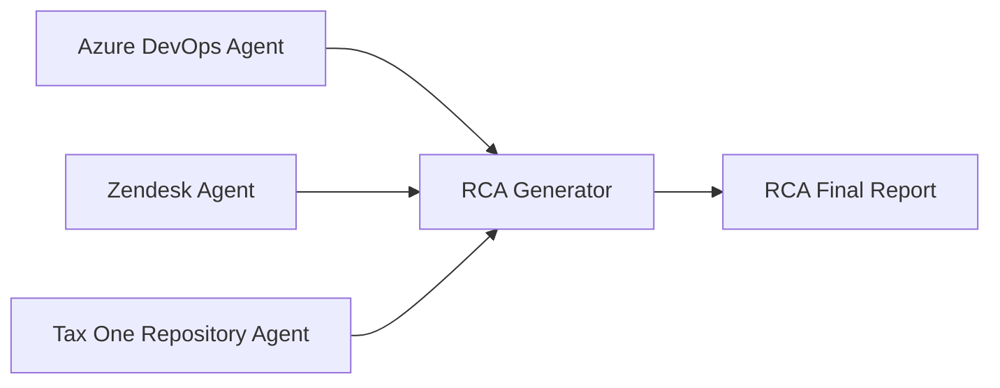
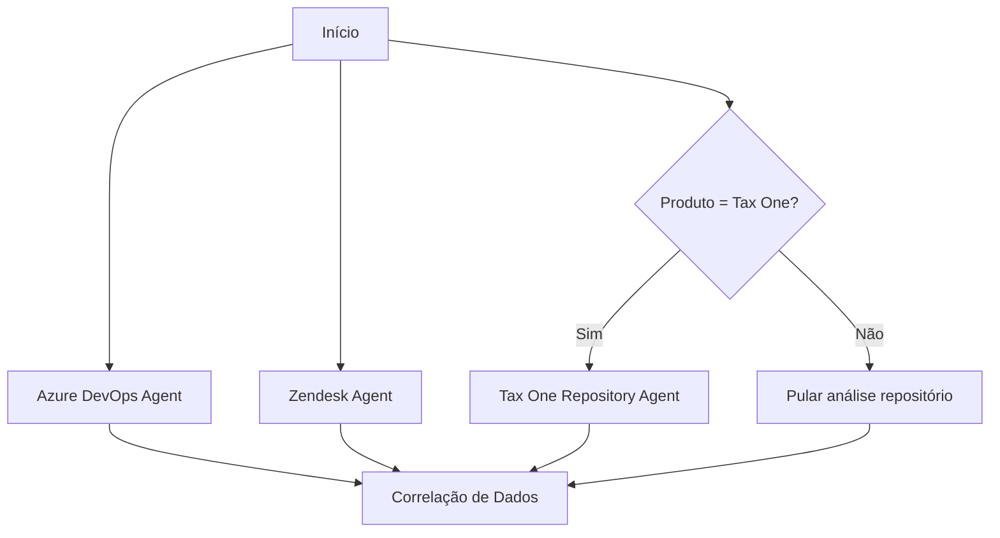

# RCA Generation Agents System

Sistema de agentes especializados para geração automática de relatórios de Root Cause Analysis (RCA) para incidentes da Thomson Reuters.

## 🎯 Visão Geral

Este sistema foi projetado para automatizar o processo de criação de RCAs através de 4 agentes especializados que trabalham de forma coordenada:



## 🤖 Agentes Disponíveis

### 1. Azure DevOps Incident Searcher Agent
**Arquivo**: `azure_devops_incident_searcher.md`  
**Função**: Extração de dados de incidentes do Azure DevOps  
**Saídas**: Timeline, work items, contexto técnico

### 2. Zendesk Connector Agent
**Arquivo**: `zendesk_connector.md`  
**Função**: Análise de impacto ao cliente via Zendesk  
**Saídas**: Métricas de impacto, clientes afetados, escalações

### 3. Tax One Repository Analyzer Agent
**Arquivo**: `taxone_repository_analyzer.md`  
**Função**: Análise técnica de código para produtos Tax One  
**Saídas**: Evidências técnicas, causa raiz do código, padrões problemáticos

### 4. RCA Generator Orchestrator Agent
**Arquivo**: `rca_generator_orchestrator.md`  
**Função**: Orquestração de todos os agentes e geração do RCA final  
**Saídas**: Relatório RCA completo formatado

## 🚀 Como Usar o Sistema

### ⚠️ IMPORTANTE: Agentes Disponíveis
Os agentes documentados aqui são **templates conceituais**. Use os agentes realmente disponíveis:
- `general-purpose` - Para análise completa de RCA
- `Explore` - Para análise específica de repositórios
- `Plan` - Para planejamento de implementação

### Execução Correta

```bash
# Para incidentes do Tax One (análise completa)
claude --agent general-purpose "Gerar RCA completo para incidente INC20260413-2 usando dados do Azure DevOps, Zendesk e repositório tr/taxone_dw"

# Para análise específica de repositório
claude --agent Explore "Analisar repositório tr/taxone_dw para identificar problemas relacionados ao incidente INC20260413-2"

# Para planejamento de correções
claude --agent Plan "Planejar implementação de correções para problemas DBMS_LOCK identificados no Tax One"
```

### Execução por Função Específica

```bash
# Análise Azure DevOps + Zendesk + GitHub
claude --agent general-purpose "Analisar incidente INC20260413-2: extrair dados Azure DevOps, correlacionar com Zendesk (impacto cliente), analisar código GitHub tr/taxone_dw, e gerar RCA completo"

# Análise focada em repositório
claude --agent Explore "Investigar repositório GitHub tr/taxone_dw para problemas DBMS_LOCK, procedure SAF_SPED_CONTABIL_FPROC, e correlações com incidente de lentidão"

# Planejamento de ações
claude --agent Plan "Criar plano de correção para problemas arquiteturais Tax One identificados: remoção DBMS_LOCK, monitoramento proativo, testes multi-tenant"
```

## 🧪 Teste e Validação

### Teste Rápido do Sistema
```bash
# Teste de acesso aos sistemas
claude --agent general-purpose "Testar conectividade: Azure DevOps (work items INC20260413-2), Zendesk (tickets), GitHub (tr/taxone_dw)"

# Teste de análise de repositório
claude --agent Explore "Verificar repositório tr/taxone_dw: localizar SAF_SPED_CONTABIL_FPROC.pck e analisar problemas DBMS_LOCK"

# Teste de geração RCA completa
claude --agent general-purpose "Gerar RCA para INC20260413-2 usando dados MS Teams, Azure DevOps, Zendesk e GitHub"
```

### Exemplo Completo - INC20260413-2
```bash
# Análise completa com correlação multi-fonte
claude --agent general-purpose "Realizar análise RCA completa INC20260413-2:
1. Extrair timeline Azure DevOps 
2. Quantificar impacto Zendesk (27 clientes)
3. Analisar código GitHub tr/taxone_dw (DBMS_LOCK issues)
4. Correlacionar dados MS Teams (reuniões 13/04 e 14/04)
5. Gerar RCA final formato Thomson Reuters"
```

## 📋 Pré-Requisitos e Configuração

### Credenciais Necessárias

1. **Azure DevOps**
   ```bash
   # Azure CLI authentication
   az login
   # ou Personal Access Token
   export ADO_PAT="your_token_here"
   ```

2. **Zendesk**
   ```bash
   export ZENDESK_API_TOKEN="your_zendesk_token"
   export ZENDESK_SUBDOMAIN="thomsonreuters"
   ```

3. **GitHub (Tax One)**
   ```bash
   export GITHUB_TOKEN="ghp_..." # Token com SAML SSO autorizado
   ```

### Configurações do Sistema

**Arquivo**: `config/rca_system_config.json`
```json
{
  "azure_devops": {
    "organization": "https://dev.azure.com/thomsonreuters",
    "project": "Tax One",
    "default_query": "SELECT [System.Id], [System.Title] FROM WorkItems WHERE [System.Title] CONTAINS '{incident_id}'"
  },
  "zendesk": {
    "subdomain": "thomsonreuters",
    "search_timeframe_hours": 48,
    "priority_levels": ["urgent", "high"],
    "product_tags": ["tax_one", "sped", "ecd"]
  },
  "github": {
    "organization": "tr",
    "repositories": {
      "tax_one": "taxone_dw",
      "mastersaf": "mastersaf_core"
    },
    "critical_paths": [
      "artifacts/sp/msaf/SPED/ECD/",
      "artifacts/sp/msaf/basico/",
      "artifacts/sp/msaf/SPED/EFD-PIS-COFINS/"
    ]
  },
  "rca_template": {
    "template_path": "../templates/rca_template_final.md",
    "output_directory": "../reports/",
    "language": "pt-BR"
  }
}
```

## 📊 Fluxo de Trabalho Detalhado

### Fase 1: Inicialização
1. **Input**: Incident ID (e.g., INC20260413-2)
2. **Validação**: Formato do ID, disponibilidade de sistemas
3. **Configuração**: Carregamento de credenciais e configurações

### Fase 2: Coleta de Dados (Paralela)


### Fase 3: Correlação e Síntese
1. **Timeline Merge**: Unificação de timelines de múltiplas fontes
2. **Evidence Correlation**: Correlação entre evidências técnicas e impacto ao cliente
3. **Root Cause Analysis**: Triangulação da causa raiz usando todas as evidências

### Fase 4: Geração do RCA
1. **Template Application**: Aplicação do template RCA Thomson Reuters
2. **Data Population**: Preenchimento de todas as seções com dados correlacionados
3. **Quality Check**: Validação de completude e consistência
4. **Output Generation**: Geração do relatório final em Markdown

## 📈 Métricas de Sucesso

### Tempo de Geração
- **Incidentes Simples**: < 5 minutos
- **Incidentes Complexos**: < 15 minutos
- **Análise Histórica**: < 30 minutos

### Qualidade
- **Precisão**: >95% de informações corretas
- **Completude**: 100% das seções obrigatórias preenchidas
- **Acionabilidade**: 100% das ações em formato SMART

### Cobertura de Evidências
- **Azure DevOps**: Timeline técnica completa
- **Zendesk**: Impacto quantificado ao cliente
- **Repositório**: Evidências técnicas do código
- **Correlação**: Validação cruzada entre fontes

## 🔧 Troubleshooting

### Problemas Comuns

#### Falha de Autenticação
```bash
# Verificar tokens
echo $GITHUB_TOKEN | cut -c1-10
echo $ZENDESK_API_TOKEN | cut -c1-10

# Re-autorizar GitHub SAML SSO
# Acesse: https://github.com/settings/tokens
```

#### Dados Incompletos
- **Azure DevOps**: Verificar permissões no projeto
- **Zendesk**: Confirmar tags e timeframe
- **GitHub**: Validar acesso ao repositório tr/taxone_dw

#### Template Missing
```bash
# Verificar template
ls -la ../templates/rca_template_final.md
```

### Logs e Debugging

```bash
# Habilitar logs detalhados
export RCA_DEBUG=true

# Localização dos logs
tail -f ~/.claude/logs/rca_generation.log
```

## 📝 Exemplos de Uso

### Exemplo 1: Incidente Tax One com Análise Completa
```bash
claude --agent rca_generator_orchestrator \
  "Gerar RCA completo para INC20260413-2 - TAX ONE - Lentidão nos processos SPED/ECD"

# Output: RCA_Report_INC20260413-2_Final.md
```

### Exemplo 2: Incidente Genérico (sem repositório)
```bash
claude --agent rca_generator_orchestrator \
  "Gerar RCA para INC20260415-1 - Sistema XYZ - Falha de autenticação"

# Output: RCA_Report_INC20260415-1_Final.md
```

### Exemplo 3: Análise Técnica Isolada
```bash
claude --agent taxone_repository_analyzer \
  "Analisar mudanças no código relacionadas ao incidente de 13 Abr 2026"

# Output: Technical_Analysis_INC20260413-2.md
```

## 🔄 Evolução e Manutenção

### Versionamento
- Agentes são versionados individualmente
- Breaking changes requerem atualização de versão major
- Compatibilidade mantida com versões anteriores quando possível

### Atualizações Regulares
- **Templates**: Conforme evolução dos padrões Thomson Reuters
- **Integrações**: Acompanhar mudanças de API dos sistemas integrados
- **Padrões de Análise**: Incluir novos padrões problemáticos identificados

### Feedback Loop
- Métricas de uso coletadas automaticamente
- Feedback de stakeholders incorporado em iterações
- Melhorias baseadas em análise de incidentes reais

---
**Sistema**: RCA Generation Agents  
**Versão**: 1.0  
**Criado**: 14 Abr 2026  
**Última Atualização**: 14 Abr 2026