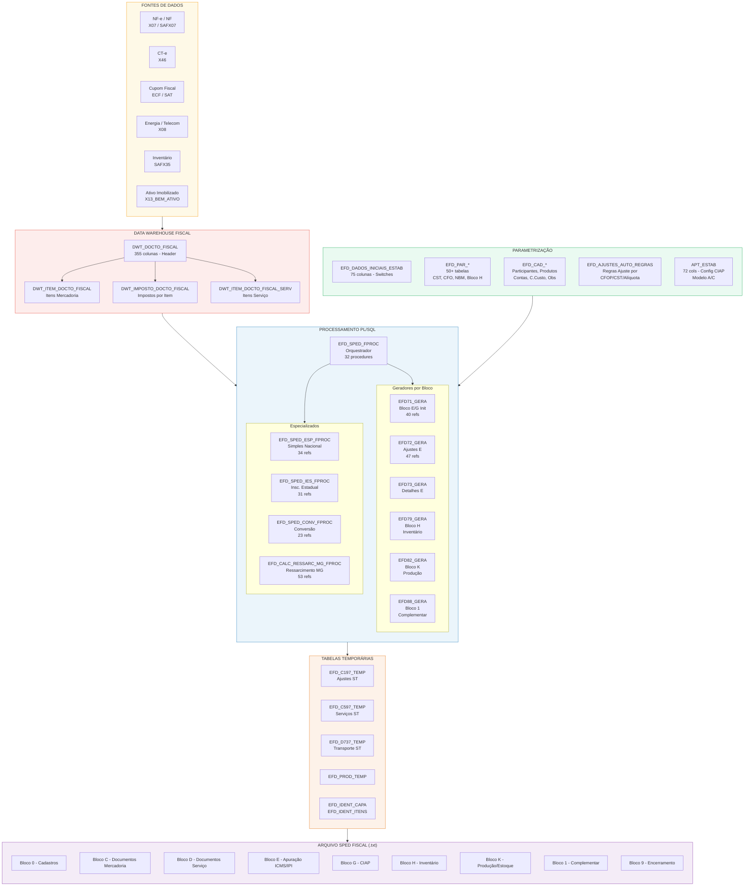
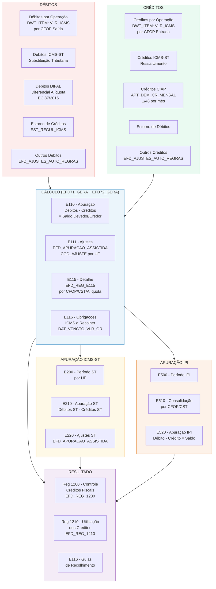
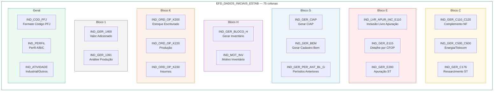
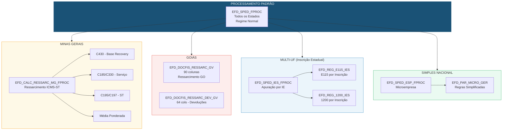

# EFD ICMS/IPI (SPED Fiscal) - Documentação Visual Detalhada

## 1. Fluxo Completo de Geração do Arquivo SPED Fiscal

---

## 2. Blocos e Registros — Mapa Detalhado

```mermaid
graph TB
    subgraph BLOCO_0 ["BLOCO 0 — Abertura e Cadastros"]
        R0000["0000 Abertura"]
        R0001["0001 Indicador"]
        R0005["0005 Dados Complementares"]
        R0015["0015 Filiais"]
        R0100["0100 Contabilista"]
        R0150["0150 Participantes\nEFD_CAD_PARTIC"]
        R0175["0175 Endereço Alternativo"]
        R0190["0190 Unid. Medida\nEFD_CAD_MED"]
        R0200["0200 Produtos/Serviços\nEFD_CAD_PROD_SERV"]
        R0220["0220 Conversão Unid.\nEFD_CAD_PROD_MED"]
        R0300["0300 Cadastro Bens CIAP\nEFD_CAD_BEM_CIAP"]
        R0400["0400 Natureza Operação\nEFD_CAD_NAT_OP"]
        R0450["0450 Informação Compl.\nEFD_CAD_OBS"]
        R0460["0460 Observação Lanc.\nEFD_CAD_OBS"]
        R0500["0500 Plano Contas\nEFD_CAD_CONTA"]
        R0600["0600 Centro Custo\nEFD_CAD_CCUSTO"]
    end

    subgraph BLOCO_C ["BLOCO C — Docs. Fiscais Mercadorias"]
        RC100["C100 NF / NF-e Header\nEFD_CAPA_DOCFIS\n29 colunas"]
        RC170["C170 Itens do Documento\nDWT_ITEM_DOCTO_FISCAL"]
        RC176["C176 Ressarcimento ST\nEFD_PAR_PROD_C176"]
        RC190["C190 Consolidação\npor CFOP/CST/Alíq"]
        RC197["C197 Ajustes ICMS\nEFD_C197_TEMP"]
        RC300["C300-C390 Cupom Fiscal\nEFD_CAPA_REDUCAO_ECF"]
        RC400["C400-C490 ECF"]
        RC500["C500 Energia/Telecom\nDocs Serviço"]
        RC597["C597 Ajustes ST Serv.\nEFD_C597_TEMP"]
        RC100 --> RC170
        RC170 --> RC176
        RC170 --> RC190
        RC190 --> RC197
    end

    subgraph BLOCO_D ["BLOCO D — Docs. Fiscais Serviço Transporte"]
        RD100["D100 CT-e Header"]
        RD190["D190 Consolidação"]
        RD500["D500 Energia/Comunicação"]
        RD737["D737 Ajustes ST\nEFD_D737_TEMP"]
    end

    subgraph BLOCO_E ["BLOCO E — Apuração ICMS/IPI"]
        RE100["E100 Período Apuração"]
        RE110["E110 Apuração ICMS\nDebito/Credito/Saldo"]
        RE111["E111 Ajuste Apuração\nEFD_APURACAO_ASSISTIDA"]
        RE115["E115 Detalhe por\nCFOP/CST/Alíquota\nEFD_REG_E115"]
        RE116["E116 Obrigações\nICMS a Recolher"]
        RE200["E200 Apuração ICMS-ST"]
        RE210["E210 Apuração ICMS-ST\nDetalhe"]
        RE220["E220 Ajuste ICMS-ST"]
        RE500["E500 Apuração IPI"]
        RE510["E510 Consolidação IPI"]
        RE520["E520 Apuração IPI"]
        RE100 --> RE110 --> RE111
        RE110 --> RE115
        RE110 --> RE116
        RE100 --> RE200 --> RE210 --> RE220
        RE100 --> RE500 --> RE510 --> RE520
    end

    subgraph BLOCO_G ["BLOCO G — CIAP (Ativo Permanente)"]
        RG110["G110 CIAP Período"]
        RG125["G125 Movimentação\nAPT_AQUISICAO\n68 colunas"]
        RG126["G126 Parcelas ICMS\nEFD_BEM_CIAP\nAPT_ALIENACAO"]
        RG110 --> RG125 --> RG126
    end

    subgraph BLOCO_H ["BLOCO H — Inventário Físico"]
        RH005["H005 Inventário Header"]
        RH010["H010 Itens Inventário\nSAFX35"]
        RH020["H020 Informação Compl.\nEFD_PAR_BLOCO_H"]
        RH005 --> RH010 --> RH020
    end

    subgraph BLOCO_K ["BLOCO K — Produção e Estoque"]
        RK100["K100 Período Estoque"]
        RK200["K200 Estoque Escriturado"]
        RK220["K220 Itens Produzidos"]
        RK230["K230 Insumos Consumidos"]
        RK250["K250 Industrialização\nTerceiros"]
        RK260["K260 Reprocessamento"]
        RK100 --> RK200
        RK100 --> RK220
        RK100 --> RK230
        RK100 --> RK250
    end

    subgraph BLOCO_1 ["BLOCO 1 — Informações Complementares"]
        R1010["1010 Obrigações Período"]
        R1100["1100 Exportações"]
        R1200["1200 Controle Créditos\nEFD_REG_1200"]
        R1210["1210 Utiliz. Créditos\nEFD_REG_1210"]
        R1400["1400 Valor Adicionado\nEFD_REG_1400\nProduto/Município"]
    end

    style BLOCO_0 fill:#eafaf1,stroke:#27ae60
    style BLOCO_C fill:#fef9e7,stroke:#f39c12
    style BLOCO_D fill:#fef9e7,stroke:#f39c12
    style BLOCO_E fill:#fdedec,stroke:#e74c3c
    style BLOCO_G fill:#ebf5fb,stroke:#2e86c1
    style BLOCO_H fill:#f4ecf7,stroke:#8e44ad
    style BLOCO_K fill:#fdf2e9,stroke:#e67e22
    style BLOCO_1 fill:#f2f4f4,stroke:#566573
```

---

## 3. Ciclo de Vida do CIAP (Bloco G) — Detalhado

```mermaid
flowchart TB
    subgraph ENTRADA_G ["ENTRADA - Aquisição do Bem"]
        NF_ATIVO["NF-e de Compra\nAtivo Imobilizado"]
        X13["X13_BEM_ATIVO\nCadastro do Bem\nTIPO_BEM, VIDA_UTIL"]
        DWT_A["DWT_DOCTO_FISCAL\nNUM_CHAVE_NFE\nNUM_ITEM"]
    end

    subgraph CIAP_CAD ["CADASTRO CIAP"]
        APT_AQ["APT_AQUISICAO\n68 colunas\nNUM_CIAP PK\nVLR_CRED_ICMS\nVLR_ICMSS"]
        APT_BEM["APT_CIAP_BEM\nVínculo CIAP ↔ Bem"]
        EFD_BEM_CAD["EFD_CAD_BEM_CIAP\n18 cols - Reg 0300\nTIPO_BEM, DSC_FUNCAO\nVIDA_UTIL"]
        APT_AQ --> APT_BEM
        APT_AQ --> EFD_BEM_CAD
    end

    subgraph CONFIG_G ["CONFIGURAÇÃO"]
        APT_ESTAB2["APT_ESTAB\n72 cols\nMODELO A ou C\nIND_FRACAO_MENSAL\nCOD_AJUSTE_ICMS"]
        APT_CFO["APT_CFO_ESTAB_MSAF\nCFOPs aplicáveis\nDAT_INI/FIN_REGRA"]
    end

    subgraph CALCULO ["CÁLCULO DE CRÉDITO"]
        APT_BASE["APT_BASE_REF_CALC\nBase Referência\nCOEFICIENTE"]
        APT_DEM_BASE["APT_DEM_BASE_CR\n24 cols\nBase por Bem\nE/S Separado"]
        APT_DEM_MENSAL["APT_DEM_CR_MENSAL\n16 cols\nVLR_TOT_OP_TRIBUT\nVLR_TOT_OP_SAIDAS\nCOEFICIENTE\nVLR_TOT_CREDITO"]
        APT_EST_S["APT_EST_SAIDA\n16 cols\nFAT_MENSAL\nDIAS_PRO_RATA\n1/48 por mês"]
        APT_CALC["APT_CALC_CRED_EXT\n16 cols\nNUM_PARCELA\nVLR_PARC_APROP\nVLR_TOT_SAIDA"]
        APT_BASE --> APT_DEM_BASE
        APT_DEM_BASE --> APT_DEM_MENSAL
        APT_DEM_MENSAL --> APT_EST_S
        APT_EST_S --> APT_CALC
    end

    subgraph SAIDA_G ["MOVIMENTAÇÃO / BAIXA"]
        APT_ALIEN["APT_ALIENACAO\n36 cols\nVLR_ALIENACAO\nVLR_ESTORNO_ICMS\nVLR_CRED_APROP"]
        APT_CTRL["APT_CONTROLE_CIAP\nWorkflow Estado\nTIPO_OPERACAO\nMODELO"]
    end

    subgraph GERACAO_G ["GERAÇÃO BLOCO G"]
        EFD_BEM["EFD_BEM_CIAP\n11 cols\nCOD_BEM, TIPO_MOV\nDAT_MOV, NUM_CIAP"]
        G110["Reg G110\nSaldo Total"]
        G125["Reg G125\nMovimentação"]
        G126["Reg G126\nParcelas ICMS"]
        EFD_BEM --> G110
        EFD_BEM --> G125
        EFD_BEM --> G126
    end

    ENTRADA_G --> CIAP_CAD
    CONFIG_G --> CALCULO
    CIAP_CAD --> CALCULO
    CALCULO --> SAIDA_G
    CALCULO --> GERACAO_G
    SAIDA_G --> GERACAO_G

    style ENTRADA_G fill:#fef9e7,stroke:#f39c12
    style CIAP_CAD fill:#eafaf1,stroke:#27ae60
    style CONFIG_G fill:#ebf5fb,stroke:#2e86c1
    style CALCULO fill:#fdedec,stroke:#e74c3c
    style SAIDA_G fill:#fdf2e9,stroke:#e67e22
    style GERACAO_G fill:#f4ecf7,stroke:#8e44ad
```

---

## 4. Apuração ICMS (Bloco E) — Fluxo de Cálculo

---

## 5. Packages PL/SQL — Dependências Detalhadas

```mermaid
graph TD
    subgraph ORCH ["ORQUESTRADOR"]
        EFD_FPROC["EFD_SPED_FPROC\n32 procedures\n150+ tabelas\nGera todos os blocos"]
    end

    subgraph GERADORES ["GERADORES POR BLOCO"]
        EFD71["EFD71_GERA\n40 refs\nBloco E Init\nBloco G Init"]
        EFD72["EFD72_GERA\n47 refs\nAjustes E111/E220\nRegras por UF"]
        EFD73["EFD73_GERA\nDetalhes E115\nCFOP/CST/Alíq"]
        EFD79["EFD79_GERA\nBloco H\nInventário Físico\nSAFX35"]
        EFD82["EFD82_GERA\nBloco K\nProdução/Estoque\nK100-K260"]
        EFD88["EFD88_GERA\nBloco 1\n1010/1100/1200\n1210/1400"]
    end

    subgraph ESTADUAIS ["REGIMES ESPECIAIS"]
        ESP["EFD_SPED_ESP_FPROC\n34 refs\nSimples Nacional\nMicroempresa"]
        IES["EFD_SPED_IES_FPROC\n31 refs\nInscrição Estadual\nMulti-UF"]
        CONV["EFD_SPED_CONV_FPROC\n23 refs\nConversão/Migração\nFormatos Antigos"]
    end

    subgraph RESSARC ["RESSARCIMENTO MG"]
        RESS_MAIN["EFD_CALC_RESSARC_MG_FPROC\n53 refs - Orquestrador"]
        RESS_C430["EFD_CALC_RESSARC_MG_C430\n35 refs - Base"]
        RESS_C185["EFD_CALC_RESSARC_MG_C185_C330\n33 refs - Serviço"]
        RESS_C195["EFD_CALC_RESSARC_MG_C195_C197\n20 refs - ST"]
        RESS_MPOND["EFD_CALC_RESSARC_MG_MPOND\n24 refs - Média Ponderada"]
        RESS_MAIN --> RESS_C430
        RESS_MAIN --> RESS_C185
        RESS_MAIN --> RESS_C195
        RESS_MAIN --> RESS_MPOND
    end

    subgraph APOIO ["APOIO"]
        LAYOUT["EFD_LAYOUT\n13 refs\nFormatação Arquivo"]
        APUR_REL["EFD_APUR_REL_ANALITICO_FPROC\n31 refs\nRelatório Analítico"]
        EFD01["EFD01_DADOS\n31 refs\nConsultas Gerais"]
    end

    EFD_FPROC --> EFD71
    EFD_FPROC --> EFD72
    EFD_FPROC --> EFD73
    EFD_FPROC --> EFD79
    EFD_FPROC --> EFD82
    EFD_FPROC --> EFD88
    EFD_FPROC --> ESP
    EFD_FPROC --> IES
    EFD_FPROC --> CONV
    EFD_FPROC --> RESS_MAIN
    EFD_FPROC --> LAYOUT
    EFD_FPROC --> APUR_REL
    EFD_FPROC --> EFD01

    style ORCH fill:#1a5276,color:#fff,stroke:#1a5276
    style GERADORES fill:#ebf5fb,stroke:#2e86c1
    style ESTADUAIS fill:#eafaf1,stroke:#27ae60
    style RESSARC fill:#fef9e7,stroke:#f39c12
    style APOIO fill:#f2f4f4,stroke:#566573
```

---

## 6. Tabela de Configuração — EFD_DADOS_INICIAIS_ESTAB (75 switches)

---

## 7. Modelo de Dados — Relacionamentos Principais

```mermaid
erDiagram
    DWT_DOCTO_FISCAL ||--o{ DWT_ITEM_DOCTO_FISCAL : "contém itens"
    DWT_ITEM_DOCTO_FISCAL ||--o{ DWT_IMPOSTO_DOCTO_FISCAL : "tem impostos"
    DWT_DOCTO_FISCAL ||--|| EFD_CAPA_DOCFIS : "mapeado em"

    EFD_CAPA_DOCFIS ||--o{ EFD_C197_TEMP : "ajustes ST"

    EFD_CAD_PARTIC ||--o{ EFD_CAPA_DOCFIS : "participante"
    EFD_CAD_PROD_SERV ||--o{ DWT_ITEM_DOCTO_FISCAL : "produto"
    EFD_CAD_NAT_OP ||--o{ EFD_CAPA_DOCFIS : "natureza op"

    EFD_DADOS_INICIAIS_ESTAB ||--o{ EFD_CAPA_DOCFIS : "config estab"
    EFD_AJUSTES_AUTO_REGRAS ||--o{ EFD_APURACAO_ASSISTIDA : "regras"
    EFD_APURACAO_ASSISTIDA ||--o{ EFD_REG_E115 : "apuração"

    APT_AQUISICAO ||--o{ APT_CIAP_BEM : "vínculo"
    APT_AQUISICAO ||--o{ APT_CALC_CRED_EXT : "crédito"
    APT_AQUISICAO ||--o{ EFD_BEM_CIAP : "gera G126"
    APT_ALIENACAO ||--o{ EFD_BEM_CIAP : "baixa G126"
    EFD_CAD_BEM_CIAP ||--o{ EFD_BEM_CIAP : "cadastro 0300"

    APT_ESTAB ||--|| APT_AQUISICAO : "config CIAP"
    APT_DEM_CR_MENSAL ||--o{ APT_EST_SAIDA : "crédito mensal"
    APT_DEM_BASE_CR ||--o{ APT_DEM_CR_MENSAL : "base crédito"

    EFD_REG_1200 }o--|| EFD_REG_E115 : "consolidação"
    EFD_REG_1210 }o--|| EFD_REG_1200 : "utilização"
    EFD_REG_1400 }o--|| DWT_ITEM_DOCTO_FISCAL : "valor adicionado"
```

---

## 8. Processamento por Estado — Regimes Especiais

---

## 9. Volumetria Detalhada

| Componente | Qtd | Maior Tabela | Colunas |
|------------|-----|--------------|---------|
| **Tabelas EFD** | 73 | EFD_DADOS_INICIAIS_ESTAB | 75 |
| **Tabelas APT (CIAP)** | 35 | APT_CRED_NF_102_CIAP | 108 |
| **Tabelas EST (Estadual)** | ~450 | EST_CALC_LANC_ICMS | 91 |
| **Tabelas DWT (Warehouse)** | 68 | DWT_DOCTO_FISCAL | 355 |
| **Tabelas COTEPE** | 20 | COTEPE_APUR_ICMS | 5 |
| **Tabelas Temporárias** | ~10 | EFD_DOCFIS_RESSARC_GV | 90 |
| **Packages PL/SQL** | 30+ | EFD_SPED_FPROC | 32 procs |
| **Registros SPED** | 50+ | — | — |
| **Params (EFD_PAR_*)** | 50+ | EFD_PAR_GER_C176 | 9 |
| **Estados com regime especial** | 5+ | MG, GO, SP, SC, PR | — |

---

*Gerado a partir do knowledge base TAX ONE — knowledge/schema/ (EFD.md, APT.md, EST.md, DWT.md, COTEPE.md, PLSQL_MAP.md)*
