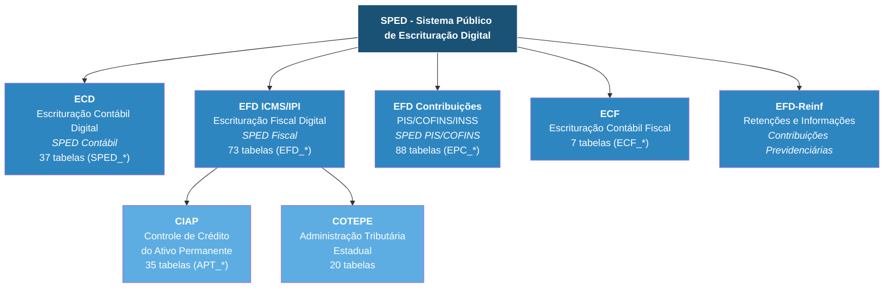
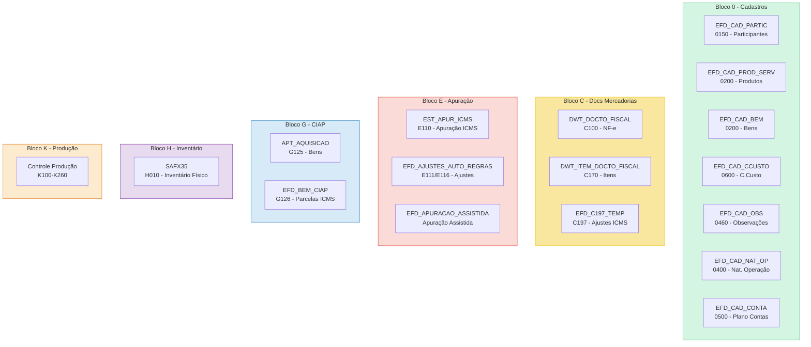
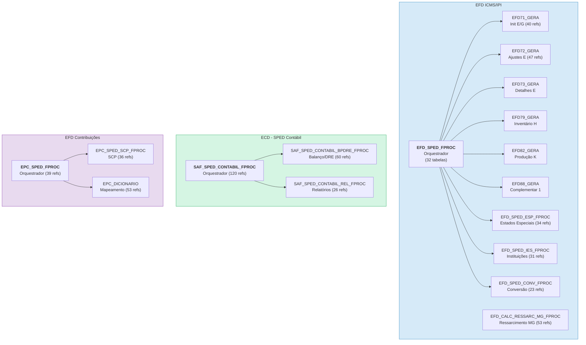
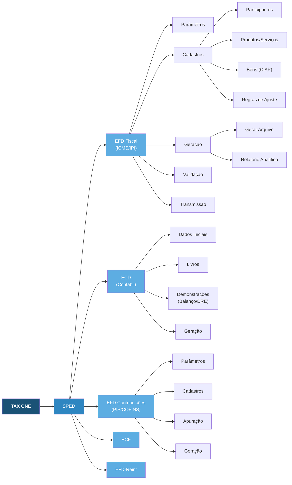

# SPED Fiscal - Documentação Visual (TAX ONE)

## 1. Visão Geral - Submódulos do SPED

---

## 2. Fluxo Principal - EFD ICMS/IPI (SPED Fiscal)

```mermaid
flowchart LR
    subgraph ENTRADA ["1. ENTRADA DE DADOS"]
        direction TB
        NF["Notas Fiscais<br>(X07/SAFX07)"]
        CF["Cupons Fiscais<br>(ECF)"]
        CT["Conhecimentos<br>Transporte (X46)"]
        ENERGY["Energia/Telecom<br>(X08)"]
    end

    subgraph DWT ["2. DATA WAREHOUSE FISCAL"]
        direction TB
        DWT_DOC["DWT_DOCTO_FISCAL<br>(355 colunas)"]
        DWT_ITEM["DWT_ITEM_DOCTO_FISCAL"]
        DWT_IMP["DWT_IMPOSTO_DOCTO_FISCAL"]
    end

    subgraph CONFIG ["3. CONFIGURAÇÃO"]
        direction TB
        EFD_INI["EFD_DADOS_INICIAIS_ESTAB<br>Dados do Estabelecimento"]
        EFD_CAD["EFD_CAD_*<br>Cadastros (Produtos,<br>Participantes, Contas)"]
        EFD_AJUST["EFD_AJUSTES_AUTO_REGRAS<br>Regras de Ajuste<br>Automático"]
    end

    subgraph PROCESSAMENTO ["4. PROCESSAMENTO (PL/SQL)"]
        direction TB
        FPROC["EFD_SPED_FPROC<br><i>Orquestrador Principal</i>"]
        EFD71["EFD71_GERA<br>Bloco E/G Init"]
        EFD72["EFD72_GERA<br>Ajustes Bloco E"]
        EFD73["EFD73_GERA<br>Bloco E Detalhes"]
        EFD79["EFD79_GERA<br>Bloco H Inventário"]
        EFD82["EFD82_GERA<br>Bloco K Produção"]
        EFD88["EFD88_GERA<br>Bloco 1 Complementar"]
        FPROC --> EFD71 --> EFD72 --> EFD73
        FPROC --> EFD79
        FPROC --> EFD82
        FPROC --> EFD88
    end

    subgraph SAIDA ["5. SAÍDA - BLOCOS DO ARQUIVO"]
        direction TB
        B0["<b>Bloco 0</b><br>Abertura e<br>Cadastros"]
        BC["<b>Bloco C</b><br>Documentos Fiscais<br>Mercadorias"]
        BD["<b>Bloco D</b><br>Documentos Fiscais<br>Serviços"]
        BE["<b>Bloco E</b><br>Apuração ICMS/IPI"]
        BG["<b>Bloco G</b><br>CIAP"]
        BH["<b>Bloco H</b><br>Inventário Físico"]
        BK["<b>Bloco K</b><br>Controle Produção"]
        B1["<b>Bloco 1</b><br>Informações<br>Complementares"]
        B9["<b>Bloco 9</b><br>Encerramento"]
    end

    ENTRADA --> DWT
    DWT --> PROCESSAMENTO
    CONFIG --> PROCESSAMENTO
    PROCESSAMENTO --> SAIDA

    style ENTRADA fill:#f9e79f,stroke:#f1c40f
    style DWT fill:#fadbd8,stroke:#e74c3c
    style CONFIG fill:#d5f5e3,stroke:#27ae60
    style PROCESSAMENTO fill:#d6eaf8,stroke:#2e86c1
    style SAIDA fill:#e8daef,stroke:#8e44ad
```

---

## 3. Fluxo Principal - EFD Contribuições (PIS/COFINS)

```mermaid
flowchart LR
    subgraph ENTRADA ["1. ENTRADA"]
        direction TB
        NF2["Notas Fiscais<br>(DWT_DOCTO_FISCAL)"]
        SERV["Serviços Prestados<br>/Tomados"]
        REC["Receitas Financeiras<br>e Outras"]
    end

    subgraph CONFIG2 ["2. CONFIGURAÇÃO"]
        direction TB
        EPC_INI["EPC_DADOS_INICIAIS_*<br>Estab/Financ/PisCof"]
        EPC_CAD["EPC_CAD_*<br>Cadastros"]
        EPC_DIC["EPC_DICIONARIO<br>(53 refs)<br>Mapeamento de Dados"]
    end

    subgraph PROC2 ["3. PROCESSAMENTO"]
        direction TB
        EPC_FPROC["EPC_SPED_FPROC<br><i>Geração Principal</i>"]
        EPC_SCP["EPC_SPED_SCP_FPROC<br><i>Sociedade em Conta<br>de Participação</i>"]
    end

    subgraph APURACAO ["4. APURAÇÃO"]
        direction TB
        EPC_APUR["EPC_APURACAO<br>Apuração PIS/COFINS"]
        EPC_CRED["EPC_APUR_CRED_DISP<br>Créditos Disponíveis"]
        EPC_RET["EPC_APUR_RET_DISP<br>Retenções"]
        EPC_AJUST["EPC_AJUSTE_APUR<br>Ajustes"]
    end

    subgraph SAIDA2 ["5. BLOCOS DO ARQUIVO"]
        direction TB
        S0["<b>Bloco 0</b> Abertura"]
        SA["<b>Bloco A</b> Serviços"]
        SC2["<b>Bloco C</b> Mercadorias"]
        SD["<b>Bloco D</b> Serviço Transp."]
        SF["<b>Bloco F</b> Outras Receitas"]
        SM["<b>Bloco M</b> Apuração<br>PIS/COFINS"]
        S1["<b>Bloco 1</b> Complementar"]
        S9["<b>Bloco 9</b> Encerramento"]
    end

    ENTRADA --> PROC2
    CONFIG2 --> PROC2
    PROC2 --> APURACAO
    APURACAO --> SAIDA2

    style ENTRADA fill:#f9e79f,stroke:#f1c40f
    style CONFIG2 fill:#d5f5e3,stroke:#27ae60
    style PROC2 fill:#d6eaf8,stroke:#2e86c1
    style APURACAO fill:#fadbd8,stroke:#e74c3c
    style SAIDA2 fill:#e8daef,stroke:#8e44ad
```

---

## 4. Fluxo - ECD (SPED Contábil)

```mermaid
flowchart LR
    subgraph ENTRADA3 ["1. ENTRADA"]
        direction TB
        LANC["Lançamentos<br>Contábeis"]
        PLANO["Plano de Contas<br>Referencial"]
        CCUSTO["Centros de Custo"]
    end

    subgraph CONFIG3 ["2. CONFIGURAÇÃO"]
        direction TB
        SPED_INI["SPED_DADOS_INI<br>Dados Iniciais"]
        SPED_SIG["SPED_DADOS_SIGNATARIO<br>Signatários"]
        SPED_AUD["SPED_DADOS_AUDITOR<br>Auditor"]
        SPED_LIVRO["SPED_LIVRO_*<br>Config. de Livros"]
    end

    subgraph PROC3 ["3. PROCESSAMENTO"]
        direction TB
        SAF_CONT["SAF_SPED_CONTABIL_FPROC<br>(120 refs)<br><i>Orquestrador Principal</i>"]
        SAF_BPDRE["SAF_SPED_CONTABIL_BPDRE_FPROC<br>(60 refs)<br><i>Balanço e DRE</i>"]
        SAF_REL["SAF_SPED_CONTABIL_REL_FPROC<br>(26 refs)<br><i>Relatórios</i>"]
        WORK["Tabelas WORK<br>(I050, I075, I100,<br>I310, I355)"]
        SAF_CONT --> WORK
        SAF_CONT --> SAF_BPDRE
    end

    subgraph SAIDA3 ["4. BLOCOS DO ARQUIVO"]
        direction TB
        E0["<b>Bloco 0</b> Abertura"]
        EI["<b>Bloco I</b><br>I050 Plano de Contas<br>I075 Hist. Padronizado<br>I100 Centro Custo<br>I200 Lançamentos<br>I250 Partidas<br>I310/I355 Diário Auxiliar"]
        EJ["<b>Bloco J</b><br>J100 Balanço<br>J150 DRE<br>J800 DRA/DMPL<br>J900 Termos"]
        E9["<b>Bloco 9</b> Encerramento"]
    end

    ENTRADA3 --> PROC3
    CONFIG3 --> PROC3
    PROC3 --> SAIDA3

    style ENTRADA3 fill:#f9e79f,stroke:#f1c40f
    style CONFIG3 fill:#d5f5e3,stroke:#27ae60
    style PROC3 fill:#d6eaf8,stroke:#2e86c1
    style SAIDA3 fill:#e8daef,stroke:#8e44ad
```

---

## 5. Mapa de Tabelas por Bloco (EFD ICMS/IPI)

---

## 6. Packages PL/SQL - Dependências

---

## 7. Menus do TAX ONE (Navegação)

---

## 8. Volumetria e Referências

| Submódulo | Tabelas | Packages PL/SQL | Refs PL/SQL | E2E Specs |
|-----------|---------|-----------------|-------------|-----------|
| EFD ICMS/IPI | 73 (EFD_*) | EFD_SPED_FPROC + 9 blocos | ~300 | efdFiscal/ |
| EFD Contribuições | 88 (EPC_*) | EPC_SPED_FPROC + 2 | ~128 | efdContribuicoes/ |
| ECD Contábil | 37 (SPED_*) | SAF_SPED_CONTABIL_* (3) | ~206 | ecdEscrituracaoContabilDigital/ |
| CIAP | 35 (APT_*) | Integrado ao EFD (G) | ~50 | — |
| COTEPE | 20 | SAF_MM_COTEPE_FPROC | ~57 | — |
| ECF | 7 | — | — | — |
| **Total SPED** | **~280** | **~16 packages** | **~741** | **45 specs** |

---

*Gerado automaticamente a partir do knowledge base do taxone-support-dev.*
*Diagramas em Mermaid — renderizar em qualquer viewer Markdown compatível (GitHub, VS Code, etc).*
