# Relacionamentos Cross-Module (FKs)

## Diagrama Mermaid (top 100 cross-module FKs)

```mermaid
graph LR
    X -->|134 FKs| ESTABELECIMENTO
    EST -->|119 FKs| ESTABELECIMENTO
    X -->|69 FKs| DWT
    EST -->|68 FKs| X
    X -->|47 FKs| GRUPO
    EST -->|35 FKs| ESP
    CBT -->|34 FKs| ESTABELECIMENTO
    ICT -->|32 FKs| ESTABELECIMENTO
    EST -->|29 FKs| RESP
    PRT -->|27 FKs| ESTABELECIMENTO
    ICT -->|26 FKs| X
    X -->|26 FKs| MUNICIPIO
    EFD -->|21 FKs| ESTABELECIMENTO
    EST -->|21 FKs| ICT
    X -->|21 FKs| Y2046
    EPC -->|20 FKs| X
    FDT -->|19 FKs| ESTABELECIMENTO
    FDT -->|18 FKs| X
    DIPI -->|17 FKs| X
    APT -->|15 FKs| ESTABELECIMENTO
    X -->|15 FKs| CAD
    DWT -->|14 FKs| X
    PRT -->|14 FKs| X
    EST -->|13 FKs| MUNICIPIO
    TFT -->|13 FKs| X
    X -->|13 FKs| PAIS
    EFD -->|12 FKs| LIB
    ICT -->|12 FKs| DWT
    MUN -->|12 FKs| ESTABELECIMENTO
    X -->|12 FKs| Y2025
    X -->|12 FKs| Y2026
    APT -->|11 FKs| X
    CBT -->|11 FKs| X
    DIF -->|11 FKs| ESTABELECIMENTO
    ICT -->|11 FKs| OPERACAO
    X -->|11 FKs| ESTADO
    EST -->|10 FKs| DWT
    IST -->|10 FKs| ESTABELECIMENTO
    PRT -->|10 FKs| MUNICIPIO
    TFT -->|10 FKs| ESTABELECIMENTO
    CPT -->|9 FKs| ESTABELECIMENTO
    GUIA -->|9 FKs| X
    IPT -->|9 FKs| ESTABELECIMENTO
    RDF -->|8 FKs| ESTABELECIMENTO
    X -->|8 FKs| PRT
    X -->|8 FKs| ICT
    DIPI -->|7 FKs| ESTABELECIMENTO
    REINF -->|7 FKs| ESTABELECIMENTO
    X -->|7 FKs| DETALHE
    ACT -->|6 FKs| LIB
    CMT -->|6 FKs| EMPRESA
    EFD -->|6 FKs| DWT
    EFT -->|6 FKs| ESTABELECIMENTO
    EST -->|6 FKs| PRT
    IPT -->|6 FKs| X
    IRT -->|6 FKs| ESTABELECIMENTO
    IRT -->|6 FKs| X
    ITEM -->|6 FKs| APURACAO
    ITEM -->|6 FKs| OPERACAO
    ITEM -->|6 FKs| ICT
    RFT -->|6 FKs| ESTABELECIMENTO
    SAICS -->|6 FKs| ESTABELECIMENTO
    TMP -->|6 FKs| RGR
    DGCA -->|5 FKs| ESTABELECIMENTO
    DWT -->|5 FKs| ESTABELECIMENTO
    EPC -->|5 FKs| ESTABELECIMENTO
    EPC -->|5 FKs| DWT
    ESP -->|5 FKs| ESTABELECIMENTO
    FDT -->|5 FKs| RESP
    GID -->|5 FKs| ESTABELECIMENTO
    ICT -->|5 FKs| APURACAO
    MUN -->|5 FKs| RESP
    PRT -->|5 FKs| CAD
    SPED -->|5 FKs| X
    CLASSIF -->|4 FKs| X
    CTM -->|4 FKs| ESTABELECIMENTO
    DCT -->|4 FKs| MUNICIPIO
    DET -->|4 FKs| JOB
    EFT -->|4 FKs| X
    ESP -->|4 FKs| RESP
    FDT -->|4 FKs| OPERACAO
    GPE -->|4 FKs| X
    GUIA -->|4 FKs| APURACAO
    ICT -->|4 FKs| TIPO
    IMP -->|4 FKs| ESTABELECIMENTO
    INCENTIVO -->|4 FKs| LINHAS
    INCENTIVO -->|4 FKs| ESTABELECIMENTO
    IST -->|4 FKs| X
    MUT -->|4 FKs| X
    RCP -->|4 FKs| X
    SEF -->|4 FKs| X
    SPED -->|4 FKs| COTEPE
    TFT -->|4 FKs| MUNICIPIO
    X -->|4 FKs| ECF
    APT -->|3 FKs| ICT
    CBT -->|3 FKs| ESTADO
    CONSOLID -->|3 FKs| TIPO
    COTEPE -->|3 FKs| LIB
    DDS -->|3 FKs| ESTABELECIMENTO
    DIF -->|3 FKs| X
```

**Total cross-module FKs**: 1695

## Lista Detalhada

| Tabela Origem | Colunas FK | Tabela Destino | Colunas Ref |
|---------------|-----------|----------------|-------------|
| ACT_CAD_BEM | PROC_ID | LIB_PROCESSO | PROC_ID |
| ACT_CAD_ITEM | PROC_ID | LIB_PROCESSO | PROC_ID |
| ACT_CAD_NAT_OP | PROC_ID | LIB_PROCESSO | PROC_ID |
| ACT_CAD_OBRA | PROC_ID | LIB_PROCESSO | PROC_ID |
| ACT_CAD_OBS | PROC_ID | LIB_PROCESSO | PROC_ID |
| ACT_CAD_PARTIC | PROC_ID | LIB_PROCESSO | PROC_ID |
| ALIQUOTA_ESTADO | COD_TRIBUTO | TRIBUTO | COD_TRIBUTO |
| ALIQ_CFO_PRODUTO | IDENT_PRODUTO | X2013_PRODUTO | IDENT_PRODUTO |
| ALIQ_CONTRIB | COD_EMPRESA, COD_ESTAB | ESTABELECIMENTO | COD_EMPRESA, COD_ESTAB |
| APT_ALIENACAO | COD_EMPRESA, COD_ESTAB | ESTABELECIMENTO | COD_EMPRESA, COD_ESTAB |
| APT_ALIENACAO | IDENT_FIS_JUR | X04_PESSOA_FIS_JUR | IDENT_FIS_JUR |
| APT_ALIENACAO | IDENT_CUSTO | X2003_CENTRO_CUSTO | IDENT_CUSTO |
| APT_ALIENACAO | IDENT_NATUREZA_OP | X2006_NATUREZA_OP | IDENT_NATUREZA_OP |
| APT_ALIENACAO | IDENT_CFO | X2012_COD_FISCAL | IDENT_CFO |
| APT_AQUISICAO | COD_EMPRESA, COD_ESTAB | ESTABELECIMENTO | COD_EMPRESA, COD_ESTAB |
| APT_AQUISICAO | IDENT_FIS_JUR | X04_PESSOA_FIS_JUR | IDENT_FIS_JUR |
| APT_AQUISICAO | IDENT_CUSTO | X2003_CENTRO_CUSTO | IDENT_CUSTO |
| APT_AQUISICAO | IDENT_NATUREZA_OP | X2006_NATUREZA_OP | IDENT_NATUREZA_OP |
| APT_AQUISICAO | IDENT_CFO | X2012_COD_FISCAL | IDENT_CFO |
| APT_AQUISICAO | IDENT_PROJETO | X2016_PROJETO | IDENT_PROJETO |
| APT_BASE_REF_CALC | COD_EMPRESA, COD_ESTAB | ESTABELECIMENTO | COD_EMPRESA, COD_ESTAB |
| APT_CFO_NATUR_OPER | IDENT_NATUREZA_OP | X2006_NATUREZA_OP | IDENT_NATUREZA_OP |
| APT_CFO_NATUR_OPER | IDENT_CFO | X2012_COD_FISCAL | IDENT_CFO |
| APT_CFO_OPER | COD_EMPRESA, COD_ESTAB | ESTABELECIMENTO | COD_EMPRESA, COD_ESTAB |
| APT_CIAP_BEM | COD_EMPRESA, COD_ESTAB | ESTABELECIMENTO | COD_EMPRESA, COD_ESTAB |
| APT_CONTROLE_CIAP | COD_EMPRESA, COD_ESTAB | ESTABELECIMENTO | COD_EMPRESA, COD_ESTAB |
| APT_CRED_CFO_102 | COD_EMPRESA, COD_ESTAB | ESTABELECIMENTO | COD_EMPRESA, COD_ESTAB |
| APT_DEM_BASE_EST | COD_EMPRESA, COD_ESTAB | ESTABELECIMENTO | COD_EMPRESA, COD_ESTAB |
| APT_ESTAB | COD_TRIB_INT | DWT_TRIBUTACAO_INT | COD_TRIB_INT |
| APT_ESTAB | COD_EMPRESA, COD_ESTAB | ESTABELECIMENTO | COD_EMPRESA, COD_ESTAB |
| APT_ESTAB | COD_AJUSTE_ICMS | ICT_AJUSTE_ICMS | COD_AJUSTE_ICMS |
| APT_ESTAB | COD_AJU_ICMS_TE_102 | ICT_AJUSTE_ICMS | COD_AJUSTE_ICMS |
| APT_ESTAB | COD_AJU_ICMS_TS_102 | ICT_AJUSTE_ICMS | COD_AJUSTE_ICMS |
| APT_ESTAB | COD_TIPO_LIVRO, ITEM_APURACAO | OPERACAO_APURACAO | COD_TIPO_LIVRO, COD_OPER_APUR |
| APT_ESTAB | COD_TIPO_LIVRO, ITEM_APURACAO_TE | OPERACAO_APURACAO | COD_TIPO_LIVRO, COD_OPER_APUR |
| APT_ESTAB | COD_INDICE | Y2046_INDICE | COD_INDICE |
| APT_EST_MENS_ANO | COD_EMPRESA, COD_ESTAB | ESTABELECIMENTO | COD_EMPRESA, COD_ESTAB |
| APT_EST_SAIDA | COD_EMPRESA, COD_ESTAB | ESTABELECIMENTO | COD_EMPRESA, COD_ESTAB |
| APT_EST_SAIDA_A | COD_EMPRESA, COD_ESTAB | ESTABELECIMENTO | COD_EMPRESA, COD_ESTAB |
| APT_EXTCFO_OPER | COD_EMPRESA, COD_ESTAB | ESTABELECIMENTO | COD_EMPRESA, COD_ESTAB |
| APT_IDENT_CIAP | COD_EMPRESA, COD_ESTAB | ESTABELECIMENTO | COD_EMPRESA, COD_ESTAB |
| APT_NUM_LIVRO | COD_EMPRESA, COD_ESTAB | ESTABELECIMENTO | COD_EMPRESA, COD_ESTAB |
| APURACAO | COD_EMPRESA, COD_ESTAB, COD_TIPO_LIVRO | OBRIGACAO_FISCAL | COD_EMPRESA, COD_ESTAB, COD_TIPO_LIVRO |
| ATT_OBRIG_FIS_EMP | COD_EMPRESA | EMPRESA | COD_EMPRESA |
| ATT_OBRIG_FIS_EMP | COD_TIPO_LIVRO | TIPO_LIVRO_FISCAL | COD_TIPO_LIVRO |
| ATT_RES_APUR | COD_EMPRESA, COD_ESTAB, COD_TIPO_LIVRO, DAT_APURACAO | APURACAO | COD_EMPRESA, COD_ESTAB, COD_TIPO_LIVRO, DAT_APURACAO |
| ATT_RES_APUR_ST | COD_EMPRESA, COD_ESTAB, COD_TIPO_LIVRO, DAT_APURACAO | APURACAO | COD_EMPRESA, COD_ESTAB, COD_TIPO_LIVRO, DAT_APURACAO |
| BRT_FECHAMENTO | COD_EMPRESA, COD_ESTAB | ESTABELECIMENTO | COD_EMPRESA, COD_ESTAB |
| BRT_GRUPO_TAB | NOME_TABELA_BANCO | CAT_PRIOR_BR | NOME_TABELA_BANCO |
| BRT_JOB_BCK_ESTAB | NUM_JOB | JOB_BCK | NUM_JOB |
| BRT_JOB_RES_ESTAB | NUM_JOB | JOB_RESTORE | NUM_JOB |
| BRT_PADRAO | COD_EMPRESA | EMPRESA | COD_EMPRESA |
| BRT_PADRAO_ESTAB | COD_EMPRESA, COD_ESTAB | ESTABELECIMENTO | COD_EMPRESA, COD_ESTAB |
| CAD_ALIQ_PRODUTO | TIPO_ALIQUOTA_PROD, GRUPO_PRODUTO_DACON | DAC_GRUPO_PRODUTOS | TIPO_ALIQUOTA_PROD, GRUPO_PRODUTO_DACON |
| CAD_ALIQ_PRODUTO | COD_PRODUTO_DACON | DAC_PRODUTOS | COD_PRODUTO_DACON |
| CAD_TRIBUTACAO_MUNIC | IDENT_ESTADO, COD_MUNICIPIO | MUNICIPIO | IDENT_ESTADO, COD_MUNICIPIO |
| CALEND_OBRIGACAO | COD_EMPRESA, COD_ESTAB, COD_TIPO_LIVRO | OBRIGACAO_FISCAL | COD_EMPRESA, COD_ESTAB, COD_TIPO_LIVRO |
| CATEG_TAB_PROC | COD_CATEGORIA | CATEGORIA | COD_CATEGORIA |
| CATEG_TAB_PROC | COD_TAB_PROC | TAB_PROC | COD_TAB_PROC |
| CAT_GRUPO_DIC_DADOS | COD_GRUPO | GRUPO_DIC_DADOS | COD_GRUPO |
| CAT_OPERACAO | COD_EMPRESA, COD_ESTAB | ESTABELECIMENTO | COD_EMPRESA, COD_ESTAB |
| CAT_OPERACAO | IDENT_NATUREZA_OP | X2006_NATUREZA_OP | IDENT_NATUREZA_OP |
| CAT_OPERACAO | IDENT_CFO | X2012_COD_FISCAL | IDENT_CFO |
| CAT_PROCESSO_AUTO | COD_MODULO | PRT_MODULOS_MSAF | COD_MODULO |
| CBT_ANEXO1_QUADRO2 | IDENT_FIS_JUR | X04_PESSOA_FIS_JUR | IDENT_FIS_JUR |
| CBT_ANEXO23_DEST | COD_EMPRESA, COD_ESTAB | ESTABELECIMENTO | COD_EMPRESA, COD_ESTAB |
| CBT_ANEXO23_DEST | IDENT_FIS_JUR | X04_PESSOA_FIS_JUR | IDENT_FIS_JUR |
| CBT_ANEXO2_NF_EMIT | COD_EMPRESA, COD_ESTAB | ESTABELECIMENTO | COD_EMPRESA, COD_ESTAB |
| CBT_ANEXO3_QUADR41 | COD_EMPRESA, COD_ESTAB | ESTABELECIMENTO | COD_EMPRESA, COD_ESTAB |
| CBT_ANEXO3_QUADR41 | IDENT_FIS_JUR | X04_PESSOA_FIS_JUR | IDENT_FIS_JUR |
| CBT_ANEXO3_QUADR42 | COD_EMPRESA, COD_ESTAB | ESTABELECIMENTO | COD_EMPRESA, COD_ESTAB |
| CBT_ANEXO3_QUADR42 | IDENT_FIS_JUR | X04_PESSOA_FIS_JUR | IDENT_FIS_JUR |
| CBT_ANEXO3_QUADRO2 | COD_EMPRESA, COD_ESTAB | ESTABELECIMENTO | COD_EMPRESA, COD_ESTAB |
| CBT_ANEXO3_QUADRO2 | IDENT_FIS_JUR | X04_PESSOA_FIS_JUR | IDENT_FIS_JUR |
| CBT_ANEXO4_QUADRO2 | COD_EMPRESA, COD_ESTAB | ESTABELECIMENTO | COD_EMPRESA, COD_ESTAB |
| CBT_ANEXO5_CLIENTE | COD_EMPRESA, COD_ESTAB | ESTABELECIMENTO | COD_EMPRESA, COD_ESTAB |
| CBT_ANEXO5_CLIENTE | IDENT_FIS_JUR_CLI | X04_PESSOA_FIS_JUR | IDENT_FIS_JUR |
| CBT_ANEXO5_QUADR41 | COD_EMPRESA, COD_ESTAB | ESTABELECIMENTO | COD_EMPRESA, COD_ESTAB |
| CBT_ANEXO5_QUADR41 | IDENT_FIS_JUR_GAS_A | X04_PESSOA_FIS_JUR | IDENT_FIS_JUR |
| CBT_ANEXO5_QUADR42 | COD_EMPRESA, COD_ESTAB | ESTABELECIMENTO | COD_EMPRESA, COD_ESTAB |
| CBT_ANEXO5_QUADR42 | IDENT_FIS_JUR_GAS_A | X04_PESSOA_FIS_JUR | IDENT_FIS_JUR |
| CBT_ANEXO5_QUADRO2 | COD_EMPRESA, COD_ESTAB | ESTABELECIMENTO | COD_EMPRESA, COD_ESTAB |
| CBT_ANEXO5_QUADRO2 | IDENT_FIS_JUR_GAS_A | X04_PESSOA_FIS_JUR | IDENT_FIS_JUR |
| CBT_ANEXO6M_QUADR1 | COD_EMPRESA, COD_ESTAB | ESTABELECIMENTO | COD_EMPRESA, COD_ESTAB |
| CBT_ANEXO6M_QUADR2 | COD_EMPRESA, COD_ESTAB | ESTABELECIMENTO | COD_EMPRESA, COD_ESTAB |
| CBT_ANEXO6M_QUADR3 | COD_EMPRESA, COD_ESTAB | ESTABELECIMENTO | COD_EMPRESA, COD_ESTAB |
| CBT_ANEXO6M_QUADR4A15 | COD_EMPRESA, COD_ESTAB | ESTABELECIMENTO | COD_EMPRESA, COD_ESTAB |
| CBT_ANEXO6M_RELAT | COD_EMPRESA, COD_ESTAB | ESTABELECIMENTO | COD_EMPRESA, COD_ESTAB |
| CBT_ANEXO6M_RELAT | IDENT_ESTADO_DESTINO | ESTADO | IDENT_ESTADO |
| CBT_ANEXO6M_RELAT | IDENT_ESTADO_QUAD | ESTADO | IDENT_ESTADO |
| CBT_ANEXO6M_RELAT | IDENT_FIS_JUR | X04_PESSOA_FIS_JUR | IDENT_FIS_JUR |
| CBT_ANEXO6_QUADR1 | COD_EMPRESA, COD_ESTAB | ESTABELECIMENTO | COD_EMPRESA, COD_ESTAB |
| CBT_ANEXO6_QUADR10 | COD_EMPRESA, COD_ESTAB | ESTABELECIMENTO | COD_EMPRESA, COD_ESTAB |
| CBT_ANEXO6_QUADR14 | COD_EMPRESA, COD_ESTAB | ESTABELECIMENTO | COD_EMPRESA, COD_ESTAB |
| CBT_ANEXO6_QUADR2 | COD_EMPRESA, COD_ESTAB | ESTABELECIMENTO | COD_EMPRESA, COD_ESTAB |
| CBT_ANEXO6_QUADR3 | COD_EMPRESA, COD_ESTAB | ESTABELECIMENTO | COD_EMPRESA, COD_ESTAB |
| CBT_ANEXO6_QUADR45 | COD_EMPRESA, COD_ESTAB | ESTABELECIMENTO | COD_EMPRESA, COD_ESTAB |
| CBT_ANEXO6_QUADR6 | COD_EMPRESA, COD_ESTAB | ESTABELECIMENTO | COD_EMPRESA, COD_ESTAB |
| CBT_ANEXO6_QUADR78 | COD_EMPRESA, COD_ESTAB | ESTABELECIMENTO | COD_EMPRESA, COD_ESTAB |
| CBT_ANEXO6_QUADR9 | COD_EMPRESA, COD_ESTAB | ESTABELECIMENTO | COD_EMPRESA, COD_ESTAB |
| CBT_ANEXO7M_QUADR1 | COD_EMPRESA, COD_ESTAB | ESTABELECIMENTO | COD_EMPRESA, COD_ESTAB |
| CBT_ANEXO7M_QUADR2A7 | COD_EMPRESA, COD_ESTAB | ESTABELECIMENTO | COD_EMPRESA, COD_ESTAB |
| CBT_ANEXO7_QUADR1 | COD_EMPRESA, COD_ESTAB | ESTABELECIMENTO | COD_EMPRESA, COD_ESTAB |
| CBT_ANEXO7_QUADR24 | COD_EMPRESA, COD_ESTAB | ESTABELECIMENTO | COD_EMPRESA, COD_ESTAB |
| CBT_ANEXO7_QUADR57 | COD_EMPRESA, COD_ESTAB | ESTABELECIMENTO | COD_EMPRESA, COD_ESTAB |
| CBT_ANEXO_ABC_NF | COD_EMPRESA, COD_ESTAB | ESTABELECIMENTO | COD_EMPRESA, COD_ESTAB |
| CBT_CARGA_ARQUIVO | COD_EMPRESA, COD_ESTAB | ESTABELECIMENTO | COD_EMPRESA, COD_ESTAB |
| CBT_GRP_ESTOQ | COD_EMPRESA, COD_ESTAB | ESTABELECIMENTO | COD_EMPRESA, COD_ESTAB |
| CBT_GRP_PFJ_ESTOQ | IDENT_FIS_JUR | X04_PESSOA_FIS_JUR | IDENT_FIS_JUR |
| CBT_PAR_LANCTO_P9 | COD_EMPRESA, COD_ESTAB | ESTABELECIMENTO | COD_EMPRESA, COD_ESTAB |
| CBT_PAR_LANCTO_P9 | IDENT_ESTADO_DESTINO | ESTADO | IDENT_ESTADO |
| CBT_PAR_LANCTO_P9 | COD_AJUSTE_ICMS | ICT_AJUSTE_ICMS | COD_AJUSTE_ICMS |
| CBT_PAR_LANCTO_P9 | COD_AJUSTE_ICMS_NEG | ICT_AJUSTE_ICMS | COD_AJUSTE_ICMS |
| CBT_PAR_LANCTO_P9 | COD_TIPO_LIVRO, COD_OPER_APUR | OPERACAO_APURACAO | COD_TIPO_LIVRO, COD_OPER_APUR |
| CBT_PAR_LANCTO_P9 | COD_TIPO_LIVRO, COD_OPER_APUR_NEG | OPERACAO_APURACAO | COD_TIPO_LIVRO, COD_OPER_APUR |
| CBT_PAR_LANCTO_P9 | COD_TIPO_LIVRO | TIPO_LIVRO_FISCAL | COD_TIPO_LIVRO |
| CBT_REGRA_COMB | COD_EMPRESA, COD_ESTAB | ESTABELECIMENTO | COD_EMPRESA, COD_ESTAB |
| CENTRAL_ESCRITURA | COD_EMPRESA, COD_ESTAB, COD_TIPO_LIVRO | OBRIGACAO_FISCAL | COD_EMPRESA, COD_ESTAB, COD_TIPO_LIVRO |
| CENTRAL_ESCRITURA | COD_EMP_CENTRAL, COD_ESTAB_CENTRAL, COD_TIPO_LIVRO_CEN | OBRIGACAO_FISCAL | COD_EMPRESA, COD_ESTAB, COD_TIPO_LIVRO |
| CENTRAL_ESCRIT_CONTABIL | COD_EMPRESA, COD_ESTAB | ESTABELECIMENTO | COD_EMPRESA, COD_ESTAB |
| CENTRAL_ESCRIT_CONTABIL | COD_EMPRESA, COD_ESTAB_CENTRAL | ESTABELECIMENTO | COD_EMPRESA, COD_ESTAB |
| CLASSIF_NBM_NALADI | IDENT_NBM | X2043_COD_NBM | IDENT_NBM |
| CLASSIF_NBM_NALADI | IDENT_NALADI | X2083_COD_NALADI | IDENT_NALADI |
| CLASSIF_NBM_NCM | IDENT_NBM | X2043_COD_NBM | IDENT_NBM |
| CLASSIF_NBM_NCM | IDENT_NCM | X2045_COD_NCM | IDENT_NCM |
| CMT_BALANCETE | COD_EMPRESA, COD_ESTAB | ESTABELECIMENTO | COD_EMPRESA, COD_ESTAB |
| CMT_ESTRUT_REL | COD_EMPRESA | EMPRESA | COD_EMPRESA |
| CMT_PAR_EXERC | COD_EMPRESA | EMPRESA | COD_EMPRESA |
| CMT_PAR_EXERC_AUT1 | COD_EMPRESA | EMPRESA | COD_EMPRESA |
| CMT_PAR_EXERC_AUT2 | COD_EMPRESA | EMPRESA | COD_EMPRESA |
| CMT_PAR_EXERC_AUT3 | COD_EMPRESA | EMPRESA | COD_EMPRESA |
| CMT_PAR_OPERACAO | COD_EMPRESA, COD_ESTAB | ESTABELECIMENTO | COD_EMPRESA, COD_ESTAB |
| CMT_RES_DEM | COD_EMPRESA | EMPRESA | COD_EMPRESA |
| COD_OBS_LIVRO | GRUPO_OBS_LIVRO | GRUPO_ESTAB | GRUPO_ESTAB |
| CONSOLID_OBRIGACAO | COD_EMPRESA, COD_ESTAB, COD_TIPO_LIVRO | OBRIGACAO_FISCAL | COD_EMPRESA, COD_ESTAB, COD_TIPO_LIVRO |
| CONSOLID_OBRIGACAO | COD_TIPO_CONSOL | TIPO_CONSOLIDACAO | COD_TIPO_CONSOL |
| CONSOLID_OBRIG_IES | COD_EMPRESA, COD_ESTAB, INSC_ESTADUAL | ICT_ESTAB_IESTAD | COD_EMPRESA, COD_ESTAB, INSC_ESTADUAL |
| CONSOLID_TP_LIVRO | COD_TIPO_CONSOL | TIPO_CONSOLIDACAO | COD_TIPO_CONSOL |
| CONSOLID_TP_LIVRO | COD_TIPO_LIVRO | TIPO_LIVRO_APURAC | COD_TIPO_LIVRO |
| CONV_DIFERIMENTO | COD_EMPRESA, COD_ESTAB | ESTABELECIMENTO | COD_EMPRESA, COD_ESTAB |
| CONV_DIFERIMENTO | IND_CORRECAO | Y2046_INDICE | COD_INDICE |
| COTEPE_LAYOUT_REGS | PROC_ID | LIB_PROCESSO | PROC_ID |
| COTEPE_PERFIL_ESTAB | COD_EMPRESA, COD_ESTAB | ESTABELECIMENTO | COD_EMPRESA, COD_ESTAB |
| COTEPE_RES_CFO_TMP | PROC_ID | LIB_PROCESSO | PROC_ID |
| COTEPE_RES_UF_TEMP | PROC_ID | LIB_PROCESSO | PROC_ID |
| CPP_PARAM_COP | COD_MODULO | PRT_MODULOS_MSAF | COD_MODULO |
| CPT_AP_CENTRAL_CI | COD_EMPR_CENTRAL, COD_ESTAB_CENTRAL | ESTABELECIMENTO | COD_EMPRESA, COD_ESTAB |
| CPT_AP_CENTRAL_CNI | COD_EMPR_CENTRAL, COD_ESTAB_CENTRAL | ESTABELECIMENTO | COD_EMPRESA, COD_ESTAB |
| CPT_AP_ESTAB_CI | COD_EMPRESA, COD_ESTAB | ESTABELECIMENTO | COD_EMPRESA, COD_ESTAB |
| CPT_AP_ESTAB_CNI | COD_EMPRESA, COD_ESTAB | ESTABELECIMENTO | COD_EMPRESA, COD_ESTAB |
| CPT_CLASSE_OPER | CLASSE_REL, COD_REL | EST_PAR_REL | CLASSE_REL, COD_REL |
| CPT_CLASSE_VLR_MES | COD_EMPRESA, COD_ESTAB | ESTABELECIMENTO | COD_EMPRESA, COD_ESTAB |
| CPT_CLASSE_VLR_MES | COD_CLASSE | PRT_CLASSE_MSAF | COD_CLASSE |
| CPT_CP_STEP_RESULTSET | PROC_ID | LIB_PROCESSO | PROC_ID |
| CPT_CP_STEP_STATS | PROC_ID | LIB_PROCESSO | PROC_ID |
| CPT_EST_CUSTO | COD_EMPRESA, COD_ESTAB | ESTABELECIMENTO | COD_EMPRESA, COD_ESTAB |
| CPT_EST_CUSTO | IDENT_INSUMO | X2013_PRODUTO | IDENT_PRODUTO |
| CPT_EST_CUSTO | IDENT_PRODUTO | X2013_PRODUTO | IDENT_PRODUTO |
| CPT_ETIQUETAS | COD_EMPRESA, COD_ESTAB | ESTABELECIMENTO | COD_EMPRESA, COD_ESTAB |
| CPT_PAR_CONTAS | COD_CLASSE | PRT_CLASSE_MSAF | COD_CLASSE |
| CPT_REG17_CINTEGR | COD_EMPRESA, COD_ESTAB | ESTABELECIMENTO | COD_EMPRESA, COD_ESTAB |
| CPT_VLR_OPERACAO | COD_EMPRESA, COD_ESTAB | ESTABELECIMENTO | COD_EMPRESA, COD_ESTAB |
| CTM_CONCILIACAO | COD_EMPRESA, COD_ESTAB | ESTABELECIMENTO | COD_EMPRESA, COD_ESTAB |
| CTM_ESTAB_CFO | COD_EMPRESA, COD_ESTAB | ESTABELECIMENTO | COD_EMPRESA, COD_ESTAB |
| CTM_NAT_OP_CFO | COD_EMPRESA, COD_ESTAB | ESTABELECIMENTO | COD_EMPRESA, COD_ESTAB |
| CTM_PAR_NAT_OP | COD_EMPRESA, COD_ESTAB | ESTABELECIMENTO | COD_EMPRESA, COD_ESTAB |
| CTM_PROG_INTERFACE | COD_PROG, COD_EMPRESA, COD_ESTAB, COD_TABELA | IBT_CONTROLE | COD_PROG, COD_EMPRESA, COD_ESTAB, COD_TABELA |
| DCA_DOCTO_FISCAL | COD_EMPRESA, COD_ESTAB | ESTABELECIMENTO | COD_EMPRESA, COD_ESTAB |
| DCA_ITENS_MERC | COD_EMPRESA, COD_ESTAB | ESTABELECIMENTO | COD_EMPRESA, COD_ESTAB |
| DCT_COMP_DEB | IDENT_ESTADO, COD_MUNICIPIO | MUNICIPIO | IDENT_ESTADO, COD_MUNICIPIO |
| DCT_COMP_DEB_DARF | IDENT_ESTADO, COD_MUNICIPIO | MUNICIPIO | IDENT_ESTADO, COD_MUNICIPIO |
| DCT_DADOS_GERAIS | COD_EMPRESA, COD_ESTAB_MATRIZ | ESTABELECIMENTO | COD_EMPRESA, COD_ESTAB |
| DCT_FICHA_DEB | COD_RECEITA | DWT_COD_RECEITA | COD_RECEITA |
| DCT_FICHA_DEB | COD_EMPRESA, COD_ESTAB | ESTABELECIMENTO | COD_EMPRESA, COD_ESTAB |
| DCT_PG_DEB_TDA | IDENT_ESTADO, COD_MUNICIPIO | MUNICIPIO | IDENT_ESTADO, COD_MUNICIPIO |
| DCT_SUSP_DEB | IDENT_ESTADO, COD_MUNICIPIO | MUNICIPIO | IDENT_ESTADO, COD_MUNICIPIO |
| DDS_NATAL_DADOS_INICIAIS | COD_EMPRESA, COD_ESTAB | ESTABELECIMENTO | COD_EMPRESA, COD_ESTAB |
| DDS_NATAL_DEDUCOES | COD_EMPRESA, COD_ESTAB | ESTABELECIMENTO | COD_EMPRESA, COD_ESTAB |
| DDS_NATAL_DESPESAS | COD_EMPRESA, COD_ESTAB | ESTABELECIMENTO | COD_EMPRESA, COD_ESTAB |
| DECLARACAO_DIPJ | COD_EMPRESA, COD_ESTAB | ESTABELECIMENTO | COD_EMPRESA, COD_ESTAB |
| DETALHE_OPERACAO | COD_AJUSTE_SPED | DWT_COD_AJUSTE_SPED | COD_AJUSTE_SPED |
| DETALHE_OPERACAO | GRUPO_DET_OPER | GRUPO_ESTAB | GRUPO_ESTAB |
| DETALHE_OPERACAO | COD_AJUSTE_ICMS | ICT_AJUSTE_ICMS | COD_AJUSTE_ICMS |
| DETALHE_OPERACAO | COD_TIPO_LIVRO, COD_OPER_APUR | OPERACAO_APURACAO | COD_TIPO_LIVRO, COD_OPER_APUR |
| DET_GRUPO_DIC_DADOS | COD_GRUPO, COD_CATEGORIA | CAT_GRUPO_DIC_DADOS | COD_GRUPO, COD_CATEGORIA |
| DET_GRUPO_DIC_REGRA | COD_REGRA | REGRA_VALID_DADOS | COD_REGRA |
| DET_JOB_BCK | NUM_JOB | JOB_BCK | NUM_JOB |
| DET_JOB_DROP | NUM_JOB | JOB_IMPORTACAO | NUM_JOB |
| DET_JOB_IMPORT | NUM_JOB | JOB_IMPORTACAO | NUM_JOB |
| DET_JOB_LOAD | NUM_JOB | JOB_IMPORTACAO | NUM_JOB |
| DET_JOB_RESTORE | NOME_TABELA_BANCO | CAT_PRIOR_BR | NOME_TABELA_BANCO |
| DET_REG_LAYOUT | COD_LAYOUT, COD_BLOCO, COD_REGISTRO | CAD_REG_LAYOUT | COD_LAYOUT, COD_BLOCO, COD_REGISTRO |
| DGCA_APURACAO | COD_EMPRESA, COD_ESTAB | ESTABELECIMENTO | COD_EMPRESA, COD_ESTAB |
| DGCA_SALDO_CRED_ACUMUL | COD_EMPRESA, COD_ESTAB | ESTABELECIMENTO | COD_EMPRESA, COD_ESTAB |
| DGCA_SALDO_CRED_GIA | COD_EMPRESA, COD_ESTAB | ESTABELECIMENTO | COD_EMPRESA, COD_ESTAB |
| DGCA_SALDO_INI_CRED_ACUMUL | COD_EMPRESA, COD_ESTAB | ESTABELECIMENTO | COD_EMPRESA, COD_ESTAB |
| DGCA_VALOR_CRED_OUT | COD_EMPRESA, COD_ESTAB | ESTABELECIMENTO | COD_EMPRESA, COD_ESTAB |
| DIFERIMENTO_IMP | COD_EMPRESA, COD_ESTAB, COD_CONVENIO | CONV_DIFERIMENTO | COD_EMPRESA, COD_ESTAB, COD_CONVENIO |
| DIFERIMENTO_IMP | COD_EMPRESA, COD_ESTAB | ESTABELECIMENTO | COD_EMPRESA, COD_ESTAB |
| DIFERIMENTO_IMP | COD_TRIBUTO | TRIBUTO | COD_TRIBUTO |
| DIF_BEB_EST_INSUMO | COD_EMPRESA, COD_ESTAB | ESTABELECIMENTO | COD_EMPRESA, COD_ESTAB |
| DIF_BEB_EST_INSUMO_A | COD_EMPRESA, COD_ESTAB | ESTABELECIMENTO | COD_EMPRESA, COD_ESTAB |
| DIF_BEB_EST_PROD | COD_EMPRESA, COD_ESTAB | ESTABELECIMENTO | COD_EMPRESA, COD_ESTAB |
| DIF_BEB_EST_PROD_A | COD_EMPRESA, COD_ESTAB | ESTABELECIMENTO | COD_EMPRESA, COD_ESTAB |
| DIF_BEB_ITEM_NF | IDENT_FIS_JUR | X04_PESSOA_FIS_JUR | IDENT_FIS_JUR |
| DIF_BEB_NF | COD_EMPRESA, COD_ESTAB | ESTABELECIMENTO | COD_EMPRESA, COD_ESTAB |
| DIF_BEB_NF | IDENT_FIS_JUR | X04_PESSOA_FIS_JUR | IDENT_FIS_JUR |
| DIF_BEB_PRD_INSUMO | COD_EMPRESA, COD_ESTAB | ESTABELECIMENTO | COD_EMPRESA, COD_ESTAB |
| DIF_BEB_PRODUTO | COD_EMPRESA, COD_ESTAB | ESTABELECIMENTO | COD_EMPRESA, COD_ESTAB |
| DIF_BEB_RESUMO_CFO | COD_EMPRESA, COD_ESTAB | ESTABELECIMENTO | COD_EMPRESA, COD_ESTAB |
| DIF_BEB_RESUMO_CFO | IDENT_CFO | X2012_COD_FISCAL | IDENT_CFO |
| DIF_BEB_RES_APUR | COD_EMPRESA, COD_ESTAB | ESTABELECIMENTO | COD_EMPRESA, COD_ESTAB |
| DIF_PAP_PROD | COD_EMPRESA, COD_ESTAB | ESTABELECIMENTO | COD_EMPRESA, COD_ESTAB |
| DIF_PAP_PROD_EXC | COD_EMPRESA, COD_ESTAB | ESTABELECIMENTO | COD_EMPRESA, COD_ESTAB |
| DIPI_BEB_CRED_NBM | IDENT_NBM | X2043_COD_NBM | IDENT_NBM |
| DIPI_BEB_CRED_PRD | IDENT_PRODUTO | X2013_PRODUTO | IDENT_PRODUTO |
| DIPI_BEB_PAUTA_PRD | IDENT_MEDIDA | X2007_MEDIDA | IDENT_MEDIDA |
| DIPI_BEB_PAUTA_PRD | IDENT_PRODUTO | X2013_PRODUTO | IDENT_PRODUTO |
| DIPI_BEB_PAUTA_PRD | IDENT_NBM | X2043_COD_NBM | IDENT_NBM |
| DIPI_DEST_AX | COD_EMPRESA, COD_ESTAB | ESTABELECIMENTO | COD_EMPRESA, COD_ESTAB |
| DIPI_DEST_AX | IDENT_FIS_JUR | X04_PESSOA_FIS_JUR | IDENT_FIS_JUR |
| DIPI_ENTRADAS_AX | COD_EMPRESA, COD_ESTAB | ESTABELECIMENTO | COD_EMPRESA, COD_ESTAB |
| DIPI_ENTRADAS_AX | IDENT_NBM | X2043_COD_NBM | IDENT_NBM |
| DIPI_ENTRADAS_PRD | IDENT_PRODUTO | X2013_PRODUTO | IDENT_PRODUTO |
| DIPI_ENTR_PRD_AX | COD_EMPRESA, COD_ESTAB | ESTABELECIMENTO | COD_EMPRESA, COD_ESTAB |
| DIPI_ENTR_PRD_AX | IDENT_PRODUTO | X2013_PRODUTO | IDENT_PRODUTO |
| DIPI_E_S_PRD_NBM | IDENT_PRODUTO | X2013_PRODUTO | IDENT_PRODUTO |
| DIPI_E_S_PRD_NBM | IDENT_NBM | X2043_COD_NBM | IDENT_NBM |
| DIPI_E_S_PRD_NBM_AX | IDENT_PRODUTO | X2013_PRODUTO | IDENT_PRODUTO |
| DIPI_E_S_PRD_NBM_AX | IDENT_NBM | X2043_COD_NBM | IDENT_NBM |
| DIPI_GERAIS | COD_EMPRESA, COD_ESTAB | ESTABELECIMENTO | COD_EMPRESA, COD_ESTAB |
| DIPI_REMET_AX | COD_EMPRESA, COD_ESTAB | ESTABELECIMENTO | COD_EMPRESA, COD_ESTAB |
| DIPI_REMET_AX | IDENT_FIS_JUR | X04_PESSOA_FIS_JUR | IDENT_FIS_JUR |
| DIPI_SAIDAS_AX | COD_EMPRESA, COD_ESTAB | ESTABELECIMENTO | COD_EMPRESA, COD_ESTAB |
| DIPI_SAIDAS_AX | IDENT_NBM | X2043_COD_NBM | IDENT_NBM |
| DIPI_SAIDAS_PRD | IDENT_PRODUTO | X2013_PRODUTO | IDENT_PRODUTO |
| DIPI_SAIDAS_PRD_AX | COD_EMPRESA, COD_ESTAB | ESTABELECIMENTO | COD_EMPRESA, COD_ESTAB |
| DIPI_SAIDAS_PRD_AX | IDENT_PRODUTO | X2013_PRODUTO | IDENT_PRODUTO |
| DMS_DADOS_INI | COD_EMPRESA, COD_ESTAB | ESTABELECIMENTO | COD_EMPRESA, COD_ESTAB |
| DMS_DEDUCAO_DOCFIS | IDENT_FIS_JUR_DED | X04_PESSOA_FIS_JUR | IDENT_FIS_JUR |
| DMS_DEDUCAO_DOCFIS | IDENT_DOCTO_DED | X2005_TIPO_DOCTO | IDENT_DOCTO |
| DMS_MANAUS_DADOS_INI | COD_EMPRESA, COD_ESTAB | ESTABELECIMENTO | COD_EMPRESA, COD_ESTAB |
| DMS_MANAUS_DADOS_INI | COD_RESPONSAVEL_INFO | RESP_INFORMACAO | COD_RESPONSAVEL |
| DMS_MANAUS_DADOS_INI | COD_RESPONSAVEL_LEGAL | RESP_INFORMACAO | COD_RESPONSAVEL |
| DMS_PALMAS_DADOS_INI | COD_EMPRESA, COD_ESTAB | ESTABELECIMENTO | COD_EMPRESA, COD_ESTAB |
| DMS_PALMAS_DADOS_INI | COD_RESPONSAVEL | RESP_INFORMACAO | COD_RESPONSAVEL |
| DST_DF_MM | COD_EMPRESA, COD_ESTAB | ESTABELECIMENTO | COD_EMPRESA, COD_ESTAB |
| DST_DF_MM | COD_RESPONSAVEL | RESP_INFORMACAO | COD_RESPONSAVEL |
| DST_RE_MM | COD_EMPRESA, COD_ESTAB | ESTABELECIMENTO | COD_EMPRESA, COD_ESTAB |
| DST_SA_MM | COD_EMPRESA, COD_ESTAB | ESTABELECIMENTO | COD_EMPRESA, COD_ESTAB |
| DWT_BALANCO | COD_EMPRESA, COD_ESTAB | ESTABELECIMENTO | COD_EMPRESA, COD_ESTAB |
| DWT_CLASSE_AMPARO | COD_CLASSE | PRT_CLASSE_MSAF | COD_CLASSE |
| DWT_COD_IATA | IDENT_ESTADO, COD_MUNICIPIO | MUNICIPIO | IDENT_ESTADO, COD_MUNICIPIO |
| DWT_COMPANHIA | COD_EMPRESA, COD_ESTAB | ESTABELECIMENTO | COD_EMPRESA, COD_ESTAB |
| DWT_CONTRATOS | COD_MUNIC_ISS | X2097_MUNIC_ISS | COD_MUNIC_ISS |
| DWT_DOCTO_FISCAL | IDENT_UF_EMIT_FATURAMENTO | ESTADO | IDENT_ESTADO |
| DWT_DOCTO_FISCAL | IDENT_UF_TERMINAL_TEL | ESTADO | IDENT_ESTADO |
| DWT_DOCTO_FISCAL | COD_PAGTO_INSS_2 | IRT_COD_PG_INSS | COD_PAGTO |
| DWT_DOCTO_FISCAL | IDENT_FIS_JUR | X04_PESSOA_FIS_JUR | IDENT_FIS_JUR |
| DWT_DOCTO_FISCAL | IDENT_CONTA | X2002_PLANO_CONTAS | IDENT_CONTA |
| DWT_DOCTO_FISCAL | IDENT_DOCTO | X2005_TIPO_DOCTO | IDENT_DOCTO |
| DWT_DOCTO_FISCAL | IDENT_MODELO_NFE_SUBST | X2024_MODELO_DOCTO | IDENT_MODELO |
| DWT_FASE_PRODUCAO | COD_EMPRESA, COD_ESTAB | ESTABELECIMENTO | COD_EMPRESA, COD_ESTAB |
| DWT_FASE_PRODUCAO | IDENT_MEDIDA | X2007_MEDIDA | IDENT_MEDIDA |
| DWT_ITENS_MERC | IDENT_FIS_JUR | X04_PESSOA_FIS_JUR | IDENT_FIS_JUR |
| DWT_ITENS_MERC | IDENT_CONTA | X2002_PLANO_CONTAS | IDENT_CONTA |
| DWT_ITENS_MERC | IDENT_DOCTO | X2005_TIPO_DOCTO | IDENT_DOCTO |
| DWT_ITENS_MERC | IDENT_PRODUTO | X2013_PRODUTO | IDENT_PRODUTO |
| DWT_ITENS_SERV | IDENT_FIS_JUR | X04_PESSOA_FIS_JUR | IDENT_FIS_JUR |
| DWT_ITENS_SERV | IDENT_CONTA | X2002_PLANO_CONTAS | IDENT_CONTA |
| DWT_ITENS_SERV | IDENT_DOCTO | X2005_TIPO_DOCTO | IDENT_DOCTO |
| DWT_ITENS_SERV | IDENT_PRODUTO | X2013_PRODUTO | IDENT_PRODUTO |
| DWT_MEIO_PAGTO_ECF | COD_EMPRESA, COD_ESTAB | ESTABELECIMENTO | COD_EMPRESA, COD_ESTAB |
| DWT_PFJ_ESTAB | COD_EMPRESA, COD_ESTAB | ESTABELECIMENTO | COD_EMPRESA, COD_ESTAB |
| DWT_PROC_REF | GRUPO_PROC_REF | GRUPO_ESTAB | GRUPO_ESTAB |
| DWT_REL_CONF_PISCOF | PROC_ID | LIB_PROCESSO | PROC_ID |
| EFA_EMISSAO_NF | IDENT_FEDERAL | X2044_SIT_TRIB_FED | IDENT_FEDERAL |
| EFA_ITEM_NF | COD_EMPRESA, COD_ESTAB, DATA_FISCAL, MOVTO_E_S, NORM_DEV, NUM_DOCFIS, SERIE_DOCFIS, SUB_SERIE_DOCFIS, COD_FIS_JUR, IND_FIS_JUR, COD_DOCTO, COD_PRODUTO, IND_PRODUTO, NUM_ITEM | EFT_ITEM | COD_EMPRESA, COD_ESTAB, DATA_FISCAL, MOVTO_E_S, NORM_DEV, NUM_DOCFIS, SERIE_DOCFIS, SUB_SERIE_DOCFIS, COD_FIS_JUR, IND_FIS_JUR, COD_DOCTO, COD_PRODUTO, IND_PRODUTO, NUM_ITEM |
| EFA_ITEM_RPA | COD_EMPRESA, COD_ESTAB | ESTABELECIMENTO | COD_EMPRESA, COD_ESTAB |
| EFA_PESSOA_FIS_JUR | COD_EMPRESA, COD_ESTAB | ESTABELECIMENTO | COD_EMPRESA, COD_ESTAB |
| EFA_RPA | COD_EMPRESA, COD_ESTAB | ESTABELECIMENTO | COD_EMPRESA, COD_ESTAB |
| EFD_CAD_BEM | PROC_ID | LIB_PROCESSO | PROC_ID |
| EFD_CAD_BEM_CIAP | PROC_ID | LIB_PROCESSO | PROC_ID |
| EFD_CAD_BEM_MED | PROC_ID | LIB_PROCESSO | PROC_ID |
| EFD_CAD_CCUSTO | PROC_ID | LIB_PROCESSO | PROC_ID |
| EFD_CAD_CONTA | PROC_ID | LIB_PROCESSO | PROC_ID |
| EFD_CAD_MED | PROC_ID | LIB_PROCESSO | PROC_ID |
| EFD_CAD_NAT_OP | PROC_ID | LIB_PROCESSO | PROC_ID |
| EFD_CAD_OBS | PROC_ID | LIB_PROCESSO | PROC_ID |
| EFD_CAD_PARTIC | PROC_ID | LIB_PROCESSO | PROC_ID |
| EFD_CAD_PROD_MED | PROC_ID | LIB_PROCESSO | PROC_ID |
| EFD_CAD_PROD_SERV | PROC_ID | LIB_PROCESSO | PROC_ID |
| EFD_DADOS_INICIAIS_ESTAB | COD_RESPONSAVEL | RESP_INFORMACAO | COD_RESPONSAVEL |
| EFD_DADOS_INICIAIS_ESTAB | IDENT_SITUACAO_A | Y2025_SIT_TRB_UF_A | IDENT_SITUACAO_A |
| EFD_DADOS_INICIAIS_ESTAB | IDENT_SITUACAO_B | Y2026_SIT_TRB_UF_B | IDENT_SITUACAO_B |
| EFD_DADOS_INICIAIS_FINANC | COD_RESPONSAVEL | RESP_INFORMACAO | COD_RESPONSAVEL |
| EFD_DADOS_INICIAIS_PISCOF | COD_RESPONSAVEL | RESP_INFORMACAO | COD_RESPONSAVEL |
| EFD_DED_CLIENTE_CAT | COD_EMPRESA, COD_ESTAB | ESTABELECIMENTO | COD_EMPRESA, COD_ESTAB |
| EFD_DED_CLIENTE_CAT | IDENT_ESTADO, COD_MUNICIPIO | MUNICIPIO | IDENT_ESTADO, COD_MUNICIPIO |
| EFD_EXP_SERVICO | PROC_ID | LIB_PROCESSO | PROC_ID |
| EFD_PAR_BLOCO_H | COD_EMPRESA, COD_ESTAB | ESTABELECIMENTO | COD_EMPRESA, COD_ESTAB |
| EFD_PAR_CFO_E115 | COD_EMPRESA, COD_ESTAB | ESTABELECIMENTO | COD_EMPRESA, COD_ESTAB |
| EFD_PAR_EXTCFO_E115 | COD_EMPRESA, COD_ESTAB | ESTABELECIMENTO | COD_EMPRESA, COD_ESTAB |
| EFD_PAR_GER_C176 | COD_AJUSTE_SPED_CRED | DWT_COD_AJUSTE_SPED | COD_AJUSTE_SPED |
| EFD_PAR_GER_C176 | COD_AJUSTE_SPED_RES | DWT_COD_AJUSTE_SPED | COD_AJUSTE_SPED |
| EFD_PAR_GER_C176 | COD_EMPRESA, COD_ESTAB | ESTABELECIMENTO | COD_EMPRESA, COD_ESTAB |
| EFD_PAR_GER_C176 | COD_AJUSTE_ICMS_EST | ICT_AJUSTE_ICMS | COD_AJUSTE_ICMS |
| EFD_PAR_IND_PROD_0200 | COD_EMPRESA, COD_ESTAB | ESTABELECIMENTO | COD_EMPRESA, COD_ESTAB |
| EFD_PAR_MICRO_GER | COD_EMPRESA, COD_ESTAB | ESTABELECIMENTO | COD_EMPRESA, COD_ESTAB |
| EFD_PAR_NBM_C176 | COD_EMPRESA, COD_ESTAB | ESTABELECIMENTO | COD_EMPRESA, COD_ESTAB |
| EFD_PAR_NBM_C178 | COD_EMPRESA, COD_ESTAB | ESTABELECIMENTO | COD_EMPRESA, COD_ESTAB |
| EFD_PAR_NCM_0200 | COD_EMPRESA, COD_ESTAB | ESTABELECIMENTO | COD_EMPRESA, COD_ESTAB |
| EFD_PAR_PROD_0200 | COD_EMPRESA, COD_ESTAB | ESTABELECIMENTO | COD_EMPRESA, COD_ESTAB |
| EFD_PAR_PROD_C176 | COD_EMPRESA, COD_ESTAB | ESTABELECIMENTO | COD_EMPRESA, COD_ESTAB |
| EFD_PAR_PROD_C178 | COD_EMPRESA, COD_ESTAB | ESTABELECIMENTO | COD_EMPRESA, COD_ESTAB |
| EFD_PAR_RESSARC_MG | COD_AJUSTE_SPED_COMPL | DWT_COD_AJUSTE_SPED | COD_AJUSTE_SPED |
| EFD_PAR_RESSARC_MG | COD_AJUSTE_SPED_EST_FEM | DWT_COD_AJUSTE_SPED | COD_AJUSTE_SPED |
| EFD_PAR_RESSARC_MG | COD_AJUSTE_SPED_INFO_FEM | DWT_COD_AJUSTE_SPED | COD_AJUSTE_SPED |
| EFD_PAR_RESSARC_MG | COD_AJUSTE_SPED_RES | DWT_COD_AJUSTE_SPED | COD_AJUSTE_SPED |
| EFD_PAR_RESSARC_MG | COD_EMPRESA, COD_ESTAB | ESTABELECIMENTO | COD_EMPRESA, COD_ESTAB |
| EFD_REG_1200 | COD_EMPRESA, COD_ESTAB | ESTABELECIMENTO | COD_EMPRESA, COD_ESTAB |
| EFD_REG_1200 | COD_AJUSTE | ICT_AJUSTE_ICMS | COD_AJUSTE_ICMS |
| EFD_REG_1200_IES | COD_EMPRESA, COD_ESTAB | ESTABELECIMENTO | COD_EMPRESA, COD_ESTAB |
| EFD_REG_1200_IES | COD_AJUSTE | ICT_AJUSTE_ICMS | COD_AJUSTE_ICMS |
| EFD_REG_1400 | COD_EMPRESA, COD_ESTAB | ESTABELECIMENTO | COD_EMPRESA, COD_ESTAB |
| EFD_REG_B420 | COD_EMPRESA, COD_ESTAB | ESTABELECIMENTO | COD_EMPRESA, COD_ESTAB |
| EFD_REG_B470 | COD_EMPRESA, COD_ESTAB | ESTABELECIMENTO | COD_EMPRESA, COD_ESTAB |
| EFD_REG_E115 | COD_EMPRESA, COD_ESTAB | ESTABELECIMENTO | COD_EMPRESA, COD_ESTAB |
| EFD_REG_E115_IES | COD_EMPRESA, COD_ESTAB | ESTABELECIMENTO | COD_EMPRESA, COD_ESTAB |
| EFT_CARTA_RF | IDENT_FIS_JUR | X04_PESSOA_FIS_JUR | IDENT_FIS_JUR |
| EFT_ESTAB_CPL_TRAN | COD_EMPRESA, COD_ESTAB_DEST | ESTABELECIMENTO | COD_EMPRESA, COD_ESTAB |
| EFT_ESTAB_CPL_TRAN | COD_EMPRESA, COD_ESTAB_ORIG | ESTABELECIMENTO | COD_EMPRESA, COD_ESTAB |
| EFT_ESTAB_CTRL_NUM | COD_EMPRESA, COD_ESTAB | ESTABELECIMENTO | COD_EMPRESA, COD_ESTAB |
| EFT_IMPRESSAO_ITEM | IDENT_FEDERAL | X2044_SIT_TRIB_FED | IDENT_FEDERAL |
| EFT_NF | COD_EMPRESA, COD_ESTAB | ESTABELECIMENTO | COD_EMPRESA, COD_ESTAB |
| EFT_PARAM_MUNIC | COD_MUNIC_ISS | X2097_MUNIC_ISS | COD_MUNIC_ISS |
| EFT_TRANSITO_MERC | COD_EMPRESA, ESTAB_DEST | ESTABELECIMENTO | COD_EMPRESA, COD_ESTAB |
| EFT_TRANSITO_MERC | COD_EMPRESA, ESTAB_ORIG | ESTABELECIMENTO | COD_EMPRESA, COD_ESTAB |
| EFT_TRANS_DEST | IDENT_FEDERAL | X2044_SIT_TRIB_FED | IDENT_FEDERAL |
| EMISSAO_LIVRO | COD_EMPRESA, COD_ESTAB, COD_TIPO_LIVRO | OBRIGACAO_FISCAL | COD_EMPRESA, COD_ESTAB, COD_TIPO_LIVRO |
| EMPRESA_ESTAB_INCORP | COD_EMPRESA_INCORPORADA, COD_ESTAB_INCORPORADA | ESTABELECIMENTO | COD_EMPRESA, COD_ESTAB |
| EMPRESA_ESTAB_INCORP | COD_EMPRESA_INCORPORADORA, COD_ESTAB_INCORPORADORA | ESTABELECIMENTO | COD_EMPRESA, COD_ESTAB |
| EMP_PRESUMIDO | COD_EMPRESA | EMPRESA | COD_EMPRESA |
| EPC_AJUSTE_APUR | IDENT_SCP | X2057_COD_SCP | IDENT_SCP |
| EPC_APURACAO | COD_LAYOUT | CAD_LAYOUT | COD_LAYOUT |
| EPC_CRED_INC_FUS_CIS | COD_EMPRESA, COD_ESTAB | ESTABELECIMENTO | COD_EMPRESA, COD_ESTAB |
| EPC_CRED_INC_FUS_CIS | IDENT_FIS_JUR | X04_PESSOA_FIS_JUR | IDENT_FIS_JUR |
| EPC_CRED_INC_FUS_CIS | IDENT_SCP | X2057_COD_SCP | IDENT_SCP |
| EPC_CRED_PRES_ESTOQ | IDENT_CONTA | X2002_PLANO_CONTAS | IDENT_CONTA |
| EPC_CRED_PRES_ESTOQ | IDENT_SCP | X2057_COD_SCP | IDENT_SCP |
| EPC_DEDUCOES_DIVERSAS | COD_EMPRESA, COD_ESTAB | ESTABELECIMENTO | COD_EMPRESA, COD_ESTAB |
| EPC_DEDUCOES_DIVERSAS | IDENT_SCP | X2057_COD_SCP | IDENT_SCP |
| EPC_FOLHA_SALARIOS | IDENT_SCP | X2057_COD_SCP | IDENT_SCP |
| EPC_IDENT_NAT_REC | IDENT_CONTA | X2002_PLANO_CONTAS | IDENT_CONTA |
| EPC_IDENT_NAT_REC | IDENT_CFO | X2012_COD_FISCAL | IDENT_CFO |
| EPC_IDENT_NAT_REC | IDENT_PRODUTO | X2013_PRODUTO | IDENT_PRODUTO |
| EPC_IDENT_NAT_REC | IDENT_SERVICO | X2018_SERVICOS | IDENT_SERVICO |
| EPC_IDENT_NAT_REC | IDENT_NBM_FIM | X2043_COD_NBM | IDENT_NBM |
| EPC_IDENT_NAT_REC | IDENT_NBM_INI | X2043_COD_NBM | IDENT_NBM |
| EPC_PAR_CONTAS | IDENT_CONTA | X2002_PLANO_CONTAS | IDENT_CONTA |
| EPC_PAR_NCM_0200 | COD_EMPRESA, COD_ESTAB | ESTABELECIMENTO | COD_EMPRESA, COD_ESTAB |
| EPC_PAR_PROD_0200 | COD_EMPRESA, COD_ESTAB | ESTABELECIMENTO | COD_EMPRESA, COD_ESTAB |
| EPC_RATEIO_CRED_COMUM | IDENT_SCP | X2057_COD_SCP | IDENT_SCP |
| EPC_REG_AJT_I199 | IDENT_PROC_REF | DWT_PROC_REF | IDENT_PROC_REF |
| EPC_REG_AJT_I200 | IDENT_CONTA | X2002_PLANO_CONTAS | IDENT_CONTA |
| EPC_REG_AJT_I299 | IDENT_PROC_REF | DWT_PROC_REF | IDENT_PROC_REF |
| EPC_REG_AJT_I300 | IDENT_CONTA | X2002_PLANO_CONTAS | IDENT_CONTA |
| EPC_REG_AJT_I399 | IDENT_PROC_REF | DWT_PROC_REF | IDENT_PROC_REF |
| EPC_REG_AJT_M115_M515 | IDENT_CONTA | X2002_PLANO_CONTAS | IDENT_CONTA |
| EPC_REG_AJT_M205_M605 | COD_RECEITA | DWT_COD_RECEITA | COD_RECEITA |
| EPC_REG_AJT_M215_M615 | IDENT_CONTA | X2002_PLANO_CONTAS | IDENT_CONTA |
| EPC_REG_AJT_M225_M625 | IDENT_CONTA | X2002_PLANO_CONTAS | IDENT_CONTA |
| EPC_REG_AJT_P210 | COD_RECEITA | DWT_COD_RECEITA | COD_RECEITA |
| EPC_REG_AJT_P210 | COD_EMPRESA, COD_ESTAB | ESTABELECIMENTO | COD_EMPRESA, COD_ESTAB |
| EPC_TP_DOC_CSTOPNAT | IND_TRIB_COFINS, COD_TRIB_COFINS, DT_VALID_COFINS | Y2027_SIT_TRIBUTARIA | IND_TRIBUTACAO, COD_TRIBUTACAO, DATA_VALID |
| EPC_TP_DOC_CSTOPNAT | IND_TRIB_PIS, COD_TRIB_PIS, DT_VALID_PIS | Y2027_SIT_TRIBUTARIA | IND_TRIBUTACAO, COD_TRIBUTACAO, DATA_VALID |
| ESDRA_USER_EXT_ESTAB | COD_EMPRESA, COD_ESTAB | ESTABELECIMENTO | COD_EMPRESA, COD_ESTAB |
| ESDRA_USER_EXT_SISTEMA_ORIGEM | ID_SISTEMA_ORIGEM | SISTEMA_ORIGEM | ID |
| ESOCIAL_PAR_SETOR_ESTAB | COD_EMPRESA, COD_ESTAB | ESTABELECIMENTO | COD_EMPRESA, COD_ESTAB |
| ESOCIAL_PGER_APUR | COD_EMPRESA, COD_ESTAB | ESTABELECIMENTO | COD_EMPRESA, COD_ESTAB |
| ESOCIAL_PGER_ESTAB | COD_EMPRESA, COD_ESTAB | ESTABELECIMENTO | COD_EMPRESA, COD_ESTAB |
| ESP_DF_GIM_APUR | COD_EMPRESA, COD_ESTAB | ESTABELECIMENTO | COD_EMPRESA, COD_ESTAB |
| ESP_DF_GIM_APUR | COD_RESPONSAVEL | RESP_INFORMACAO | COD_RESPONSAVEL |
| ESP_LANCTO_P9 | COD_AJUSTE_ICMS_CR | ICT_AJUSTE_ICMS | COD_AJUSTE_ICMS |
| ESP_LANCTO_P9 | COD_AJUSTE_ICMS_DB | ICT_AJUSTE_ICMS | COD_AJUSTE_ICMS |
| ESP_PI_GIM_APUR | COD_EMPRESA, COD_ESTAB | ESTABELECIMENTO | COD_EMPRESA, COD_ESTAB |
| ESP_RJ_GIA_APUR | COD_CONTABILISTA | RESP_INFORMACAO | COD_RESPONSAVEL |
| ESP_RJ_GIA_APUR | COD_RESPONSAVEL | RESP_INFORMACAO | COD_RESPONSAVEL |
| ESP_RS_GIA_APUR | COD_EMPRESA, COD_ESTAB | ESTABELECIMENTO | COD_EMPRESA, COD_ESTAB |
| ESP_RS_GIA_GER | COD_EMPRESA, COD_ESTAB | ESTABELECIMENTO | COD_EMPRESA, COD_ESTAB |
| ESP_SP_CAT17_ESTAB | COD_EMPRESA, COD_ESTAB | ESTABELECIMENTO | COD_EMPRESA, COD_ESTAB |
| ESP_SP_CAT17_ESTAB | COD_RESPONSAVEL | RESP_INFORMACAO | COD_RESPONSAVEL |
| ESTABELECIMENTO | COD_ATIVIDADE, DAT_VALIDADE_INI_ATIVIDADE | ATIV_ECONOMICA | COD_ATIVIDADE, DAT_VALIDADE_INI |
| ESTABELECIMENTO | COD_CLASSE | CLASSE_ESTAB | COD_CLASSE_ESTAB |
| ESTABELECIMENTO | COD_EMPRESA | EMPRESA | COD_EMPRESA |
| ESTABELECIMENTO | COD_TP_RECOLH | IST_TIPO_RECOLH | COD_TP_RECOLH |
| ESTABELECIMENTO | IDENT_ESTADO, COD_MUNICIPIO | MUNICIPIO | IDENT_ESTADO, COD_MUNICIPIO |
| ESTABELECIMENTO | COD_MUNIC_ISS | X2097_MUNIC_ISS | COD_MUNIC_ISS |
| EST_ALC_CFO | COD_EMPRESA, COD_ESTAB | ESTABELECIMENTO | COD_EMPRESA, COD_ESTAB |
| EST_ALC_CFO | IDENT_CFO | X2012_COD_FISCAL | IDENT_CFO |
| EST_ALC_CFO_NATUR | COD_EMPRESA, COD_ESTAB | ESTABELECIMENTO | COD_EMPRESA, COD_ESTAB |
| EST_ALC_CFO_NATUR | IDENT_CFO, IDENT_NATUREZA_OP | X2081_EXTENSAO_CFO | IDENT_CFO, IDENT_NATUREZA_OP |
| EST_ALC_DESC_MUNIC | COD_AREA_LIVR_COM | DWT_AREA_LIVR_COM | COD_AREA_LIVR_COM |
| EST_ALC_MUNIC | IDENT_ESTADO, COD_MUNICIPIO | MUNICIPIO | IDENT_ESTADO, COD_MUNICIPIO |
| EST_ALC_ZFM | COD_AREA_LIVR_COM | DWT_AREA_LIVR_COM | COD_AREA_LIVR_COM |
| EST_ALC_ZFM | IDENT_FIS_JUR | X04_PESSOA_FIS_JUR | IDENT_FIS_JUR |
| EST_ALC_ZFM | IDENT_TRANSP | X04_PESSOA_FIS_JUR | IDENT_FIS_JUR |
| EST_ALC_ZFM | IDENT_NATUREZA_OP | X2006_NATUREZA_OP | IDENT_NATUREZA_OP |
| EST_ALC_ZFM | IDENT_CFO | X2012_COD_FISCAL | IDENT_CFO |
| EST_ALC_ZFM | IDENT_SITUACAO_A | Y2025_SIT_TRB_UF_A | IDENT_SITUACAO_A |
| EST_ALC_ZFM | IDENT_SITUACAO_B | Y2026_SIT_TRB_UF_B | IDENT_SITUACAO_B |
| EST_ALC_ZFM_CFO | COD_AREA_LIVR_COM | DWT_AREA_LIVR_COM | COD_AREA_LIVR_COM |
| EST_ALC_ZFM_CFO | IDENT_FIS_JUR | X04_PESSOA_FIS_JUR | IDENT_FIS_JUR |
| EST_ALC_ZFM_CFO | IDENT_TRANSP | X04_PESSOA_FIS_JUR | IDENT_FIS_JUR |
| EST_ALC_ZFM_CFO | IDENT_NATUREZA_OP | X2006_NATUREZA_OP | IDENT_NATUREZA_OP |
| EST_ALC_ZFM_CFO | IDENT_CFO | X2012_COD_FISCAL | IDENT_CFO |
| EST_ALC_ZFM_CFO | IDENT_SITUACAO_A | Y2025_SIT_TRB_UF_A | IDENT_SITUACAO_A |
| EST_ALC_ZFM_CFO | IDENT_SITUACAO_B | Y2026_SIT_TRB_UF_B | IDENT_SITUACAO_B |
| EST_ALIQ_MED_PROD | COD_EMPRESA, COD_ESTAB | ESTABELECIMENTO | COD_EMPRESA, COD_ESTAB |
| EST_ALIQ_MED_PROD | IDENT_PRODUTO | X2013_PRODUTO | IDENT_PRODUTO |
| EST_AMP_LEGAL_DIF | IDENT_ESTADO, COD_AMPARO_LEGAL, DAT_VALIDADE | DWT_AMPARO_LEGAL | IDENT_ESTADO, COD_AMPARO_LEGAL, DAT_VALIDADE |
| EST_AMP_LEGAL_DIF | COD_EMPRESA, COD_ESTAB | ESTABELECIMENTO | COD_EMPRESA, COD_ESTAB |
| EST_BA_DMA_GERAL | COD_ATIVIDADE, DAT_VALIDADE_INI_ATIVIDADE | ATIV_ECONOMICA | COD_ATIVIDADE, DAT_VALIDADE_INI |
| EST_BA_DMA_GERAL | COD_EMPRESA, COD_ESTAB | ESTABELECIMENTO | COD_EMPRESA, COD_ESTAB |
| EST_BA_DMA_RESP | COD_RESPONSAVEL | RESP_CONTADOR | COD_RESPONSAVEL |
| EST_CALC_LANC_ICMS | COD_EMPRESA, COD_ESTAB | ESTABELECIMENTO | COD_EMPRESA, COD_ESTAB |
| EST_CALC_LANC_ICMS | COD_TIPO_LIVRO | TIPO_LIVRO_FISCAL | COD_TIPO_LIVRO |
| EST_CALC_LANC_IPI | COD_EMPRESA, COD_ESTAB | ESTABELECIMENTO | COD_EMPRESA, COD_ESTAB |
| EST_CAT87_MEIO_PAGTO | IDENT_MEIO_PAGTO | DWT_MEIO_PAGTO_ECF | IDENT_MEIO_PAGTO |
| EST_CE_DEF | COD_EMPRESA, COD_ESTAB | ESTABELECIMENTO | COD_EMPRESA, COD_ESTAB |
| EST_CE_REG20 | COD_EMPRESA, COD_ESTAB | ESTABELECIMENTO | COD_EMPRESA, COD_ESTAB |
| EST_CE_REG21 | COD_RESPONSAVEL | RESP_CONTADOR | COD_RESPONSAVEL |
| EST_CE_REG30 | IDENT_PRODUTO | X2013_PRODUTO | IDENT_PRODUTO |
| EST_CE_REG36 | COD_GNRE | ICT_COD_GNRE | COD_GNRE |
| EST_CE_REG37 | IDENT_CONTA | X2002_PLANO_CONTAS | IDENT_CONTA |
| EST_CE_REG70 | IDENT_CONTA | X2002_PLANO_CONTAS | IDENT_CONTA |
| EST_CE_REG72 | IDENT_PRODUTO | X2013_PRODUTO | IDENT_PRODUTO |
| EST_CE_REG72 | IDENT_SITUACAO_B | Y2026_SIT_TRB_UF_B | IDENT_SITUACAO_B |
| EST_CE_REG76 | IDENT_CONTA | X2002_PLANO_CONTAS | IDENT_CONTA |
| EST_CE_REG80 | IDENT_MODELO | X2024_MODELO_DOCTO | IDENT_MODELO |
| EST_CE_REG_AIDF | IDENT_MODELO | X2024_MODELO_DOCTO | IDENT_MODELO |
| EST_CE_REG_CAPA | IDENT_FIS_JUR | X04_PESSOA_FIS_JUR | IDENT_FIS_JUR |
| EST_CPRES | COD_EMPRESA, COD_ESTAB | ESTABELECIMENTO | COD_EMPRESA, COD_ESTAB |
| EST_CPRES | IDENT_FIS_JUR | X04_PESSOA_FIS_JUR | IDENT_FIS_JUR |
| EST_CPRES_PARC | COD_EMPRESA, COD_ESTAB | ESTABELECIMENTO | COD_EMPRESA, COD_ESTAB |
| EST_CTRL_OPE_AUX | IDENT_CFO | X2012_COD_FISCAL | IDENT_CFO |
| EST_DAPI_MG_PRT_FEM | COD_AJUSTE_SPED_821 | DWT_COD_AJUSTE_SPED | COD_AJUSTE_SPED |
| EST_DAPI_MG_PRT_FEM | COD_AJUSTE_SPED_901 | DWT_COD_AJUSTE_SPED | COD_AJUSTE_SPED |
| EST_DAPI_MG_PRT_FEM | COD_AJUSTE_ICMS_822 | ICT_AJUSTE_ICMS | COD_AJUSTE_ICMS |
| EST_DAPI_MG_PRT_FEM | COD_AJUSTE_ICMS_981 | ICT_AJUSTE_ICMS | COD_AJUSTE_ICMS |
| EST_DCIP_PAR_INCENT | COD_EMPRESA, COD_ESTAB | ESTABELECIMENTO | COD_EMPRESA, COD_ESTAB |
| EST_DCIP_PAR_MODELO_DOCTO | COD_EMPRESA | EMPRESA | COD_EMPRESA |
| EST_DCIP_REG100 | COD_EMPRESA, COD_ESTAB | ESTABELECIMENTO | COD_EMPRESA, COD_ESTAB |
| EST_DCIP_REG140 | COD_EMPRESA, COD_ESTAB | ESTABELECIMENTO | COD_EMPRESA, COD_ESTAB |
| EST_DCIP_REG40 | COD_EMPRESA, COD_ESTAB | ESTABELECIMENTO | COD_EMPRESA, COD_ESTAB |
| EST_DCIP_REG60 | COD_EMPRESA, COD_ESTAB | ESTABELECIMENTO | COD_EMPRESA, COD_ESTAB |
| EST_DCIP_REG80 | COD_EMPRESA, COD_ESTAB | ESTABELECIMENTO | COD_EMPRESA, COD_ESTAB |
| EST_DEB_DADOS_INI | COD_RESPONSAVEL | RESP_INFORMACAO | COD_RESPONSAVEL |
| EST_DE_PARA_MUNIC | IDENT_ESTADO, COD_MUNICIPIO | MUNICIPIO | IDENT_ESTADO, COD_MUNICIPIO |
| EST_DIAPAP_INF_INI | COD_EMPRESA, COD_ESTAB | ESTABELECIMENTO | COD_EMPRESA, COD_ESTAB |
| EST_DIA_AM_DD_INIC | COD_RESP | RESP_INFORMACAO | COD_RESPONSAVEL |
| EST_DIA_AM_ITEM_DOC | COD_TRIB_PROD | PRT_COD_TRIB_AM | COD_TRIB_PROD |
| EST_DIA_AM_PAR_PROD | COD_TRIB_PROD | PRT_COD_TRIB_AM | COD_TRIB_PROD |
| EST_DIEFCE_DAE_IDA | COD_EMPRESA, COD_ESTAB | ESTABELECIMENTO | COD_EMPRESA, COD_ESTAB |
| EST_DIEFCE_DD_INIC | COD_EMPRESA, COD_ESTAB | ESTABELECIMENTO | COD_EMPRESA, COD_ESTAB |
| EST_DIEFCE_DD_INIC | COD_CONTADOR | RESP_INFORMACAO | COD_RESPONSAVEL |
| EST_DIEFCE_DD_INIC | COD_RESPONSAVEL | RESP_INFORMACAO | COD_RESPONSAVEL |
| EST_DIEFCE_GNRE | COD_EMPRESA, COD_ESTAB | ESTABELECIMENTO | COD_EMPRESA, COD_ESTAB |
| EST_DIEFCE_GNRE | COD_GNRE | ICT_COD_GNRE | COD_GNRE |
| EST_DIEFCE_INVENTARIO | COD_EMPRESA, COD_ESTAB | ESTABELECIMENTO | COD_EMPRESA, COD_ESTAB |
| EST_DIEFCE_LEX | COD_EMPRESA, COD_ESTAB | ESTABELECIMENTO | COD_EMPRESA, COD_ESTAB |
| EST_DIEFCE_PRI | COD_EMPRESA, COD_ESTAB | ESTABELECIMENTO | COD_EMPRESA, COD_ESTAB |
| EST_DIEFCE_PRI | IDENT_ESTADO, COD_MUNICIPIO | MUNICIPIO | IDENT_ESTADO, COD_MUNICIPIO |
| EST_DIEFSC_DD_INIC | COD_EMPRESA, COD_ESTAB | ESTABELECIMENTO | COD_EMPRESA, COD_ESTAB |
| EST_DIEFSC_DD_INIC | COD_RESPONSAVEL | RESP_INFORMACAO | COD_RESPONSAVEL |
| EST_DIEF_ES_CRED_ACUMULA | COD_EMPRESA, COD_ESTAB | ESTABELECIMENTO | COD_EMPRESA, COD_ESTAB |
| EST_DIEF_ES_CRED_ACUMULA | IDENT_FIS_JUR | X04_PESSOA_FIS_JUR | IDENT_FIS_JUR |
| EST_DIEF_ES_INF_COMPL | COD_EMPRESA, COD_ESTAB | ESTABELECIMENTO | COD_EMPRESA, COD_ESTAB |
| EST_DIEF_ES_OPER_SIT | COD_EMPRESA, COD_ESTAB | ESTABELECIMENTO | COD_EMPRESA, COD_ESTAB |
| EST_DIEF_ES_VENCIMENTOS | COD_EMPRESA, COD_ESTAB | ESTABELECIMENTO | COD_EMPRESA, COD_ESTAB |
| EST_DIF_TO_DD_ANUAL | IDENT_ESTADO, COD_MUNIC_B | MUNICIPIO | IDENT_ESTADO, COD_MUNICIPIO |
| EST_DIF_TO_DD_ANUAL | IDENT_ESTADO, COD_MUNIC_C | MUNICIPIO | IDENT_ESTADO, COD_MUNICIPIO |
| EST_DIF_TO_DD_ANUAL | IDENT_ESTADO, COD_MUNIC_D | MUNICIPIO | IDENT_ESTADO, COD_MUNICIPIO |
| EST_DIF_TO_DD_ANUAL | IDENT_ESTADO, COD_MUNIC_E | MUNICIPIO | IDENT_ESTADO, COD_MUNICIPIO |
| EST_DIF_TO_DD_INIC | COD_CONT_RESP | RESP_INFORMACAO | COD_RESPONSAVEL |
| EST_DIF_TO_DD_INIC | COD_RESP | RESP_INFORMACAO | COD_RESPONSAVEL |
| EST_DMD_BA_DD_INIC | COD_EMPRESA, COD_ESTAB | ESTABELECIMENTO | COD_EMPRESA, COD_ESTAB |
| EST_DMD_BA_DD_INIC | COD_RESP | RESP_INFORMACAO | COD_RESPONSAVEL |
| EST_DMD_BA_PAR_CFO | COD_EMPRESA, COD_ESTAB | ESTABELECIMENTO | COD_EMPRESA, COD_ESTAB |
| EST_DMD_BA_PAR_EXTCFO | COD_EMPRESA, COD_ESTAB | ESTABELECIMENTO | COD_EMPRESA, COD_ESTAB |
| EST_DMD_BA_PAR_PROD | COD_EMPRESA, COD_ESTAB | ESTABELECIMENTO | COD_EMPRESA, COD_ESTAB |
| EST_DPIGO_DD_INIC | COD_EMPRESA, COD_ESTAB | ESTABELECIMENTO | COD_EMPRESA, COD_ESTAB |
| EST_DPIGO_DD_INIC | COD_CONTADOR | RESP_INFORMACAO | COD_RESPONSAVEL |
| EST_DPIGO_OBR_PRINC | COD_EMPRESA, COD_ESTAB | ESTABELECIMENTO | COD_EMPRESA, COD_ESTAB |
| EST_DUB_CAD_BENEF | COD_ATO_LEGAL, NUMERO_ANO, COD_ESPECIE, DATA_INI | PRT_CAD_BENEF_ICMS | COD_ATO_LEGAL, NUMERO_ANO, COD_ESPECIE, DATA_INI |
| EST_DUB_DADOS_INI | COD_RESPONSAVEL | RESP_INFORMACAO | COD_RESPONSAVEL |
| EST_GIA_INFO | COD_EMPRESA, COD_ESTAB | ESTABELECIMENTO | COD_EMPRESA, COD_ESTAB |
| EST_GIA_INFO_INCE | COD_EMPRESA, COD_ESTAB | ESTABELECIMENTO | COD_EMPRESA, COD_ESTAB |
| EST_GIA_RECEITA_MES | COD_EMPRESA, COD_ESTAB | ESTABELECIMENTO | COD_EMPRESA, COD_ESTAB |
| EST_GIA_RECOLH_ICMS | COD_EMPRESA, COD_ESTAB | ESTABELECIMENTO | COD_EMPRESA, COD_ESTAB |
| EST_GIA_RECOLH_ICMS | IDENT_RECEITA_EST | X2080_COD_REC_UF | IDENT_RECEITA_EST |
| EST_GNRE_DOCFIS | COD_EMPRESA, COD_ESTAB, DATA_FISCAL, MOVTO_E_S, NORM_DEV, IDENT_DOCTO, IDENT_FIS_JUR, NUM_DOCFIS, SERIE_DOCFIS, SUB_SERIE_DOCFIS | X07_DOCTO_FISCAL | COD_EMPRESA, COD_ESTAB, DATA_FISCAL, MOVTO_E_S, NORM_DEV, IDENT_DOCTO, IDENT_FIS_JUR, NUM_DOCFIS, SERIE_DOCFIS, SUB_SERIE_DOCFIS |
| EST_GNRE_FORNEC | COD_GNRE | ICT_COD_GNRE | COD_GNRE |
| EST_GO_GIA_R01 | COD_EMPRESA, COD_ESTAB | ESTABELECIMENTO | COD_EMPRESA, COD_ESTAB |
| EST_GO_GIA_R02 | IDENT_FIS_JUR | X04_PESSOA_FIS_JUR | IDENT_FIS_JUR |
| EST_GO_GIA_R02 | IDENT_MODELO | X2024_MODELO_DOCTO | IDENT_MODELO |
| EST_GO_GIA_R03 | IDENT_CFOP | X2012_COD_FISCAL | IDENT_CFO |
| EST_GO_GIA_R03 | IDENT_PRODUTO | X2013_PRODUTO | IDENT_PRODUTO |
| EST_GO_GIA_R05 | IDENT_PRODUTO | X2013_PRODUTO | IDENT_PRODUTO |
| EST_GO_GIA_R06 | IDENT_FIS_JUR | X04_PESSOA_FIS_JUR | IDENT_FIS_JUR |
| EST_GO_GIA_R06 | IDENT_MODELO | X2024_MODELO_DOCTO | IDENT_MODELO |
| EST_GUIA_REC_IMP | COD_EMPRESA, COD_ESTAB | ESTABELECIMENTO | COD_EMPRESA, COD_ESTAB |
| EST_GUIA_REC_IMP | IDENT_RECEITA_EST | X2080_COD_REC_UF | IDENT_RECEITA_EST |
| EST_GUIA_REC_IMP | IDENT_ORG_ARRECAD | X2088_ORGAO_ARREC | IDENT_ORG_ARRECAD |
| EST_ICMS_AMOC_EST | COD_EMPRESA | EMPRESA | COD_EMPRESA |
| EST_ICMS_AMOC_EST | IDENT_PRODUTO | X2013_PRODUTO | IDENT_PRODUTO |
| EST_ICMS_PRO_IMPRO | COD_EMPRESA, COD_ESTAB | ESTABELECIMENTO | COD_EMPRESA, COD_ESTAB |
| EST_ISIMP_DADOS_INI | COD_EMPRESA, COD_ESTAB | ESTABELECIMENTO | COD_EMPRESA, COD_ESTAB |
| EST_LANCTO_P9 | COD_EMPRESA, COD_ESTAB | ESTABELECIMENTO | COD_EMPRESA, COD_ESTAB |
| EST_LANCTO_P9 | COD_TIPO_LIVRO, COD_OPER_APUR | OPERACAO_APURACAO | COD_TIPO_LIVRO, COD_OPER_APUR |
| EST_LA_AT_ALIEN | COD_EMPRESA, COD_ESTAB | ESTABELECIMENTO | COD_EMPRESA, COD_ESTAB |
| EST_LA_VD_DV_UCONS | COD_EMPRESA, COD_ESTAB | ESTABELECIMENTO | COD_EMPRESA, COD_ESTAB |
| EST_MG_CNAE | COD_EMPRESA, COD_ESTAB | ESTABELECIMENTO | COD_EMPRESA, COD_ESTAB |
| EST_MG_OUT_ENT_MUNIC | IDENT_ESTADO, COD_MUNICIPIO | MUNICIPIO | IDENT_ESTADO, COD_MUNICIPIO |
| EST_MM_COTEPE_INIC | COD_EMPRESA, COD_ESTAB | ESTABELECIMENTO | COD_EMPRESA, COD_ESTAB |
| EST_MM_COTEPE_INIC | COD_CONTADOR | RESP_INFORMACAO | COD_RESPONSAVEL |
| EST_MM_COTEPE_INIC | COD_TECNICO | RESP_INFORMACAO | COD_RESPONSAVEL |
| EST_MOV_CONSIG | COD_EMPRESA, COD_ESTAB | ESTABELECIMENTO | COD_EMPRESA, COD_ESTAB |
| EST_MOV_CONSIG | IDENT_FIS_JUR | X04_PESSOA_FIS_JUR | IDENT_FIS_JUR |
| EST_MOV_CONSIG | IDENT_PRODUTO | X2013_PRODUTO | IDENT_PRODUTO |
| EST_MOV_CTRL_FECH | COD_EMPRESA, COD_ESTAB | ESTABELECIMENTO | COD_EMPRESA, COD_ESTAB |
| EST_MOV_CTRL_OPER | COD_EMPRESA, COD_ESTAB | ESTABELECIMENTO | COD_EMPRESA, COD_ESTAB |
| EST_MOV_CTRL_OPER | IDENT_FIS_JUR | X04_PESSOA_FIS_JUR | IDENT_FIS_JUR |
| EST_MOV_CTRL_OPER | IDENT_DOCTO | X2005_TIPO_DOCTO | IDENT_DOCTO |
| EST_MOV_CTRL_OPER | IDENT_MEDIDA | X2007_MEDIDA | IDENT_MEDIDA |
| EST_MOV_CTRL_OPER | IDENT_CFO | X2012_COD_FISCAL | IDENT_CFO |
| EST_MOV_CTRL_OPER | IDENT_PRODUTO | X2013_PRODUTO | IDENT_PRODUTO |
| EST_MOV_CTRL_OPER | IDENT_NCM | X2043_COD_NBM | IDENT_NBM |
| EST_MOV_CTRL_OPER | IDENT_CFO, IDENT_NATUREZA_OP | X2081_EXTENSAO_CFO | IDENT_CFO, IDENT_NATUREZA_OP |
| EST_MOV_CTRL_RET | IDENT_CFO | X2012_COD_FISCAL | IDENT_CFO |
| EST_MS_GIA_R00 | COD_EMPRESA, COD_ESTAB | ESTABELECIMENTO | COD_EMPRESA, COD_ESTAB |
| EST_MUNIC_N_AMOC | IDENT_ESTADO, COD_MUNICIPIO | MUNICIPIO | IDENT_ESTADO, COD_MUNICIPIO |
| EST_PAR_CONV_GNRE | COD_EMPRESA, COD_ESTAB | ESTABELECIMENTO | COD_EMPRESA, COD_ESTAB |
| EST_PAR_CTRL_OPER | COD_EMPRESA, COD_ESTAB | ESTABELECIMENTO | COD_EMPRESA, COD_ESTAB |
| EST_PAR_DADOS_ACS | COD_EMPRESA, COD_ESTAB | ESTABELECIMENTO | COD_EMPRESA, COD_ESTAB |
| EST_PAR_DIPAMB_CFO | COD_EMPRESA, COD_ESTAB | ESTABELECIMENTO | COD_EMPRESA, COD_ESTAB |
| EST_PAR_DIPAMB_NAT | COD_EMPRESA, COD_ESTAB | ESTABELECIMENTO | COD_EMPRESA, COD_ESTAB |
| EST_PAR_LANCTO_P9 | COD_AJUSTE_SPED | DWT_COD_AJUSTE_SPED | COD_AJUSTE_SPED |
| EST_PAR_LANCTO_P9 | COD_AJUSTE_SPED_1 | DWT_COD_AJUSTE_SPED | COD_AJUSTE_SPED |
| EST_PAR_LANCTO_P9 | COD_AJUSTE_ICMS | ICT_AJUSTE_ICMS | COD_AJUSTE_ICMS |
| EST_PAR_LANCTO_P9 | COD_AJUSTE_ICMS_1 | ICT_AJUSTE_ICMS | COD_AJUSTE_ICMS |
| EST_PAR_LANCTO_P9 | COD_TIPO_LIVRO, COD_OPER_APUR | OPERACAO_APURACAO | COD_TIPO_LIVRO, COD_OPER_APUR |
| EST_PAR_LANCTO_P9 | COD_TIPO_LIVRO, COD_OPER_APUR_1 | OPERACAO_APURACAO | COD_TIPO_LIVRO, COD_OPER_APUR |
| EST_PAR_MT_CLASSE | COD_CLASSE | PRT_CLASSE_MSAF | COD_CLASSE |
| EST_PAR_REL_ALEGAL | COD_EMPRESA, COD_ESTAB | ESTABELECIMENTO | COD_EMPRESA, COD_ESTAB |
| EST_PAR_REL_CFO | COD_EMPRESA, COD_ESTAB | ESTABELECIMENTO | COD_EMPRESA, COD_ESTAB |
| EST_PAR_REL_CONTA | COD_EMPRESA, COD_ESTAB | ESTABELECIMENTO | COD_EMPRESA, COD_ESTAB |
| EST_PAR_REL_EXTCFO | COD_EMPRESA, COD_ESTAB | ESTABELECIMENTO | COD_EMPRESA, COD_ESTAB |
| EST_PAR_REL_FISJUR | COD_EMPRESA, COD_ESTAB | ESTABELECIMENTO | COD_EMPRESA, COD_ESTAB |
| EST_PAR_REL_FISJUR | IDENT_FIS_JUR | X04_PESSOA_FIS_JUR | IDENT_FIS_JUR |
| EST_PAR_REL_OPER | COD_EMPRESA, COD_ESTAB | ESTABELECIMENTO | COD_EMPRESA, COD_ESTAB |
| EST_PAR_REL_PROD | COD_EMPRESA, COD_ESTAB | ESTABELECIMENTO | COD_EMPRESA, COD_ESTAB |
| EST_PAR_REL_UF | COD_EMPRESA, COD_ESTAB | ESTABELECIMENTO | COD_EMPRESA, COD_ESTAB |
| EST_PAR_RES_CFO | IDENT_CFO_FINAL | X2012_COD_FISCAL | IDENT_CFO |
| EST_PAR_RES_CFO | IDENT_CFO_INIC | X2012_COD_FISCAL | IDENT_CFO |
| EST_PAR_RET_DET | IDENT_DET_OPERACAO | DETALHE_OPERACAO | IDENT_DET_OPERACAO |
| EST_PAR_RET_TRANSP | COD_EMPRESA, COD_ESTAB | ESTABELECIMENTO | COD_EMPRESA, COD_ESTAB |
| EST_PAR_SERV_CFO | COD_EMPRESA, COD_ESTAB | ESTABELECIMENTO | COD_EMPRESA, COD_ESTAB |
| EST_PAR_SERV_NAT | COD_EMPRESA, COD_ESTAB | ESTABELECIMENTO | COD_EMPRESA, COD_ESTAB |
| EST_PAR_SISIF | COD_EMPRESA, COD_ESTAB | ESTABELECIMENTO | COD_EMPRESA, COD_ESTAB |
| EST_PA_DIEF_ESTAB | COD_EMPRESA, COD_ESTAB | ESTABELECIMENTO | COD_EMPRESA, COD_ESTAB |
| EST_PA_DIEF_ESTAB | COD_CONTADOR | RESP_INFORMACAO | COD_RESPONSAVEL |
| EST_PA_DIEF_REG_ANUAL | COD_EMPRESA, COD_ESTAB | ESTABELECIMENTO | COD_EMPRESA, COD_ESTAB |
| EST_PB_GIM_DET01 | COD_EMPRESA, COD_ESTAB | ESTABELECIMENTO | COD_EMPRESA, COD_ESTAB |
| EST_PB_GIM_DET02 | COD_EMPRESA, COD_ESTAB | ESTABELECIMENTO | COD_EMPRESA, COD_ESTAB |
| EST_PB_GIM_DET03 | COD_EMPRESA, COD_ESTAB | ESTABELECIMENTO | COD_EMPRESA, COD_ESTAB |
| EST_PB_GIM_DET04 | COD_EMPRESA, COD_ESTAB | ESTABELECIMENTO | COD_EMPRESA, COD_ESTAB |
| EST_PB_GIM_DET05 | COD_EMPRESA, COD_ESTAB | ESTABELECIMENTO | COD_EMPRESA, COD_ESTAB |
| EST_PB_GIM_DET05 | COD_RESPONSAVEL | RESP_CONTADOR | COD_RESPONSAVEL |
| EST_PB_GIM_DET06 | COD_EMPRESA, COD_ESTAB | ESTABELECIMENTO | COD_EMPRESA, COD_ESTAB |
| EST_PB_GIM_DET15 | COD_EMPRESA, COD_ESTAB | ESTABELECIMENTO | COD_EMPRESA, COD_ESTAB |
| EST_PB_GIM_DET16 | COD_EMPRESA, COD_ESTAB | ESTABELECIMENTO | COD_EMPRESA, COD_ESTAB |
| EST_PE_GIA_DETCDEB | IDENT_RECEITA_EST | X2080_COD_REC_UF | IDENT_RECEITA_EST |
| EST_PE_GIA_DET_ECF | COD_EMPRESA, COD_ESTAB, COD_EQUIPAMENTO | X2099_EQUIPAMENTO | COD_EMPRESA, COD_ESTAB, COD_EQUIPAMENTO |
| EST_PE_GIA_DET_REC | IDENT_RECEITA_EST | X2080_COD_REC_UF | IDENT_RECEITA_EST |
| EST_PE_GIA_INF_GER | COD_EMPRESA, COD_ESTAB | ESTABELECIMENTO | COD_EMPRESA, COD_ESTAB |
| EST_PE_GIA_INF_GER | COD_CONTADOR | RESP_INFORMACAO | COD_RESPONSAVEL |
| EST_PE_GIA_INF_GER | COD_RESPONSAVEL | RESP_INFORMACAO | COD_RESPONSAVEL |
| EST_PE_GIA_QUAD_C | COD_EMPRESA, COD_ESTAB | ESTABELECIMENTO | COD_EMPRESA, COD_ESTAB |
| EST_RES_ALIQ_01 | COD_EMPRESA, COD_ESTAB | ESTABELECIMENTO | COD_EMPRESA, COD_ESTAB |
| EST_RES_AP_ICMS_01 | COD_EMPRESA, COD_ESTAB | ESTABELECIMENTO | COD_EMPRESA, COD_ESTAB |
| EST_RES_CFO_01 | COD_EMPRESA, COD_ESTAB | ESTABELECIMENTO | COD_EMPRESA, COD_ESTAB |
| EST_RES_CFO_01 | IDENT_CFO | X2012_COD_FISCAL | IDENT_CFO |
| EST_RES_CFO_ALI_01 | COD_EMPRESA, COD_ESTAB | ESTABELECIMENTO | COD_EMPRESA, COD_ESTAB |
| EST_RES_CFO_ALI_01 | IDENT_CFO | X2012_COD_FISCAL | IDENT_CFO |
| EST_RES_CFO_UF_01 | COD_EMPRESA, COD_ESTAB | ESTABELECIMENTO | COD_EMPRESA, COD_ESTAB |
| EST_RES_CFO_UF_01 | IDENT_CFO | X2012_COD_FISCAL | IDENT_CFO |
| EST_RES_CFO_UF_AL | COD_EMPRESA, COD_ESTAB | ESTABELECIMENTO | COD_EMPRESA, COD_ESTAB |
| EST_RES_CFO_UF_AL | IDENT_CFO | X2012_COD_FISCAL | IDENT_CFO |
| EST_RES_ESTOQUE | COD_EMPRESA, COD_ESTAB | ESTABELECIMENTO | COD_EMPRESA, COD_ESTAB |
| EST_RES_ESTOQUE_01 | COD_EMPRESA, COD_ESTAB | ESTABELECIMENTO | COD_EMPRESA, COD_ESTAB |
| EST_RES_IMPORT | COD_EMPRESA, COD_ESTAB | ESTABELECIMENTO | COD_EMPRESA, COD_ESTAB |
| EST_RES_IMPORT | IDENT_FIS_JUR | X04_PESSOA_FIS_JUR | IDENT_FIS_JUR |
| EST_RES_IMPORT | IDENT_DOCTO | X2005_TIPO_DOCTO | IDENT_DOCTO |
| EST_RES_IMPORT | IDENT_CFO | X2012_COD_FISCAL | IDENT_CFO |
| EST_RES_MUNIC_01 | COD_EMPRESA, COD_ESTAB | ESTABELECIMENTO | COD_EMPRESA, COD_ESTAB |
| EST_RES_MUN_AGRO | COD_EMPRESA, COD_ESTAB | ESTABELECIMENTO | COD_EMPRESA, COD_ESTAB |
| EST_RES_SERV | COD_EMPRESA, COD_ESTAB | ESTABELECIMENTO | COD_EMPRESA, COD_ESTAB |
| EST_RES_SERV | COD_PARAM | PRT_PAR2_MSAF | COD_PARAM |
| EST_RES_SER_CFO_UF | COD_EMPRESA, COD_ESTAB | ESTABELECIMENTO | COD_EMPRESA, COD_ESTAB |
| EST_RES_SER_CFO_UF | IDENT_CFO | X2012_COD_FISCAL | IDENT_CFO |
| EST_RES_UF_01 | COD_EMPRESA, COD_ESTAB | ESTABELECIMENTO | COD_EMPRESA, COD_ESTAB |
| EST_RJ_DECLAN_PAR | COD_EMPRESA, COD_ESTAB | ESTABELECIMENTO | COD_EMPRESA, COD_ESTAB |
| EST_RJ_DECLAN_PAR | COD_CONTABILISTA | RESP_INFORMACAO | COD_RESPONSAVEL |
| EST_RJ_DECLAN_PAR | COD_REPRESENTANTE | RESP_INFORMACAO | COD_RESPONSAVEL |
| EST_RJ_DECLAN_QDE | COD_EMPRESA, COD_ESTAB | ESTABELECIMENTO | COD_EMPRESA, COD_ESTAB |
| EST_RJ_DECLAN_QFG | COD_EMPRESA, COD_ESTAB | ESTABELECIMENTO | COD_EMPRESA, COD_ESTAB |
| EST_RJ_GIA_R0110 | COD_EMPRESA, COD_ESTAB, MES_APURACAO, ANO_APURACAO | ESP_RJ_GIA_APUR | COD_EMPRESA, COD_ESTAB, MES_APURACAO, ANO_APURACAO |
| EST_RJ_GIA_R0123 | COD_EMPRESA, COD_ESTAB, MES_APURACAO, ANO_APURACAO | ESP_RJ_GIA_APUR | COD_EMPRESA, COD_ESTAB, MES_APURACAO, ANO_APURACAO |
| EST_RJ_GIA_R01_S03 | COD_EMPRESA, COD_ESTAB, MES_APURACAO, ANO_APURACAO | ESP_RJ_GIA_APUR | COD_EMPRESA, COD_ESTAB, MES_APURACAO, ANO_APURACAO |
| EST_RJ_GIA_R01_S04 | COD_EMPRESA, COD_ESTAB, MES_APURACAO, ANO_APURACAO | ESP_RJ_GIA_APUR | COD_EMPRESA, COD_ESTAB, MES_APURACAO, ANO_APURACAO |
| EST_RJ_GIA_R01_S12 | COD_EMPRESA, COD_ESTAB, MES_APURACAO, ANO_APURACAO | ESP_RJ_GIA_APUR | COD_EMPRESA, COD_ESTAB, MES_APURACAO, ANO_APURACAO |
| EST_RJ_GIA_R0210 | COD_EMPRESA, COD_ESTAB, MES_APURACAO, ANO_APURACAO | ESP_RJ_GIA_APUR | COD_EMPRESA, COD_ESTAB, MES_APURACAO, ANO_APURACAO |
| EST_RJ_GIA_R0220 | COD_EMPRESA, COD_ESTAB, MES_APURACAO, ANO_APURACAO | ESP_RJ_GIA_APUR | COD_EMPRESA, COD_ESTAB, MES_APURACAO, ANO_APURACAO |
| EST_RJ_GIA_R0230 | COD_EMPRESA, COD_ESTAB, MES_APURACAO, ANO_APURACAO | ESP_RJ_GIA_APUR | COD_EMPRESA, COD_ESTAB, MES_APURACAO, ANO_APURACAO |
| EST_RJ_GIA_R0240 | COD_EMPRESA, COD_ESTAB, MES_APURACAO, ANO_APURACAO | ESP_RJ_GIA_APUR | COD_EMPRESA, COD_ESTAB, MES_APURACAO, ANO_APURACAO |
| EST_RJ_GIA_R0250 | COD_EMPRESA, COD_ESTAB, MES_APURACAO, ANO_APURACAO | ESP_RJ_GIA_APUR | COD_EMPRESA, COD_ESTAB, MES_APURACAO, ANO_APURACAO |
| EST_RJ_GIA_R0260 | COD_EMPRESA, COD_ESTAB, MES_APURACAO, ANO_APURACAO | ESP_RJ_GIA_APUR | COD_EMPRESA, COD_ESTAB, MES_APURACAO, ANO_APURACAO |
| EST_RJ_GIA_R0270 | COD_EMPRESA, COD_ESTAB, MES_APURACAO, ANO_APURACAO | ESP_RJ_GIA_APUR | COD_EMPRESA, COD_ESTAB, MES_APURACAO, ANO_APURACAO |
| EST_RJ_GIA_R02_03 | COD_EMPRESA, COD_ESTAB, MES_APURACAO, ANO_APURACAO | ESP_RJ_GIA_APUR | COD_EMPRESA, COD_ESTAB, MES_APURACAO, ANO_APURACAO |
| EST_RJ_GIA_R04_08 | COD_EMPRESA, COD_ESTAB, MES_APURACAO, ANO_APURACAO | ESP_RJ_GIA_APUR | COD_EMPRESA, COD_ESTAB, MES_APURACAO, ANO_APURACAO |
| EST_RJ_GIA_R140_2 | COD_EMPRESA, COD_ESTAB, MES_APURACAO, ANO_APURACAO | ESP_RJ_GIA_APUR | COD_EMPRESA, COD_ESTAB, MES_APURACAO, ANO_APURACAO |
| EST_RN_INF_FISCAL | COD_EMPRESA, COD_ESTAB | ESTABELECIMENTO | COD_EMPRESA, COD_ESTAB |
| EST_RS_GIA_ANEXO1 | COD_EMPRESA, COD_ESTAB, ANO_APURACAO, MES_APURACAO | ESP_RS_GIA_APUR | COD_EMPRESA, COD_ESTAB, ANO_APURACAO, MES_APURACAO |
| EST_RS_GIA_ANEXO10 | COD_EMPRESA, COD_ESTAB, ANO_APURACAO, MES_APURACAO | ESP_RS_GIA_APUR | COD_EMPRESA, COD_ESTAB, ANO_APURACAO, MES_APURACAO |
| EST_RS_GIA_ANEXO11 | COD_EMPRESA, COD_ESTAB, ANO_APURACAO, MES_APURACAO | ESP_RS_GIA_APUR | COD_EMPRESA, COD_ESTAB, ANO_APURACAO, MES_APURACAO |
| EST_RS_GIA_ANEXO12 | COD_EMPRESA, COD_ESTAB, ANO_APURACAO, MES_APURACAO | ESP_RS_GIA_APUR | COD_EMPRESA, COD_ESTAB, ANO_APURACAO, MES_APURACAO |
| EST_RS_GIA_ANEXO14 | COD_EMPRESA, COD_ESTAB, ANO_APURACAO, MES_APURACAO | ESP_RS_GIA_APUR | COD_EMPRESA, COD_ESTAB, ANO_APURACAO, MES_APURACAO |
| EST_RS_GIA_ANEXO15 | COD_EMPRESA, COD_ESTAB, ANO_APURACAO, MES_APURACAO | ESP_RS_GIA_APUR | COD_EMPRESA, COD_ESTAB, ANO_APURACAO, MES_APURACAO |
| EST_RS_GIA_ANEXO16 | COD_EMPRESA, COD_ESTAB, ANO_APURACAO, MES_APURACAO | ESP_RS_GIA_APUR | COD_EMPRESA, COD_ESTAB, ANO_APURACAO, MES_APURACAO |
| EST_RS_GIA_ANEXO16 | IDENT_ESTADO, COD_MUNICIPIO | MUNICIPIO | IDENT_ESTADO, COD_MUNICIPIO |
| EST_RS_GIA_ANEXO2 | COD_EMPRESA, COD_ESTAB, ANO_APURACAO, MES_APURACAO | ESP_RS_GIA_APUR | COD_EMPRESA, COD_ESTAB, ANO_APURACAO, MES_APURACAO |
| EST_RS_GIA_ANEXO3 | COD_EMPRESA, COD_ESTAB, ANO_APURACAO, MES_APURACAO | ESP_RS_GIA_APUR | COD_EMPRESA, COD_ESTAB, ANO_APURACAO, MES_APURACAO |
| EST_RS_GIA_ANEXO4 | COD_EMPRESA, COD_ESTAB, ANO_APURACAO, MES_APURACAO | ESP_RS_GIA_APUR | COD_EMPRESA, COD_ESTAB, ANO_APURACAO, MES_APURACAO |
| EST_RS_GIA_ANEXO5 | COD_EMPRESA, COD_ESTAB, ANO_APURACAO, MES_APURACAO | ESP_RS_GIA_APUR | COD_EMPRESA, COD_ESTAB, ANO_APURACAO, MES_APURACAO |
| EST_RS_GIA_ANEXO6 | COD_EMPRESA, COD_ESTAB, ANO_APURACAO, MES_APURACAO | ESP_RS_GIA_APUR | COD_EMPRESA, COD_ESTAB, ANO_APURACAO, MES_APURACAO |
| EST_RS_GIA_ANEXO7 | COD_EMPRESA, COD_ESTAB, ANO_APURACAO, MES_APURACAO | ESP_RS_GIA_APUR | COD_EMPRESA, COD_ESTAB, ANO_APURACAO, MES_APURACAO |
| EST_RS_GIA_ANEXO8 | COD_EMPRESA, COD_ESTAB, ANO_APURACAO, MES_APURACAO | ESP_RS_GIA_APUR | COD_EMPRESA, COD_ESTAB, ANO_APURACAO, MES_APURACAO |
| EST_RS_GIA_ANEXO9 | COD_EMPRESA, COD_ESTAB, ANO_APURACAO, MES_APURACAO | ESP_RS_GIA_APUR | COD_EMPRESA, COD_ESTAB, ANO_APURACAO, MES_APURACAO |
| EST_RS_GIA_QUAD_A | COD_EMPRESA, COD_ESTAB, ANO_APURACAO, MES_APURACAO | ESP_RS_GIA_APUR | COD_EMPRESA, COD_ESTAB, ANO_APURACAO, MES_APURACAO |
| EST_RS_GIA_QUAD_A | COD_EMPRESA, COD_ESTAB | ESTABELECIMENTO | COD_EMPRESA, COD_ESTAB |
| EST_RS_GIA_QUAD_B | COD_EMPRESA, COD_ESTAB, ANO_APURACAO, MES_APURACAO | ESP_RS_GIA_APUR | COD_EMPRESA, COD_ESTAB, ANO_APURACAO, MES_APURACAO |
| EST_RS_GIA_QUAD_C | COD_EMPRESA, COD_ESTAB, ANO_APURACAO, MES_APURACAO | ESP_RS_GIA_APUR | COD_EMPRESA, COD_ESTAB, ANO_APURACAO, MES_APURACAO |
| EST_RS_GIA_QUAD_E | COD_EMPRESA, COD_ESTAB, ANO_APURACAO, MES_APURACAO | ESP_RS_GIA_APUR | COD_EMPRESA, COD_ESTAB, ANO_APURACAO, MES_APURACAO |
| EST_RS_GIA_REG_OBS | COD_EMPRESA, COD_ESTAB, ANO_APURACAO, MES_APURACAO | ESP_RS_GIA_APUR | COD_EMPRESA, COD_ESTAB, ANO_APURACAO, MES_APURACAO |
| EST_RS_PAR_COD_AJ | COD_AJUSTE_SPED | DWT_COD_AJUSTE_SPED | COD_AJUSTE_SPED |
| EST_RS_PAR_COD_AJ | COD_EMPRESA, COD_ESTAB | ESTABELECIMENTO | COD_EMPRESA, COD_ESTAB |
| EST_SC_COD_RECEITA | IDENT_RECEITA_EST | X2080_COD_REC_UF | IDENT_RECEITA_EST |
| EST_SC_DIEF_TAB | COD_EMPRESA, COD_ESTAB | ESTABELECIMENTO | COD_EMPRESA, COD_ESTAB |
| EST_SC_DIEF_TAB | COD_INDICE | Y2046_INDICE | COD_INDICE |
| EST_SC_DIME_CC_IME_PARC | COD_EMPRESA, COD_ESTAB | ESTABELECIMENTO | COD_EMPRESA, COD_ESTAB |
| EST_SC_DIME_CONC_BENEF | COD_EMPRESA, COD_ESTAB | ESTABELECIMENTO | COD_EMPRESA, COD_ESTAB |
| EST_SC_DIME_DD_INI | COD_EMPRESA, COD_ESTAB | ESTABELECIMENTO | COD_EMPRESA, COD_ESTAB |
| EST_SC_GUIA_RECOL | COD_EMPRESA, COD_ESTAB | ESTABELECIMENTO | COD_EMPRESA, COD_ESTAB |
| EST_SC_PAR_DIEF_AN | COD_EMPRESA, COD_ESTAB | ESTABELECIMENTO | COD_EMPRESA, COD_ESTAB |
| EST_SC_PAR_DIEF_AN | COD_CONTADOR | RESP_INFORMACAO | COD_RESPONSAVEL |
| EST_SC_PAR_DIEF_AN | COD_CONTRIBUINTE | RESP_INFORMACAO | COD_RESPONSAVEL |
| EST_SC_PAR_DIEF_AN | COD_RESPONSAVEL | RESP_INFORMACAO | COD_RESPONSAVEL |
| EST_SC_PAR_GIA | COD_EMPRESA, COD_ESTAB | ESTABELECIMENTO | COD_EMPRESA, COD_ESTAB |
| EST_SC_PAR_GIA | COD_CONTADOR | RESP_INFORMACAO | COD_RESPONSAVEL |
| EST_SC_PAR_RECEITA | COD_EMPRESA, COD_ESTAB | ESTABELECIMENTO | COD_EMPRESA, COD_ESTAB |
| EST_SC_PAR_RECEITA | IDENT_RECEITA_EST | X2080_COD_REC_UF | IDENT_RECEITA_EST |
| EST_SC_REG47_MUNIC | IDENT_ESTADO, COD_MUNICIPIO | MUNICIPIO | IDENT_ESTADO, COD_MUNICIPIO |
| EST_SEFPE_OBRIG_RECOL | IDENT_RECEITA_EST | X2080_COD_REC_UF | IDENT_RECEITA_EST |
| EST_SE_DIC_PREST_SERV | IDENT_ESTADO, COD_MUNIC | MUNICIPIO | IDENT_ESTADO, COD_MUNICIPIO |
| EST_SE_DIC_PREST_SERV | IDENT_CFO | X2012_COD_FISCAL | IDENT_CFO |
| EST_SE_DIC_PREST_SERV | IDENT_MODELO | X2024_MODELO_DOCTO | IDENT_MODELO |
| EST_SIS_PR_DD_INIC | COD_CONT_RESP | RESP_INFORMACAO | COD_RESPONSAVEL |
| EST_SIS_PR_DD_INIC | COD_RESP | RESP_INFORMACAO | COD_RESPONSAVEL |
| EST_SP_GIA_REG05 | COD_EMPRESA, COD_ESTAB | ESTABELECIMENTO | COD_EMPRESA, COD_ESTAB |
| EST_ST_PR_DADOS_INI | COD_EMPRESA, COD_ESTAB_CD | ESTABELECIMENTO | COD_EMPRESA, COD_ESTAB |
| EST_ST_RS_DADOS_INI | COD_EMPRESA, COD_ESTAB | ESTABELECIMENTO | COD_EMPRESA, COD_ESTAB |
| EST_ST_RS_DADOS_INI | COD_AJUSTE_ICMS_COMPL_P9 | ICT_AJUSTE_ICMS | COD_AJUSTE_ICMS |
| EST_ST_RS_DADOS_INI | COD_AJUSTE_ICMS_COMPL_SUB | ICT_AJUSTE_ICMS | COD_AJUSTE_ICMS |
| EST_ST_RS_DADOS_INI | COD_AJUSTE_ICMS_DEV_SAI | ICT_AJUSTE_ICMS | COD_AJUSTE_ICMS |
| EST_ST_RS_DADOS_INI | COD_AJUSTE_ICMS_ENTR | ICT_AJUSTE_ICMS | COD_AJUSTE_ICMS |
| EST_ST_RS_DADOS_INI | COD_AJUSTE_ICMS_ESTOQ | ICT_AJUSTE_ICMS | COD_AJUSTE_ICMS |
| EST_ST_RS_DADOS_INI | COD_AJUSTE_ICMS_RESS_P9 | ICT_AJUSTE_ICMS | COD_AJUSTE_ICMS |
| EST_ST_RS_DADOS_INI | COD_AJUSTE_ICMS_RESS_SUB | ICT_AJUSTE_ICMS | COD_AJUSTE_ICMS |
| EST_ST_RS_DADOS_INI | COD_AJUSTE_ICMS_SAIDA_CF | ICT_AJUSTE_ICMS | COD_AJUSTE_ICMS |
| EST_ST_RS_DADOS_INI | COD_AJUSTE_ICMS_SAIDA_UF | ICT_AJUSTE_ICMS | COD_AJUSTE_ICMS |
| EST_ST_RS_DADOS_INI_IN87 | COD_EMPRESA, COD_ESTAB | ESTABELECIMENTO | COD_EMPRESA, COD_ESTAB |
| EST_ST_RS_DADOS_INI_IN87 | COD_AJUSTE_ICMS_COMPENS | ICT_AJUSTE_ICMS | COD_AJUSTE_ICMS |
| EST_ST_RS_DADOS_INI_IN87 | COD_AJUSTE_ICMS_COMPL | ICT_AJUSTE_ICMS | COD_AJUSTE_ICMS |
| EST_ST_RS_DADOS_INI_IN87 | COD_AJUSTE_ICMS_ESTORNO | ICT_AJUSTE_ICMS | COD_AJUSTE_ICMS |
| EST_ST_RS_DADOS_INI_IN87 | COD_AJUSTE_ICMS_REST_IC | ICT_AJUSTE_ICMS | COD_AJUSTE_ICMS |
| EST_ST_RS_DADOS_INI_IN87 | COD_AJUSTE_ICMS_REST_ST | ICT_AJUSTE_ICMS | COD_AJUSTE_ICMS |
| EST_ST_SC_DADOS_INI | COD_RESPONSAVEL | RESP_INFORMACAO | COD_RESPONSAVEL |
| EST_ST_SP_NOTA_ECF | COD_EMPRESA, COD_ESTAB | ESTABELECIMENTO | COD_EMPRESA, COD_ESTAB |
| EST_ST_SP_NOTA_ECF | IDENT_FIS_JUR | X04_PESSOA_FIS_JUR | IDENT_FIS_JUR |
| EST_ST_SP_NOTA_ECF | IDENT_PRODUTO | X2013_PRODUTO | IDENT_PRODUTO |
| EST_ST_SP_NOTA_ECF_CONF | IDENT_FIS_JUR | X04_PESSOA_FIS_JUR | IDENT_FIS_JUR |
| EST_ST_SP_NOTA_ECF_CONF | IDENT_PRODUTO | X2013_PRODUTO | IDENT_PRODUTO |
| EST_TO_DADOS_INICIAIS | COD_EMPRESA, COD_ESTAB | ESTABELECIMENTO | COD_EMPRESA, COD_ESTAB |
| EST_TO_DADOS_INICIAIS | COD_CONTABILISTA | RESP_INFORMACAO | COD_RESPONSAVEL |
| EST_TO_DADOS_INICIAIS | COD_DECLARANTE | RESP_INFORMACAO | COD_RESPONSAVEL |
| EST_TO_DADOS_MENSAIS | COD_EMPRESA, COD_ESTAB | ESTABELECIMENTO | COD_EMPRESA, COD_ESTAB |
| EST_TO_DADOS_MENSAIS | IDENT_ESTADO, COD_MUNIC_ANT | MUNICIPIO | IDENT_ESTADO, COD_MUNICIPIO |
| EST_TO_DIF_ALIQ | COD_EMPRESA, COD_ESTAB | ESTABELECIMENTO | COD_EMPRESA, COD_ESTAB |
| EST_TO_DIF_ALIQ | COD_TIPO_LIVRO | TIPO_LIVRO_FISCAL | COD_TIPO_LIVRO |
| EST_TO_DIF_ALIQ_UF | COD_EMPRESA, COD_ESTAB | ESTABELECIMENTO | COD_EMPRESA, COD_ESTAB |
| EST_TO_DIF_ALIQ_UF | COD_TIPO_LIVRO | TIPO_LIVRO_FISCAL | COD_TIPO_LIVRO |
| EST_TO_ICMS_RECOLHER | COD_EMPRESA, COD_ESTAB | ESTABELECIMENTO | COD_EMPRESA, COD_ESTAB |
| EST_UF_CLASSE_GIA | COD_CLASSE | PRT_CLASSE_MSAF | COD_CLASSE |
| EST_UF_CONF_SEFAZ | IDENT_CFO | X2012_COD_FISCAL | IDENT_CFO |
| FDT_ALIQ_MED_PROD | COD_EMPRESA, COD_ESTAB | ESTABELECIMENTO | COD_EMPRESA, COD_ESTAB |
| FDT_ALIQ_MED_PROD | IDENT_PRODUTO | X2013_PRODUTO | IDENT_PRODUTO |
| FDT_APF_AGRUP_CONTA | IDENT_CONTA | X2002_PLANO_CONTAS | IDENT_CONTA |
| FDT_ATO_CONCES | COD_EMPRESA, COD_ESTAB | ESTABELECIMENTO | COD_EMPRESA, COD_ESTAB |
| FDT_CAD_EMP | COD_EMPRESA, COD_ESTAB | ESTABELECIMENTO | COD_EMPRESA, COD_ESTAB |
| FDT_CAD_EMP | IDENT_FIS_JUR | X04_PESSOA_FIS_JUR | IDENT_FIS_JUR |
| FDT_CFO_DRBK | IDENT_CFO | X2012_COD_FISCAL | IDENT_CFO |
| FDT_COMPOS_NCM | COD_EMPRESA | EMPRESA | COD_EMPRESA |
| FDT_COMPOS_NCM | IDENT_NBM | X2043_COD_NBM | IDENT_NBM |
| FDT_COMPOS_NCM | IDENT_NBM_INSUMO | X2043_COD_NBM | IDENT_NBM |
| FDT_CONTROLE_DRBK | IDENT_PRODUTO | X2013_PRODUTO | IDENT_PRODUTO |
| FDT_CPRES_ESTAB | COD_EMPRESA, COD_ESTAB | ESTABELECIMENTO | COD_EMPRESA, COD_ESTAB |
| FDT_CPRES_ESTAB | COD_EMPR_CENTRAL, COD_ESTAB_CENTRAL | ESTABELECIMENTO | COD_EMPRESA, COD_ESTAB |
| FDT_CPRES_PR_ESTAB | COD_EMPRESA, COD_ESTAB | ESTABELECIMENTO | COD_EMPRESA, COD_ESTAB |
| FDT_DIRF_PROC_01 | COD_RESP_DECPJ | RESP_INFORMACAO | COD_RESPONSAVEL |
| FDT_DIRF_PROC_01 | COD_RESP_LEGAL | RESP_INFORMACAO | COD_RESPONSAVEL |
| FDT_DIRF_PROC_01 | COD_RESP_TECNICO | RESP_TECNICO | COD_RESPONSAVEL |
| FDT_DIRF_PROC_01 | COD_EQUIP, COD_SOFT_SO | SOFTWARE_EQUIP | COD_EQUIPAMENTO, COD_SOFTWARE |
| FDT_DMED_DD_INI | COD_RESP_DECLAR | RESP_INFORMACAO | COD_RESPONSAVEL |
| FDT_DMED_DD_INI | COD_RESP_EMP | RESP_INFORMACAO | COD_RESPONSAVEL |
| FDT_EST_CFO_APUR | COD_AJUSTE_SPED | DWT_COD_AJUSTE_SPED | COD_AJUSTE_SPED |
| FDT_EST_CFO_APUR | COD_AJUSTE_ICMS | ICT_AJUSTE_ICMS | COD_AJUSTE_ICMS |
| FDT_EST_CFO_APUR | COD_EMPRESA, COD_ESTAB, COD_TIPO_LIVRO | OBRIGACAO_FISCAL | COD_EMPRESA, COD_ESTAB, COD_TIPO_LIVRO |
| FDT_EST_CFO_APUR | COD_TIPO_LIVRO, COD_ITEM_APUR | OPERACAO_APURACAO | COD_TIPO_LIVRO, COD_OPER_APUR |
| FDT_EST_CFO_APUR | IDENT_CFO | X2012_COD_FISCAL | IDENT_CFO |
| FDT_EST_CUSTO | COD_EMPRESA, COD_ESTAB | ESTABELECIMENTO | COD_EMPRESA, COD_ESTAB |
| FDT_EST_CUSTO | IDENT_INSUMO | X2013_PRODUTO | IDENT_PRODUTO |
| FDT_EST_CUSTO | IDENT_PRODUTO | X2013_PRODUTO | IDENT_PRODUTO |
| FDT_EST_CUSTO | IDENT_NBM | X2043_COD_NBM | IDENT_NBM |
| FDT_EST_EXTCF_APUR | COD_AJUSTE_SPED | DWT_COD_AJUSTE_SPED | COD_AJUSTE_SPED |
| FDT_EST_EXTCF_APUR | COD_AJUSTE_ICMS | ICT_AJUSTE_ICMS | COD_AJUSTE_ICMS |
| FDT_EST_EXTCF_APUR | COD_EMPRESA, COD_ESTAB, COD_TIPO_LIVRO | OBRIGACAO_FISCAL | COD_EMPRESA, COD_ESTAB, COD_TIPO_LIVRO |
| FDT_EST_EXTCF_APUR | COD_TIPO_LIVRO, COD_ITEM_APUR | OPERACAO_APURACAO | COD_TIPO_LIVRO, COD_OPER_APUR |
| FDT_EST_EXTCF_APUR | IDENT_CFO, IDENT_NATUREZA_OP | X2081_EXTENSAO_CFO | IDENT_CFO, IDENT_NATUREZA_OP |
| FDT_GRUPO_NCM_02 | IDENT_NBM | X2043_COD_NBM | IDENT_NBM |
| FDT_IPI_PRO_IMPRO | COD_EMPRESA, COD_ESTAB | ESTABELECIMENTO | COD_EMPRESA, COD_ESTAB |
| FDT_IPI_PRO_IMPRO | IDENT_NBM | X2043_COD_NBM | IDENT_NBM |
| FDT_LANCTO_P8 | COD_EMPRESA, COD_ESTAB | ESTABELECIMENTO | COD_EMPRESA, COD_ESTAB |
| FDT_LANCTO_P8 | COD_TIPO_LIVRO, COD_OPER_APUR | OPERACAO_APURACAO | COD_TIPO_LIVRO, COD_OPER_APUR |
| FDT_MJUD_ALIQ_TPRD | COD_EMPRESA, COD_ESTAB | ESTABELECIMENTO | COD_EMPRESA, COD_ESTAB |
| FDT_MJUD_CRED_IPI | COD_EMPRESA, COD_ESTAB | ESTABELECIMENTO | COD_EMPRESA, COD_ESTAB |
| FDT_MJUD_ENTR | COD_EMPRESA, COD_ESTAB | ESTABELECIMENTO | COD_EMPRESA, COD_ESTAB |
| FDT_MJUD_PAR_ESTAB | COD_EMPRESA, COD_ESTAB | ESTABELECIMENTO | COD_EMPRESA, COD_ESTAB |
| FDT_MJUD_PAR_GPRD | COD_EMPRESA, COD_ESTAB | ESTABELECIMENTO | COD_EMPRESA, COD_ESTAB |
| FDT_MJUD_PAR_NCM | COD_EMPRESA, COD_ESTAB | ESTABELECIMENTO | COD_EMPRESA, COD_ESTAB |
| FDT_MJUD_PAR_PRD | COD_EMPRESA, COD_ESTAB | ESTABELECIMENTO | COD_EMPRESA, COD_ESTAB |
| FDT_MJUD_SAIDA_CFO | COD_EMPRESA, COD_ESTAB | ESTABELECIMENTO | COD_EMPRESA, COD_ESTAB |
| FDT_MJUD_SAIDA_PRD | COD_EMPRESA, COD_ESTAB | ESTABELECIMENTO | COD_EMPRESA, COD_ESTAB |
| FDT_MUNIC_N_AMOC | IDENT_ESTADO, COD_MUNICIPIO | MUNICIPIO | IDENT_ESTADO, COD_MUNICIPIO |
| FDT_PAR_LANCTO_P8 | COD_TIPO_LIVRO, COD_OPER_APUR | OPERACAO_APURACAO | COD_TIPO_LIVRO, COD_OPER_APUR |
| FDT_PFJ_SIT_FUNRURAL | COD_EMPRESA, COD_ESTAB | ESTABELECIMENTO | COD_EMPRESA, COD_ESTAB |
| FDT_PROD_INSUMO | IDENT_PRODUTO | X2013_PRODUTO | IDENT_PRODUTO |
| FDT_PROD_INSUMO | IDENT_NBM | X2043_COD_NBM | IDENT_NBM |
| FDT_SC_PAR_CFO | IDENT_CFO | X2012_COD_FISCAL | IDENT_CFO |
| FDT_SC_PAR_OPER | IDENT_OPERACAO | X2001_OPERACAO | IDENT_OPERACAO |
| FPAR_PARAM_ESTAB | COD_EMPRESA, COD_ESTAB | ESTABELECIMENTO | COD_EMPRESA, COD_ESTAB |
| FPM_GO_VALOR | COD_EMPRESA, COD_ESTAB | ESTABELECIMENTO | COD_EMPRESA, COD_ESTAB |
| GID_CONTAS_PROVISAO | COD_EMPRESA, COD_ESTAB | ESTABELECIMENTO | COD_EMPRESA, COD_ESTAB |
| GID_RELAC_CONTAS | COD_EMPRESA, COD_ESTAB | ESTABELECIMENTO | COD_EMPRESA, COD_ESTAB |
| GID_RELAC_CONTAS | GRUPO_CONTA | GRUPO_ESTAB | GRUPO_ESTAB |
| GID_RELAC_CONTAS_EST | COD_EMPRESA, COD_ESTAB | ESTABELECIMENTO | COD_EMPRESA, COD_ESTAB |
| GID_RELAC_CONTAS_EST | GRUPO_CONTA | GRUPO_ESTAB | GRUPO_ESTAB |
| GID_RELAC_CONTAS_PARCELAS | COD_EMPRESA, COD_ESTAB | ESTABELECIMENTO | COD_EMPRESA, COD_ESTAB |
| GID_RELAC_CONTAS_PARCELAS_EST | COD_EMPRESA, COD_ESTAB | ESTABELECIMENTO | COD_EMPRESA, COD_ESTAB |
| GPE_FECHAMENTO_ISS | IDENT_FIS_JUR | X04_PESSOA_FIS_JUR | IDENT_FIS_JUR |
| GPE_FECHAMENTO_ISS | IDENT_DOCTO | X2005_TIPO_DOCTO | IDENT_DOCTO |
| GPE_FECHAMENTO_ISS | IDENT_SERVICO | X2018_SERVICOS | IDENT_SERVICO |
| GPE_FECHAMENTO_ISS | IDENT_MODELO | X2024_MODELO_DOCTO | IDENT_MODELO |
| GPE_STATUS_FECHAMENTO_ISS | COD_EMPRESA, COD_ESTAB | ESTABELECIMENTO | COD_EMPRESA, COD_ESTAB |
| GRUPO_EMPRESA_MAN | COD_EMPRESA | EMPRESA | COD_EMPRESA |
| GRUPO_ESTAB_MAN | COD_EMPRESA, COD_ESTAB | ESTABELECIMENTO | COD_EMPRESA, COD_ESTAB |
| GUIA_GNR | COD_EMPRESA, COD_ESTAB, COD_TIPO_LIVRO, DAT_APURACAO | APURACAO | COD_EMPRESA, COD_ESTAB, COD_TIPO_LIVRO, DAT_APURACAO |
| GUIA_GNR | IDENT_ORG_ARRECAD | X2088_ORGAO_ARREC | IDENT_ORG_ARRECAD |
| GUIA_RECOLHIMENTO | COD_EMPRESA, COD_ESTAB, COD_TIPO_LIVRO, DAT_APURACAO | APURACAO | COD_EMPRESA, COD_ESTAB, COD_TIPO_LIVRO, DAT_APURACAO |
| GUIA_RECOLHIMENTO | COD_DEB_ICMS | ICT_COD_DEB_ICMS | COD_DEB_ICMS |
| GUIA_RECOLHIMENTO | IDENT_RECEITA_EST | X2080_COD_REC_UF | IDENT_RECEITA_EST |
| GUIA_RECOLHIMENTO | IDENT_ORG_ARRECAD | X2088_ORGAO_ARREC | IDENT_ORG_ARRECAD |
| GUIA_REC_FRETES | COD_EMPRESA, COD_ESTAB, COD_TIPO_LIVRO, DAT_APURACAO | APURACAO | COD_EMPRESA, COD_ESTAB, COD_TIPO_LIVRO, DAT_APURACAO |
| GUIA_REC_FRETES | IDENT_RECEITA_EST | X2080_COD_REC_UF | IDENT_RECEITA_EST |
| GUIA_REC_FRETES | IDENT_ORG_ARRECAD | X2088_ORGAO_ARREC | IDENT_ORG_ARRECAD |
| GUIA_REC_SUBST | COD_EMPRESA, COD_ESTAB, COD_TIPO_LIVRO, DAT_APURACAO | APURACAO | COD_EMPRESA, COD_ESTAB, COD_TIPO_LIVRO, DAT_APURACAO |
| GUIA_REC_SUBST | COD_DEB_ICMS | ICT_COD_DEB_ICMS | COD_DEB_ICMS |
| GUIA_REC_SUBST | IDENT_RECEITA_EST | X2080_COD_REC_UF | IDENT_RECEITA_EST |
| GUIA_REC_SUBST | IDENT_ORG_ARRECAD | X2088_ORGAO_ARREC | IDENT_ORG_ARRECAD |
| GUIA_REC_SUBST_IES | COD_EMPRESA, COD_ESTAB, INSC_ESTADUAL, COD_TIPO_LIVRO, DAT_APURACAO | ICT_APUR_INSC_EST | COD_EMPRESA, COD_ESTAB, INSC_ESTADUAL, COD_TIPO_LIVRO, DAT_APURACAO |
| GUIA_REC_SUBST_IES | IDENT_RECEITA_EST | X2080_COD_REC_UF | IDENT_RECEITA_EST |
| GUIA_REC_SUBST_IES | IDENT_ORG_ARRECAD | X2088_ORGAO_ARREC | IDENT_ORG_ARRECAD |
| HISTORICO_RETENCAO_IRRF | COD_EMPRESA, COD_ESTAB, DATA_MOVTO, IDENT_FIS_JUR, IDENT_DOCTO, NUM_DOCFIS, SERIE_DOCFIS, SUB_SERIE_DOCFIS, IDENT_OPERACAO, IDENT_DARF | X53_RETENCAO_IRRF | COD_EMPRESA, COD_ESTAB, DATA_MOVTO, IDENT_FIS_JUR, IDENT_DOCTO, NUM_DOCFIS, SERIE_DOCFIS, SUB_SERIE_DOCFIS, IDENT_OPERACAO, IDENT_DARF |
| HIST_EXPORT | NUM_JOB, GRUPO_ARQUIVO, NUMERO_ARQUIVO | JOB_EXP_TAB | NUM_JOB, GRUPO_ARQUIVO, NUMERO_ARQUIVO |
| ICP_GIA_ST_UF | COD_EMPRESA, COD_ESTAB | ESTABELECIMENTO | COD_EMPRESA, COD_ESTAB |
| ICP_INSC_EST_CENTR | COD_EMPRESA, COD_ESTAB | ESTABELECIMENTO | COD_EMPRESA, COD_ESTAB |
| ICP_INSC_EST_CENTR | COD_EMPRESA, COD_ESTAB_CENTR | ESTABELECIMENTO | COD_EMPRESA, COD_ESTAB |
| ICT_ALC_MUNIC | IDENT_ESTADO, COD_MUNICIPIO_MSAF | MUNICIPIO | IDENT_ESTADO, COD_MUNICIPIO |
| ICT_AM_ALIQ_FRETE | COD_EMPRESA, COD_ESTAB | ESTABELECIMENTO | COD_EMPRESA, COD_ESTAB |
| ICT_AM_ARV_PROD | IDENT_PRODUTO | X2013_PRODUTO | IDENT_PRODUTO |
| ICT_AM_ARV_PROD | IDENT_UND_PADRAO | X2017_UND_PADRAO | IDENT_UND_PADRAO |
| ICT_AM_CLASSE_INFO | COD_EMPRESA, COD_ESTAB | ESTABELECIMENTO | COD_EMPRESA, COD_ESTAB |
| ICT_AM_COD_SEFAZ | COD_CLASSE | PRT_CLASSE_MSAF | COD_CLASSE |
| ICT_AM_COMP_AP | COD_EMPRESA, COD_ESTAB | ESTABELECIMENTO | COD_EMPRESA, COD_ESTAB |
| ICT_AM_COMP_INDUST | IDENT_ESTADO, COD_REGIAO | DWT_DEF_REGIAO | IDENT_ESTADO, COD_REGIAO |
| ICT_AM_CTRANSP | IDENT_FIS_JUR | X04_PESSOA_FIS_JUR | IDENT_FIS_JUR |
| ICT_AM_DCR | COD_EMPRESA, COD_ESTAB | ESTABELECIMENTO | COD_EMPRESA, COD_ESTAB |
| ICT_AM_DCR | COD_RESPONSAVEL | RESP_INFORMACAO | COD_RESPONSAVEL |
| ICT_AM_ICMS_IMP | IDENT_FIS_JUR | X04_PESSOA_FIS_JUR | IDENT_FIS_JUR |
| ICT_AM_INFO_COMP | IDENT_FIS_JUR | X04_PESSOA_FIS_JUR | IDENT_FIS_JUR |
| ICT_AM_INFO_COMP | IDENT_PRODUTO | X2013_PRODUTO | IDENT_PRODUTO |
| ICT_AM_INFO_COMP | IDENT_UND_PADRAO | X2017_UND_PADRAO | IDENT_UND_PADRAO |
| ICT_AM_INFO_COMP | IDENT_NBM | X2043_COD_NBM | IDENT_NBM |
| ICT_AM_INF_VENDA | IDENT_QUITACAO | X2014_QUITACAO | IDENT_QUITACAO |
| ICT_AM_INTERNACAO | IDENT_ESTADO_ORIG, COD_MUNICIPIO | MUNICIPIO | IDENT_ESTADO, COD_MUNICIPIO |
| ICT_AM_IT_CANAL_AP | COD_CANAL_DISTRIB | DWT_CANAIS_DISTRIB | COD_CANAL_DISTRIB |
| ICT_AM_NF_SUFRAMA | IDENT_FIS_JUR | X04_PESSOA_FIS_JUR | IDENT_FIS_JUR |
| ICT_AM_NF_SUFRAMA | IDENT_PRODUTO | X2013_PRODUTO | IDENT_PRODUTO |
| ICT_AM_NF_SUFRAMA | IDENT_VIA_TRANSP | X2047_VIA_TRANSP | IDENT_VIA_TRANSP |
| ICT_AM_NF_TRANSP | IDENT_FIS_JUR | X04_PESSOA_FIS_JUR | IDENT_FIS_JUR |
| ICT_AM_OPE_PREST | IDENT_CFOP | X2012_COD_FISCAL | IDENT_CFO |
| ICT_AM_OP_ISENTA | IDENT_CFO | X2012_COD_FISCAL | IDENT_CFO |
| ICT_AM_PAR_GER_AJ | COD_AJUSTE_SPED | DWT_COD_AJUSTE_SPED | COD_AJUSTE_SPED |
| ICT_AM_PAR_GER_AJ | COD_EMPRESA, COD_ESTAB | ESTABELECIMENTO | COD_EMPRESA, COD_ESTAB |
| ICT_AM_PAR_GER_NF | COD_TRIB_INT | DWT_TRIBUTACAO_INT | COD_TRIB_INT |
| ICT_AM_PAR_GER_VAL_DEC | COD_INF_ADIC | EFD_INF_ADIC_APUR | COD_INF_ADIC |
| ICT_AM_SERV_ADUAN | COD_EMPRESA, COD_ESTAB | ESTABELECIMENTO | COD_EMPRESA, COD_ESTAB |
| ICT_AM_VENDA_PRAZO | COD_EMPRESA, COD_ESTAB | ESTABELECIMENTO | COD_EMPRESA, COD_ESTAB |
| ICT_AM_VENDA_PRAZO | IDENT_QUITACAO | X2014_QUITACAO | IDENT_QUITACAO |
| ICT_APDISC_ST_INCE | COD_TIPO_LIVRO, COD_OPER_APUR | OPERACAO_APURACAO | COD_TIPO_LIVRO, COD_OPER_APUR |
| ICT_APDISC_ST_INCE | IDENT_OBSERVACAO | X2009_OBSERVACAO | IDENT_OBSERVACAO |
| ICT_APURACAO_OBS | COD_EMPRESA, COD_ESTAB, COD_TIPO_LIVRO, DAT_APURACAO | APURACAO | COD_EMPRESA, COD_ESTAB, COD_TIPO_LIVRO, DAT_APURACAO |
| ICT_APUR_DAICMS | COD_EMPRESA, COD_ESTAB, COD_TIPO_LIVRO, DAT_APURACAO | APURACAO | COD_EMPRESA, COD_ESTAB, COD_TIPO_LIVRO, DAT_APURACAO |
| ICT_APUR_RECEITA | COD_EMPRESA, COD_ESTAB | ESTABELECIMENTO | COD_EMPRESA, COD_ESTAB |
| ICT_APUR_UF | COD_EMPRESA, COD_ESTAB | ESTABELECIMENTO | COD_EMPRESA, COD_ESTAB |
| ICT_APUR_UF | COD_TIPO_LIVRO, COD_OPER_APUR | OPERACAO_APURACAO | COD_TIPO_LIVRO, COD_OPER_APUR |
| ICT_AP_CALC_INCE | COD_TIPO_LIVRO, COD_OPER_APUR | OPERACAO_APURACAO | COD_TIPO_LIVRO, COD_OPER_APUR |
| ICT_AP_DISC_INCE | COD_TIPO_LIVRO, COD_OPER_APUR | OPERACAO_APURACAO | COD_TIPO_LIVRO, COD_OPER_APUR |
| ICT_AP_DISC_INCE | IDENT_OBSERVACAO | X2009_OBSERVACAO | IDENT_OBSERVACAO |
| ICT_AP_UF_D_C | COD_EMPRESA, COD_ESTAB | ESTABELECIMENTO | COD_EMPRESA, COD_ESTAB |
| ICT_CANA_COMPL | COD_EMPRESA, COD_ESTAB | ESTABELECIMENTO | COD_EMPRESA, COD_ESTAB |
| ICT_CANA_PFJ | COD_EMPRESA, COD_ESTAB | ESTABELECIMENTO | COD_EMPRESA, COD_ESTAB |
| ICT_CLASS_PROD_SEF | COD_PROD_SEF | DWT_PRODUTO_SEF | COD_PROD_SEF |
| ICT_CPRES_MOV | COD_EMPRESA, COD_ESTAB | ESTABELECIMENTO | COD_EMPRESA, COD_ESTAB |
| ICT_DEBITO_ESP | COD_EMPRESA, COD_ESTAB, COD_TIPO_LIVRO, DAT_APURACAO | APURACAO | COD_EMPRESA, COD_ESTAB, COD_TIPO_LIVRO, DAT_APURACAO |
| ICT_DEBITO_ESP_ST | COD_EMPRESA, COD_ESTAB, COD_TIPO_LIVRO, DAT_APURACAO | APURACAO | COD_EMPRESA, COD_ESTAB, COD_TIPO_LIVRO, DAT_APURACAO |
| ICT_ESTAB_IESTAD | COD_EMPRESA, COD_ESTAB | ESTABELECIMENTO | COD_EMPRESA, COD_ESTAB |
| ICT_GIA_ST | COD_EMPRESA, COD_ESTAB | ESTABELECIMENTO | COD_EMPRESA, COD_ESTAB |
| ICT_GIA_ST_ANEX1_2 | COD_EMPRESA, COD_ESTAB | ESTABELECIMENTO | COD_EMPRESA, COD_ESTAB |
| ICT_GIA_ST_ANEX1_2 | COD_EMPRESA, COD_ESTAB, UF_FAVORECIDA | ICP_GIA_ST_UF | COD_EMPRESA, COD_ESTAB, UF_FAVORECIDA |
| ICT_GIA_ST_ANEX1_2 | IDENT_FIS_JUR | X04_PESSOA_FIS_JUR | IDENT_FIS_JUR |
| ICT_GIA_ST_ANEX3 | COD_EMPRESA, COD_ESTAB | ESTABELECIMENTO | COD_EMPRESA, COD_ESTAB |
| ICT_GIA_ST_ANEX3 | COD_EMPRESA, COD_ESTAB, UF_FAVORECIDA | ICP_GIA_ST_UF | COD_EMPRESA, COD_ESTAB, UF_FAVORECIDA |
| ICT_GNRE_OL_GUIA | IDENT_FIS_JUR_DEST | X04_PESSOA_FIS_JUR | IDENT_FIS_JUR |
| ICT_GNRE_OL_GUIA | IDENT_OBSERVACAO | X2009_OBSERVACAO | IDENT_OBSERVACAO |
| ICT_GRP_INCENT | COD_EMPRESA, COD_ESTAB | ESTABELECIMENTO | COD_EMPRESA, COD_ESTAB |
| ICT_GUIA_GNRE_CON | CLASSE_REL, COD_REL | EST_PAR_REL | CLASSE_REL, COD_REL |
| ICT_GUIA_INCENT | COD_EMPRESA, COD_ESTAB | ESTABELECIMENTO | COD_EMPRESA, COD_ESTAB |
| ICT_GUIA_REC_INCE | IDENT_RECEITA_EST | X2080_COD_REC_UF | IDENT_RECEITA_EST |
| ICT_GUIA_REC_INCE | IDENT_ORG_ARRECAD | X2088_ORGAO_ARREC | IDENT_ORG_ARRECAD |
| ICT_GUIA_ST_INCE | IDENT_RECEITA_EST | X2080_COD_REC_UF | IDENT_RECEITA_EST |
| ICT_GUIA_ST_INCE | IDENT_ORG_ARRECAD | X2088_ORGAO_ARREC | IDENT_ORG_ARRECAD |
| ICT_ITDF_PAR2_MSAF | COD_PARAM | PRT_PAR2_MSAF | COD_PARAM |
| ICT_IT_AP_CAL_IES | COD_TIPO_LIVRO, COD_OPER_APUR | OPERACAO_APURACAO | COD_TIPO_LIVRO, COD_OPER_APUR |
| ICT_IT_AP_DSCR_IES | COD_TIPO_LIVRO, COD_OPER_APUR | OPERACAO_APURACAO | COD_TIPO_LIVRO, COD_OPER_APUR |
| ICT_IT_AP_SUBS_IES | COD_TIPO_LIVRO, COD_OPER_APUR | OPERACAO_APURACAO | COD_TIPO_LIVRO, COD_OPER_APUR |
| ICT_NF_INCENT | COD_EMPRESA, COD_ESTAB | ESTABELECIMENTO | COD_EMPRESA, COD_ESTAB |
| ICT_OBRIGACAO_INCE | COD_EMPRESA, COD_ESTAB | ESTABELECIMENTO | COD_EMPRESA, COD_ESTAB |
| ICT_OBRIGACAO_INCE | COD_TIPO_LIVRO | TIPO_LIVRO_FISCAL | COD_TIPO_LIVRO |
| ICT_OBRIG_INSC_EST | COD_TIPO_LIVRO | TIPO_LIVRO_FISCAL | COD_TIPO_LIVRO |
| ICT_PAR_APURAC | COD_AJUSTE_SPED_CRED | DWT_COD_AJUSTE_SPED | COD_AJUSTE_SPED |
| ICT_PAR_APURAC | COD_AJUSTE_SPED_DEB | DWT_COD_AJUSTE_SPED | COD_AJUSTE_SPED |
| ICT_PAR_APURAC | COD_AJ_SPED_DEB_DIFAL | DWT_COD_AJUSTE_SPED | COD_AJUSTE_SPED |
| ICT_PAR_APURAC | COD_EMPRESA, COD_ESTAB | ESTABELECIMENTO | COD_EMPRESA, COD_ESTAB |
| ICT_PAR_APURAC | COD_TP_LIVRO, COD_OPER_APUR | OPERACAO_APURACAO | COD_TIPO_LIVRO, COD_OPER_APUR |
| ICT_PAR_APURAC | COD_TP_LIVRO, COD_OPER_APUR_OUTR | OPERACAO_APURACAO | COD_TIPO_LIVRO, COD_OPER_APUR |
| ICT_PAR_APURAC_ST | COD_AJUSTE_SPED_CRED | DWT_COD_AJUSTE_SPED | COD_AJUSTE_SPED |
| ICT_PAR_APURAC_ST | COD_AJUSTE_SPED_DEB | DWT_COD_AJUSTE_SPED | COD_AJUSTE_SPED |
| ICT_PAR_APURAC_ST | COD_TP_LIVRO, COD_OPER_APUR_CRED | OPERACAO_APURACAO | COD_TIPO_LIVRO, COD_OPER_APUR |
| ICT_PAR_APURAC_ST | COD_TP_LIVRO, COD_OPER_APUR_DEB | OPERACAO_APURACAO | COD_TIPO_LIVRO, COD_OPER_APUR |
| ICT_PAR_IMP_OBS | COD_EMPRESA, COD_ESTAB | ESTABELECIMENTO | COD_EMPRESA, COD_ESTAB |
| ICT_PAR_INCENT | COD_EMPRESA, COD_ESTAB | ESTABELECIMENTO | COD_EMPRESA, COD_ESTAB |
| ICT_PAR_MM_ESTAB | COD_EMPRESA, COD_ESTAB | ESTABELECIMENTO | COD_EMPRESA, COD_ESTAB |
| ICT_PAR_MODELO_LIVRO | COD_TIPO_LIVRO | TIPO_LIVRO_FISCAL | COD_TIPO_LIVRO |
| ICT_PAR_OBS_UF_CFO | COD_EMPRESA | EMPRESA | COD_EMPRESA |
| ICT_PAR_OBS_UF_SIT_ESP_ST | COD_AJUSTE_SPED | DWT_COD_AJUSTE_SPED | COD_AJUSTE_SPED |
| ICT_PAR_TC_ESTAB | COD_TRIB_INT | DWT_TRIBUTACAO_INT | COD_TRIB_INT |
| ICT_PAR_TC_ESTAB | COD_EMPRESA, COD_ESTAB | ESTABELECIMENTO | COD_EMPRESA, COD_ESTAB |
| ICT_PAR_TC_ESTAB_ITEM | COD_EMPRESA, COD_ESTAB | ESTABELECIMENTO | COD_EMPRESA, COD_ESTAB |
| ICT_PROG | COD_EMPRESA | EMPRESA | COD_EMPRESA |
| ICT_PR_EXTCFO_INCE | COD_PARAM | PRT_PAR2_MSAF | COD_PARAM |
| ICT_REGRA_INCENT | IDENT_MEDIDA | X2007_MEDIDA | IDENT_MEDIDA |
| ICT_RES_DAICMS | COD_EMPRESA, COD_ESTAB_CENTR, COD_TIPO_LIVRO, DAT_APURACAO | APURACAO | COD_EMPRESA, COD_ESTAB, COD_TIPO_LIVRO, DAT_APURACAO |
| ICT_SUB_APURACAO_RS | COD_EMPRESA, COD_ESTAB | ESTABELECIMENTO | COD_EMPRESA, COD_ESTAB |
| ICT_SUB_APURACAO_RS | COD_TIPO_LIVRO | TIPO_LIVRO_FISCAL | COD_TIPO_LIVRO |
| ICT_TC_ESTAB | COD_EMPRESA, COD_ESTAB | ESTABELECIMENTO | COD_EMPRESA, COD_ESTAB |
| ICT_TC_ESTAB_CENTR | COD_EMPRESA, COD_ESTAB | ESTABELECIMENTO | COD_EMPRESA, COD_ESTAB |
| ICT_TC_ESTAB_CENTR | COD_EMPRESA, COD_ESTAB_CENTR | ESTABELECIMENTO | COD_EMPRESA, COD_ESTAB |
| ICT_TOT_SAIDA_INCE | COD_EMPRESA, COD_ESTAB | ESTABELECIMENTO | COD_EMPRESA, COD_ESTAB |
| IMP_CALENDARIO_N_F | COD_EMPRESA, COD_ESTAB | ESTABELECIMENTO | COD_EMPRESA, COD_ESTAB |
| IMP_CATALOGO_ESTAB | COD_EMPRESA, COD_ESTAB | ESTABELECIMENTO | COD_EMPRESA, COD_ESTAB |
| IMP_CONCILIACAO | COD_EMPRESA, COD_ESTAB | ESTABELECIMENTO | COD_EMPRESA, COD_ESTAB |
| IMP_CONSISTENCIA | COD_EMPRESA, COD_ESTAB | ESTABELECIMENTO | COD_EMPRESA, COD_ESTAB |
| INCENTIVO_CFOP | COD_EMPRESA, COD_ESTAB | ESTABELECIMENTO | COD_EMPRESA, COD_ESTAB |
| INCENTIVO_CFOP | SIGLA_INCENTIVO | LINHAS_INCENTIVO | SIGLA_INCENTIVO |
| INCENTIVO_LIV_COM | COD_EMPRESA, COD_ESTAB | ESTABELECIMENTO | COD_EMPRESA, COD_ESTAB |
| INCENTIVO_LIV_COM | SIGLA_INCENTIVO | LINHAS_INCENTIVO | SIGLA_INCENTIVO |
| INCENTIVO_NAT_OPER | COD_EMPRESA, COD_ESTAB | ESTABELECIMENTO | COD_EMPRESA, COD_ESTAB |
| INCENTIVO_NAT_OPER | SIGLA_INCENTIVO | LINHAS_INCENTIVO | SIGLA_INCENTIVO |
| INCENTIVO_PRODUTO | COD_EMPRESA, COD_ESTAB | ESTABELECIMENTO | COD_EMPRESA, COD_ESTAB |
| INCENTIVO_PRODUTO | SIGLA_INCENTIVO | LINHAS_INCENTIVO | SIGLA_INCENTIVO |
| INCIDENCIA_CFO | COD_EMPRESA, COD_ESTAB | ESTABELECIMENTO | COD_EMPRESA, COD_ESTAB |
| INCIDENCIA_CFO | COD_TRIBUTO | TRIBUTO | COD_TRIBUTO |
| INCIDENCIA_CFO | IDENT_CFO | X2012_COD_FISCAL | IDENT_CFO |
| INCID_EXT_CFO | COD_EMPRESA, COD_ESTAB, COD_TRIBUTO, IDENT_CFO | INCIDENCIA_CFO | COD_EMPRESA, COD_ESTAB, COD_TRIBUTO, IDENT_CFO |
| INCID_EXT_CFO | IDENT_CFO, IDENT_NATUREZA_OP | X2081_EXTENSAO_CFO | IDENT_CFO, IDENT_NATUREZA_OP |
| INIC_ESTAB | COD_EMPRESA, COD_ESTAB | ESTABELECIMENTO | COD_EMPRESA, COD_ESTAB |
| INIC_PROG | COD_EMPRESA | EMPRESA | COD_EMPRESA |
| IPT_BEB_ESP_MARCA | COD_EMPRESA, COD_ESTAB | ESTABELECIMENTO | COD_EMPRESA, COD_ESTAB |
| IPT_BEB_PAR_ESTAB | COD_EMPRESA, COD_ESTAB | ESTABELECIMENTO | COD_EMPRESA, COD_ESTAB |
| IPT_BEB_PAR_EXTCFO | COD_EMPRESA, COD_ESTAB | ESTABELECIMENTO | COD_EMPRESA, COD_ESTAB |
| IPT_EMB_MM_NCM_PRD | COD_EMPRESA, COD_ESTAB | ESTABELECIMENTO | COD_EMPRESA, COD_ESTAB |
| IPT_EMB_UND_ESP | COD_EMPRESA, COD_ESTAB | ESTABELECIMENTO | COD_EMPRESA, COD_ESTAB |
| IPT_GUIA_REC | COD_EMPRESA, COD_ESTAB, COD_TIPO_LIVRO, DAT_APURACAO | APURACAO | COD_EMPRESA, COD_ESTAB, COD_TIPO_LIVRO, DAT_APURACAO |
| IPT_GUIA_REC_APUR | IDENT_ORG_ARRECAD | X2088_ORGAO_ARREC | IDENT_ORG_ARRECAD |
| IPT_GUIA_REC_APUR_IES | IDENT_ORG_ARRECAD | X2088_ORGAO_ARREC | IDENT_ORG_ARRECAD |
| IPT_GUIA_REC_IES | COD_EMPRESA, COD_ESTAB, INSC_ESTADUAL, COD_TIPO_LIVRO, DAT_APURACAO | ICT_APUR_INSC_EST | COD_EMPRESA, COD_ESTAB, INSC_ESTADUAL, COD_TIPO_LIVRO, DAT_APURACAO |
| IPT_ST_ACORDO | COD_EMPRESA, COD_ESTAB | ESTABELECIMENTO | COD_EMPRESA, COD_ESTAB |
| IPT_ST_MOV | COD_EMPRESA, COD_ESTAB | ESTABELECIMENTO | COD_EMPRESA, COD_ESTAB |
| IPT_ST_MOV | IDENT_FIS_JUR | X04_PESSOA_FIS_JUR | IDENT_FIS_JUR |
| IPT_ST_MOV | IDENT_CFO_NF | X2012_COD_FISCAL | IDENT_CFO |
| IPT_ST_MOV | IDENT_CFO_PROD | X2012_COD_FISCAL | IDENT_CFO |
| IPT_ST_MOV | IDENT_PRODUTO | X2013_PRODUTO | IDENT_PRODUTO |
| IPT_ST_PAR_NCM | COD_EMPRESA, COD_ESTAB | ESTABELECIMENTO | COD_EMPRESA, COD_ESTAB |
| IPT_ST_PAR_PRODUTO | COD_EMPRESA, COD_ESTAB | ESTABELECIMENTO | COD_EMPRESA, COD_ESTAB |
| IRP_TP_INSS | COD_EMPRESA, COD_ESTAB | ESTABELECIMENTO | COD_EMPRESA, COD_ESTAB |
| IRT_CEDULA_C | COD_EMPRESA, COD_ESTAB_CENTR | ESTABELECIMENTO | COD_EMPRESA, COD_ESTAB |
| IRT_CEDULA_D | COD_EMPRESA, COD_ESTAB_CENTR | ESTABELECIMENTO | COD_EMPRESA, COD_ESTAB |
| IRT_CEDULA_D | IDENT_FIS_JUR | X04_PESSOA_FIS_JUR | IDENT_FIS_JUR |
| IRT_CENTRAL | COD_EMPRESA, COD_ESTAB | ESTABELECIMENTO | COD_EMPRESA, COD_ESTAB |
| IRT_CENTRAL | COD_EMPRESA, COD_ESTAB_CENTR | ESTABELECIMENTO | COD_EMPRESA, COD_ESTAB |
| IRT_DADOS_INICIAIS_DIMOB | COD_MUNIC_SIAFI, COD_UF_SIAFI | MUNICIPIO_SIAFI | COD_MUNIC_SIAFI, COD_UF_SIAFI |
| IRT_DADOS_INICIAIS_DIMOB | COD_RESPONSAVEL | RESP_INFORMACAO | COD_RESPONSAVEL |
| IRT_DIPJ_R34 | CNAE_FISCAL, DAT_VALIDADE_INI_ATIVIDADE | ATIV_ECONOMICA | COD_ATIVIDADE, DAT_VALIDADE_INI |
| IRT_DIRF_MM_RRA | COD_EMPRESA, COD_ESTAB_CENTR, COD_FUNC, VALID_FUNC | X15_FUNCIONARIO | COD_EMPRESA, COD_ESTAB, COD_FUNC, VALID_FUNC |
| IRT_DIRF_MM_RRA_DEP | COD_EMPRESA, COD_ESTAB_CENTR, COD_FUNC, VALID_FUNC | X15_FUNCIONARIO | COD_EMPRESA, COD_ESTAB, COD_FUNC, VALID_FUNC |
| IRT_DIRF_MM_RRA_DEP | COD_EMPRESA, COD_ESTAB_CENTR, COD_FUNC, VALID_FUNC, COD_DEPEND, VALID_DEPEND | X55_DEPEND_FUNC | COD_EMPRESA, COD_ESTAB, COD_FUNC, VALID_FUNC, COD_DEPEND, VALID_DEPEND |
| IRT_DIRF_MM_SCP | IDENT_SCP | X2057_COD_SCP | IDENT_SCP |
| IRT_ESTRANGEIRO | COD_EMPRESA | EMPRESA | COD_EMPRESA |
| IRT_GPS | COD_EMPRESA, COD_ESTAB | ESTABELECIMENTO | COD_EMPRESA, COD_ESTAB |
| IRT_PAR_CED_C | CLASS_VERBA, CLASS_AD_DIM | DIRF_NOMENCLATURA | CLASS_VERBA, CLASS_AD_DIM |
| IRT_PAR_CED_C | COD_OPER_SAUDE | DWT_OPERADORA_SAUDE | COD_OPER_SAUDE |
| IRT_PAR_DARF_QUOTAS | IDENT_DARF | X2019_COD_DARF | IDENT_DARF |
| IRT_SEFIP_PARAM | COD_EMPRESA, COD_ESTAB | ESTABELECIMENTO | COD_EMPRESA, COD_ESTAB |
| IST_CONTA_CONTRATO | COD_MUNIC_ISS | X2097_MUNIC_ISS | COD_MUNIC_ISS |
| IST_FATUR_ANTECIP | COD_EMPRESA, COD_ESTAB | ESTABELECIMENTO | COD_EMPRESA, COD_ESTAB |
| IST_GUIA_REC | COD_EMPRESA, COD_ESTAB | ESTABELECIMENTO | COD_EMPRESA, COD_ESTAB |
| IST_GUIA_REC | COD_MUNIC_ISS | X2097_MUNIC_ISS | COD_MUNIC_ISS |
| IST_GUIA_RECOLH | COD_EMPRESA, COD_ESTAB | ESTABELECIMENTO | COD_EMPRESA, COD_ESTAB |
| IST_GUIA_RECOLH | COD_MUNIC_ISS | X2097_MUNIC_ISS | COD_MUNIC_ISS |
| IST_GUIA_RET | COD_EMPRESA, COD_ESTAB | ESTABELECIMENTO | COD_EMPRESA, COD_ESTAB |
| IST_LVR_ISS_ESP_DF | COD_EMPRESA, COD_ESTAB | ESTABELECIMENTO | COD_EMPRESA, COD_ESTAB |
| IST_LVR_ISS_ESP_MA | COD_EMPRESA, COD_ESTAB | ESTABELECIMENTO | COD_EMPRESA, COD_ESTAB |
| IST_LVR_ISS_RJCOMP | COD_EMPRESA, COD_ESTAB | ESTABELECIMENTO | COD_EMPRESA, COD_ESTAB |
| IST_LVR_ISS_TOM_CAMP | COD_EMPRESA, COD_ESTAB | ESTABELECIMENTO | COD_EMPRESA, COD_ESTAB |
| IST_LVR_OBS_ISS | COD_TIPO_LIVRO | TIPO_LIVRO_FISCAL | COD_TIPO_LIVRO |
| IST_PAR_EQUIPARADO | COD_EMPRESA, COD_ESTAB | ESTABELECIMENTO | COD_EMPRESA, COD_ESTAB |
| IST_PAR_PRESTADOR | COD_MUNIC_ISS | X2097_MUNIC_ISS | COD_MUNIC_ISS |
| IST_TEXTO_LEGAL | COD_EMPRESA, COD_ESTAB | ESTABELECIMENTO | COD_EMPRESA, COD_ESTAB |
| ITEM_APURAC_CALC | COD_EMPRESA, COD_ESTAB, COD_TIPO_LIVRO, DAT_APURACAO | APURACAO | COD_EMPRESA, COD_ESTAB, COD_TIPO_LIVRO, DAT_APURACAO |
| ITEM_APURAC_CALC | COD_TIPO_LIVRO, COD_OPER_APUR | OPERACAO_APURACAO | COD_TIPO_LIVRO, COD_OPER_APUR |
| ITEM_APURAC_DIFAL | COD_EMPRESA, COD_ESTAB, COD_TIPO_LIVRO, DAT_APURACAO | APURACAO | COD_EMPRESA, COD_ESTAB, COD_TIPO_LIVRO, DAT_APURACAO |
| ITEM_APURAC_DISCR | COD_EMPRESA, COD_ESTAB, COD_TIPO_LIVRO, DAT_APURACAO | APURACAO | COD_EMPRESA, COD_ESTAB, COD_TIPO_LIVRO, DAT_APURACAO |
| ITEM_APURAC_DISCR | COD_AJUSTE_ICMS | ICT_AJUSTE_ICMS | COD_AJUSTE_ICMS |
| ITEM_APURAC_DISCR | COD_AJ_ICMS_CONV | ICT_AJUSTE_ICMS | COD_AJUSTE_ICMS |
| ITEM_APURAC_DISCR | COD_TIPO_LIVRO, COD_OPER_APUR | OPERACAO_APURACAO | COD_TIPO_LIVRO, COD_OPER_APUR |
| ITEM_APURAC_DISCR_PROC | IDENT_OBSERVACAO | X2009_OBSERVACAO | IDENT_OBSERVACAO |
| ITEM_APURAC_SUBRS | COD_AJUSTE_ICMS | ICT_AJUSTE_ICMS | COD_AJUSTE_ICMS |
| ITEM_APURAC_SUBRS | COD_TIPO_LIVRO, COD_OPER_APUR | OPERACAO_APURACAO | COD_TIPO_LIVRO, COD_OPER_APUR |
| ITEM_APURAC_SUBST | COD_EMPRESA, COD_ESTAB, COD_TIPO_LIVRO, DAT_APURACAO | APURACAO | COD_EMPRESA, COD_ESTAB, COD_TIPO_LIVRO, DAT_APURACAO |
| ITEM_APURAC_SUBST | COD_AJUSTE_ICMS | ICT_AJUSTE_ICMS | COD_AJUSTE_ICMS |
| ITEM_APURAC_SUBST | COD_PROD_GNRE | ICT_GNRE_OL_CLAS_PROD | COD_PROD_GNRE |
| ITEM_APURAC_SUBST | COD_TIPO_LIVRO, COD_OPER_APUR | OPERACAO_APURACAO | COD_TIPO_LIVRO, COD_OPER_APUR |
| ITEM_APURAC_SUBST_PROC | IDENT_OBSERVACAO | X2009_OBSERVACAO | IDENT_OBSERVACAO |
| ITEM_APUR_DIFAL_IES | COD_EMPRESA, COD_ESTAB, INSC_ESTADUAL, COD_TIPO_LIVRO, DAT_APURACAO | ICT_APUR_INSC_EST | COD_EMPRESA, COD_ESTAB, INSC_ESTADUAL, COD_TIPO_LIVRO, DAT_APURACAO |
| ITEM_AP_CALC_SJ | COD_EMPRESA, COD_ESTAB, COD_TIPO_LIVRO, DAT_APURACAO | APURACAO | COD_EMPRESA, COD_ESTAB, COD_TIPO_LIVRO, DAT_APURACAO |
| ITEM_AP_CALC_SJ | COD_TIPO_LIVRO, COD_OPER_APUR | OPERACAO_APURACAO | COD_TIPO_LIVRO, COD_OPER_APUR |
| ITEM_AP_DISCR_SJ | COD_EMPRESA, COD_ESTAB, COD_TIPO_LIVRO, DAT_APURACAO | APURACAO | COD_EMPRESA, COD_ESTAB, COD_TIPO_LIVRO, DAT_APURACAO |
| ITEM_AP_DISCR_SJ | COD_TIPO_LIVRO, COD_OPER_APUR | OPERACAO_APURACAO | COD_TIPO_LIVRO, COD_OPER_APUR |
| ITF_MOV_PROD_FCI | COD_EMPRESA, COD_ESTAB, DATA_REFERENCIA, IDENT_PRODUTO, COD_MEDIDA_FCI | X214_MOV_PROD_FCI | COD_EMPRESA, COD_ESTAB, DATA_REFERENCIA, IDENT_PRODUTO, COD_MEDIDA_FCI |
| JOB_EXPORT | COD_EMPRESA | EMPRESA | COD_EMPRESA |
| JOB_EXPORT | COD_EMPRESA, COD_ESTAB | ESTABELECIMENTO | COD_EMPRESA, COD_ESTAB |
| JOB_EXP_ESTAB | COD_EMPRESA, COD_ESTAB | ESTABELECIMENTO | COD_EMPRESA, COD_ESTAB |
| JOB_EXP_TAB | GRUPO_ARQUIVO, NUMERO_ARQUIVO | CAT_PRIOR_IMP | GRUPO_ARQUIVO, NUMERO_ARQUIVO |
| LIB_LIC_MODULOS | COD_EMPRESA | EMPRESA | COD_EMPRESA |
| LOG_PROCESSO | COD_EQUIPAMENTO, COD_SOFTWARE | SOFTWARE_EQUIP | COD_EQUIPAMENTO, COD_SOFTWARE |
| LOG_PROCESSO | COD_TIPO_MIDIA | TIPO_MIDIA | COD_TIPO_MIDIA |
| MEIO_MAGNETICO_DIPJ | IDENT_DECLARACAO | DECLARACAO_DIPJ | IDENT_DECLARACAO |
| MIDIA_EQUIPAMENTO | COD_EQUIPAMENTO | EQUIPAMENTO | COD_EQUIPAMENTO |
| MIDIA_EQUIPAMENTO | COD_TIPO_MIDIA | TIPO_MIDIA | COD_TIPO_MIDIA |
| MODULO_FICHA_FUNC | GRUPO_MODULO | GRUPO_ESTAB | GRUPO_ESTAB |
| MUNICIPIO | COD_AREA_LIVR_COM | DWT_AREA_LIVR_COM | COD_AREA_LIVR_COM |
| MUN_CANOAS_DADOS_INI | COD_EMPRESA, COD_ESTAB | ESTABELECIMENTO | COD_EMPRESA, COD_ESTAB |
| MUN_CANOAS_DADOS_INI | COD_RESPONSAVEL | RESP_INFORMACAO | COD_RESPONSAVEL |
| MUN_MANUT_DEDUCAO_PROJ | COD_EMPRESA, COD_ESTAB | ESTABELECIMENTO | COD_EMPRESA, COD_ESTAB |
| MUN_MANUT_DESIF_0430 | IDENT_CONTA | X2002_PLANO_CONTAS | IDENT_CONTA |
| MUN_MANUT_DESIF_0440 | COD_TRIB_DESIF | CAD_TRIB_DESIF | COD_TRIB_DESIF |
| MUN_MANUT_DESPESA | COD_EMPRESA, COD_ESTAB | ESTABELECIMENTO | COD_EMPRESA, COD_ESTAB |
| MUN_MANUT_INF_ECONOM | COD_EMPRESA, COD_ESTAB | ESTABELECIMENTO | COD_EMPRESA, COD_ESTAB |
| MUN_MANUT_PROF_LIBERAL | COD_EMPRESA, COD_ESTAB | ESTABELECIMENTO | COD_EMPRESA, COD_ESTAB |
| MUN_MANUT_RECEITA | COD_EMPRESA, COD_ESTAB | ESTABELECIMENTO | COD_EMPRESA, COD_ESTAB |
| MUN_MANUT_SOCIOS | COD_EMPRESA, COD_ESTAB | ESTABELECIMENTO | COD_EMPRESA, COD_ESTAB |
| MUN_PARNAMIRIM_DADOS_INI | COD_EMPRESA, COD_ESTAB | ESTABELECIMENTO | COD_EMPRESA, COD_ESTAB |
| MUN_PARNAMIRIM_DADOS_INI | COD_RESPONSAVEL | RESP_INFORMACAO | COD_RESPONSAVEL |
| MUN_RATEIO_DESIF | COD_EMPRESA, COD_ESTAB | ESTABELECIMENTO | COD_EMPRESA, COD_ESTAB |
| MUN_RATEIO_DESIF | IDENT_CONTA | X2002_PLANO_CONTAS | IDENT_CONTA |
| MUN_REMESSA_DADOS_INI | COD_EMPRESA, COD_ESTAB | ESTABELECIMENTO | COD_EMPRESA, COD_ESTAB |
| MUN_REMESSA_DADOS_INI | COD_RESPONSAVEL | RESP_INFORMACAO | COD_RESPONSAVEL |
| MUN_SIGAMWEB_DADOS_INI | COD_EMPRESA, COD_ESTAB | ESTABELECIMENTO | COD_EMPRESA, COD_ESTAB |
| MUN_SIGAMWEB_DADOS_INI | COD_RESPONSAVEL | RESP_INFORMACAO | COD_RESPONSAVEL |
| MUN_SIGIS_DADOS_INI | COD_EMPRESA, COD_ESTAB | ESTABELECIMENTO | COD_EMPRESA, COD_ESTAB |
| MUN_SIGIS_DADOS_INI | COD_RESPONSAVEL | RESP_INFORMACAO | COD_RESPONSAVEL |
| MUT_SP_ALIQ_ISS | COD_EMPRESA, COD_ESTAB | ESTABELECIMENTO | COD_EMPRESA, COD_ESTAB |
| MUT_SP_ALIQ_ISS | COD_TIPO_LIVRO | TIPO_LIVRO_FISCAL | COD_TIPO_LIVRO |
| MUT_SP_ALIQ_ISS | IDENT_DOCTO | X2005_TIPO_DOCTO | IDENT_DOCTO |
| MUT_SP_GUIA_ISS | COD_EMPRESA, COD_ESTAB | ESTABELECIMENTO | COD_EMPRESA, COD_ESTAB |
| MUT_SP_GUIA_ISS | COD_TIPO_LIVRO | TIPO_LIVRO_FISCAL | COD_TIPO_LIVRO |
| MUT_SP_GUIA_ISS | IDENT_SERVICO | X2018_SERVICOS | IDENT_SERVICO |
| MUT_SP_GUIA_ISS | IDENT_ORG_ARRECAD1 | X2088_ORGAO_ARREC | IDENT_ORG_ARRECAD |
| MUT_SP_GUIA_ISS | IDENT_ORG_ARRECAD2 | X2088_ORGAO_ARREC | IDENT_ORG_ARRECAD |
| NOTA_SECAO_TIPI | COD_SECAO_TIPI | SECAO_TIPI | COD_SECAO_TIPI |
| OBRIGACAO_FISCAL | COD_EMPRESA, COD_ESTAB | ESTABELECIMENTO | COD_EMPRESA, COD_ESTAB |
| OBRIGACAO_FISCAL | COD_TIPO_LIVRO | TIPO_LIVRO_FISCAL | COD_TIPO_LIVRO |
| OBS_MOTIVO_NOTA | COD_MUNIC_ISS | X2097_MUNIC_ISS | COD_MUNIC_ISS |
| OLSS_EBT_PARAM | COD_EMPRESA, COD_ESTAB | ESTABELECIMENTO | COD_EMPRESA, COD_ESTAB |
| OLSS_EBT_PROG | COD_EMPRESA, COD_ESTAB | ESTABELECIMENTO | COD_EMPRESA, COD_ESTAB |
| OLSS_PROG | COD_EMPRESA | EMPRESA | COD_EMPRESA |
| OPERACAO_APURACAO | COD_TIPO_LIVRO | TIPO_LIVRO_APURAC | COD_TIPO_LIVRO |
| PARAMETRO_CONTABIL | COD_EMPRESA | EMPRESA | COD_EMPRESA |
| PLT_ANEG_ESTAB | COD_EMPRESA, COD_ESTAB | ESTABELECIMENTO | COD_EMPRESA, COD_ESTAB |
| PLT_CALC_TRIB | COD_TRIBUTO, ESP_TRIBUTO | DWT_TRIBUTO_ESP | COD_TRIBUTO, ESP_TRIBUTO |
| PLT_ESTAB_TRIB | COD_EMPRESA, COD_ESTAB | ESTABELECIMENTO | COD_EMPRESA, COD_ESTAB |
| PLT_PAR_CONTAB | COD_EMPRESA | EMPRESA | COD_EMPRESA |
| PRT_AJUSTE_MSAF | COD_AJUSTE_SPED | DWT_COD_AJUSTE_SPED | COD_AJUSTE_SPED |
| PRT_AJUSTE_MSAF | COD_EMPRESA, COD_ESTAB | ESTABELECIMENTO | COD_EMPRESA, COD_ESTAB |
| PRT_APUR_IPI_LANCTO_AUT | IDENT_OBSERVACAO | X2009_OBSERVACAO | IDENT_OBSERVACAO |
| PRT_APUR_LANCTO_AUT_CFOP | IDENT_CFO | X2012_COD_FISCAL | IDENT_CFO |
| PRT_APUR_LANCTO_AUT_NAT_OPER | IDENT_NATUREZA_OP | X2006_NATUREZA_OP | IDENT_NATUREZA_OP |
| PRT_APUR_LANCTO_AUT_NAT_OPER | IDENT_CFO | X2012_COD_FISCAL | IDENT_CFO |
| PRT_APUR_LANCTO_AUT_NBM | IDENT_NATUREZA_OP | X2006_NATUREZA_OP | IDENT_NATUREZA_OP |
| PRT_APUR_LANCTO_AUT_NBM | IDENT_CFO | X2012_COD_FISCAL | IDENT_CFO |
| PRT_APUR_LANCTO_AUT_NBM | IDENT_NBM | X2043_COD_NBM | IDENT_NBM |
| PRT_APUR_LANCTO_AUT_PROD | IDENT_NATUREZA_OP | X2006_NATUREZA_OP | IDENT_NATUREZA_OP |
| PRT_APUR_LANCTO_AUT_PROD | IDENT_CFO | X2012_COD_FISCAL | IDENT_CFO |
| PRT_APUR_LANCTO_AUT_PROD | IDENT_PRODUTO | X2013_PRODUTO | IDENT_PRODUTO |
| PRT_BALANCO_MSAF | COD_CLASSE_BALANCO | DWT_CLASSE_BALANCO | COD_CLASSE_BALANCO |
| PRT_BALANCO_MSAF | COD_EMPRESA, COD_ESTAB | ESTABELECIMENTO | COD_EMPRESA, COD_ESTAB |
| PRT_CANAIS_DISTRIB_MSAF_OBRIG | COD_CANAL_DISTRIB | DWT_CANAIS_DISTRIB | COD_CANAL_DISTRIB |
| PRT_CFO_AJUSTES | COD_EMPRESA, COD_ESTAB | ESTABELECIMENTO | COD_EMPRESA, COD_ESTAB |
| PRT_CFO_MSAF | COD_EMPRESA, COD_ESTAB | ESTABELECIMENTO | COD_EMPRESA, COD_ESTAB |
| PRT_CFO_VAMB | COD_EMPRESA, COD_ESTAB | ESTABELECIMENTO | COD_EMPRESA, COD_ESTAB |
| PRT_COD_TRIB_MUNIC | IDENT_ESTADO, COD_MUNICIPIO, COD_TRIBUTACAO_MUNIC | CAD_TRIBUTACAO_MUNIC | IDENT_ESTADO, COD_MUNICIPIO, COD_TRIBUTACAO_MUNIC |
| PRT_COD_TRIB_MUNIC | IDENT_SERVICO | X2018_SERVICOS | IDENT_SERVICO |
| PRT_CONTAS_REF_MSAF | IDENT_CONTA_REF | SPED_CONTAS_REF | IDENT_CONTA_REF |
| PRT_CONTA_MSAF | COD_EMPRESA, COD_ESTAB | ESTABELECIMENTO | COD_EMPRESA, COD_ESTAB |
| PRT_CONTA_PSERV_DESIF | COD_PSERV_DESIF | CAD_PSERV_DESIF | COD_PSERV_DESIF |
| PRT_CONTA_TARIFA_DESIF | COD_TARIFA_DESIF | CAD_TARIFA_DESIF | COD_TARIFA_DESIF |
| PRT_EXTCFO_AJUSTES | COD_EMPRESA, COD_ESTAB | ESTABELECIMENTO | COD_EMPRESA, COD_ESTAB |
| PRT_EXTCFO_MSAF | COD_EMPRESA, COD_ESTAB | ESTABELECIMENTO | COD_EMPRESA, COD_ESTAB |
| PRT_EXTCFO_UF_MSAF | COD_EMPRESA | EMPRESA | COD_EMPRESA |
| PRT_EXTCFO_VAMB | COD_EMPRESA, COD_ESTAB | ESTABELECIMENTO | COD_EMPRESA, COD_ESTAB |
| PRT_FECHA_GRP | COD_GRUPO | BRT_GRUPO | COD_GRUPO |
| PRT_FECHA_GRP | COD_EMPRESA, COD_ESTAB | ESTABELECIMENTO | COD_EMPRESA, COD_ESTAB |
| PRT_GISS_LAYOUT | COD_EMPRESA | EMPRESA | COD_EMPRESA |
| PRT_GISS_LAYOUT | IDENT_ESTADO, COD_MUNICIPIO | MUNICIPIO | IDENT_ESTADO, COD_MUNICIPIO |
| PRT_GRUPO_LIVRO | COD_GRUPO | BRT_GRUPO | COD_GRUPO |
| PRT_GRUPO_LIVRO | COD_TIPO_LIVRO | TIPO_LIVRO_FISCAL | COD_TIPO_LIVRO |
| PRT_GRUPO_TAB | COD_GRUPO, NOME_TABELA | BRT_GRUPO_TAB | COD_GRUPO, NOME_TABELA_BANCO |
| PRT_ID_APOS_ESP_ESOCIAL | COD_EMPRESA, COD_ESTAB | ESTABELECIMENTO | COD_EMPRESA, COD_ESTAB |
| PRT_ID_TIPO_SERV_ESOCIAL | COD_EMPRESA, COD_ESTAB | ESTABELECIMENTO | COD_EMPRESA, COD_ESTAB |
| PRT_ID_TIPO_SERV_PROD | COD_EMPRESA, COD_ESTAB | ESTABELECIMENTO | COD_EMPRESA, COD_ESTAB |
| PRT_IND_PROD_MSAF | COD_EMPRESA, COD_ESTAB | ESTABELECIMENTO | COD_EMPRESA, COD_ESTAB |
| PRT_JUROS_MULTA | COD_PAGTO_INSS | IRT_COD_PG_INSS | COD_PAGTO |
| PRT_JUROS_MULTA | COD_INDICE_SELIC | Y2046_INDICE | COD_INDICE |
| PRT_LANCTO_MSAF | COD_EMPRESA, COD_ESTAB | ESTABELECIMENTO | COD_EMPRESA, COD_ESTAB |
| PRT_LOCAL_DOCFIS | COD_EMPRESA | EMPRESA | COD_EMPRESA |
| PRT_MODELO_TERMO | COD_MODELO | EFT_MODELO_NF | COD_MODELO |
| PRT_MUNIC_SIAFI | COD_MUNIC_SIAFI, COD_UF_SIAFI | MUNICIPIO_SIAFI | COD_MUNIC_SIAFI, COD_UF_SIAFI |
| PRT_NBM_ATIV_CONT_PREV | COD_EMPRESA, COD_ESTAB | ESTABELECIMENTO | COD_EMPRESA, COD_ESTAB |
| PRT_NBM_MSAF | COD_EMPRESA, COD_ESTAB | ESTABELECIMENTO | COD_EMPRESA, COD_ESTAB |
| PRT_NBM_VIGENCIA_MSAF | COD_EMPRESA, COD_ESTAB | ESTABELECIMENTO | COD_EMPRESA, COD_ESTAB |
| PRT_OBS_MSAF | COD_EMPRESA, COD_ESTAB | ESTABELECIMENTO | COD_EMPRESA, COD_ESTAB |
| PRT_OPER_ESTAB_OBRIG | COD_EMPRESA, COD_ESTAB | ESTABELECIMENTO | COD_EMPRESA, COD_ESTAB |
| PRT_OPER_MSAF | COD_EMPRESA, COD_ESTAB | ESTABELECIMENTO | COD_EMPRESA, COD_ESTAB |
| PRT_PAIS_MSAF_OBRIG | COD_PAIS | PAIS | COD_PAIS |
| PRT_PAR_OPER_UF | IDENT_ESTADO | ESTADO | IDENT_ESTADO |
| PRT_PFJ_MSAF | COD_EMPRESA, COD_ESTAB | ESTABELECIMENTO | COD_EMPRESA, COD_ESTAB |
| PRT_PORT63_AUTONOMO | COD_LAYOUT, COD_PERFIL | COTEPE_PERFIL | COD_LAYOUT, COD_PERFIL |
| PRT_PORT63_AUTONOMO | IDENT_CONTA | X2002_PLANO_CONTAS | IDENT_CONTA |
| PRT_PORT63_AUTONOMO | IDENT_CUSTO | X2003_CENTRO_CUSTO | IDENT_CUSTO |
| PRT_PORT63_AUTONOMO | IDENT_VERBA | X2023_VERBAS | IDENT_VERBA |
| PRT_PROD_MSAF | COD_EMPRESA, COD_ESTAB | ESTABELECIMENTO | COD_EMPRESA, COD_ESTAB |
| PRT_PROD_MSAF | TIPO_CODIGO_DECLAN, CODIGO_DECLAN | EST_RJ_DECLAN_COD | TIPO_CODIGO, CODIGO |
| PRT_PROD_MSAF | COD_EMPRESA, COD_ESTAB, COD_GRP_INCENT | ICT_GRP_INCENT | COD_EMPRESA, COD_ESTAB, COD_GRP_INCENT |
| PRT_REL_CAMPO | ID_GRP_REL, ID_TAB_GRP, ID_CAMPO_GRP | CAD_GRP_REL_CAMPO | ID_GRP_REL, ID_TAB_GRP, ID_CAMPO_GRP |
| PRT_REL_DEF | ID_GRP_REL | CAD_GRP_REL | ID_GRP_REL |
| PRT_SERVICO_CONTAS_REF | IDENT_ESTADO, COD_MUNICIPIO | MUNICIPIO | IDENT_ESTADO, COD_MUNICIPIO |
| PRT_SERVICO_CONTAS_REF | IDENT_CONTA_REF | SPED_CONTAS_REF | IDENT_CONTA_REF |
| PRT_SERVICO_FIS_JUR_DESBH | IDENT_ESTADO, COD_MUNICIPIO | MUNICIPIO | IDENT_ESTADO, COD_MUNICIPIO |
| PRT_SERVICO_MUNIC_DESBH | IDENT_ESTADO, COD_MUNICIPIO | MUNICIPIO | IDENT_ESTADO, COD_MUNICIPIO |
| PRT_SERV_AJUSTES | COD_EMPRESA, COD_ESTAB | ESTABELECIMENTO | COD_EMPRESA, COD_ESTAB |
| PRT_SERV_LEI_116_GISS | IDENT_ESTADO, COD_MUNICIPIO | MUNICIPIO | IDENT_ESTADO, COD_MUNICIPIO |
| PRT_SERV_LEI_116_VETADO | IDENT_ESTADO, COD_MUNICIPIO | MUNICIPIO | IDENT_ESTADO, COD_MUNICIPIO |
| PRT_SERV_MSAF | COD_EMPRESA, COD_ESTAB | ESTABELECIMENTO | COD_EMPRESA, COD_ESTAB |
| PRT_SERV_MUNIC_GISS | IDENT_ESTADO, COD_MUNICIPIO | MUNICIPIO | IDENT_ESTADO, COD_MUNICIPIO |
| PRT_TIPO_DOCTO_MUNIC | IDENT_ESTADO, COD_MUNICIPIO | MUNICIPIO | IDENT_ESTADO, COD_MUNICIPIO |
| PRT_TRIBUT_MSAF | COD_EMPRESA, COD_ESTAB | ESTABELECIMENTO | COD_EMPRESA, COD_ESTAB |
| PRT_UF_MSAF | COD_EMPRESA, COD_ESTAB | ESTABELECIMENTO | COD_EMPRESA, COD_ESTAB |
| PRT_VALIDADOR_MUNIC | IDENT_ESTADO, COD_MUNICIPIO | MUNICIPIO | IDENT_ESTADO, COD_MUNICIPIO |
| PRT_VAL_SAFX196 | ID_SISTEMA_ORIGEM | SISTEMA_ORIGEM | ID |
| RCP_REG_H270 | COD_EMPRESA, COD_ESTAB | ESTABELECIMENTO | COD_EMPRESA, COD_ESTAB |
| RCP_REG_H270 | IDENT_MEDIDA | X2007_MEDIDA | IDENT_MEDIDA |
| RCP_REG_H270 | IDENT_PRODUTO | X2013_PRODUTO | IDENT_PRODUTO |
| RCP_REG_H275 | IDENT_MEDIDA | X2007_MEDIDA | IDENT_MEDIDA |
| RCP_REG_H275 | IDENT_PRODUTO | X2013_PRODUTO | IDENT_PRODUTO |
| RDF_ARQGERADOS | COD_EMPRESA, COD_ESTAB | ESTABELECIMENTO | COD_EMPRESA, COD_ESTAB |
| RDF_ARQGERAR_TEMP | COD_EMPRESA, COD_ESTAB | ESTABELECIMENTO | COD_EMPRESA, COD_ESTAB |
| RDF_COMP_NOTA | COD_EMPRESA, COD_ESTAB | ESTABELECIMENTO | COD_EMPRESA, COD_ESTAB |
| RDF_CONTA_EMAIL | COD_EMPRESA, COD_ESTAB | ESTABELECIMENTO | COD_EMPRESA, COD_ESTAB |
| RDF_DIRETORIOS | COD_EMPRESA, COD_ESTAB | ESTABELECIMENTO | COD_EMPRESA, COD_ESTAB |
| RDF_LOG_ERRO | COD_ERRO | CAT_ERRO | COD_ERRO |
| RDF_LOG_GERACAO | COD_EMPRESA, COD_ESTAB | ESTABELECIMENTO | COD_EMPRESA, COD_ESTAB |
| RDF_SERV_EMAIL | COD_EMPRESA, COD_ESTAB | ESTABELECIMENTO | COD_EMPRESA, COD_ESTAB |
| RDF_WEBSERVICE | COD_EMPRESA, COD_ESTAB | ESTABELECIMENTO | COD_EMPRESA, COD_ESTAB |
| REGISTRO_ESTADUAL | COD_EMPRESA, COD_ESTAB | ESTABELECIMENTO | COD_EMPRESA, COD_ESTAB |
| REGISTRO_INSTITUICAO | COD_EMPRESA | EMPRESA | COD_EMPRESA |
| REINF_CONF_PREV_AJUSTE | COD_EMPRESA, COD_ESTAB, DATA_INI, COD_RECEITA, DISCRI_ATIV_CONT_PREV | X185_CONTRIB_PREV | COD_EMPRESA, COD_ESTAB, DATA_INI, COD_RECEITA, DISCRI_ATIV_CONT_PREV |
| REINF_CONF_PREV_NF | COD_EMPRESA, COD_ESTAB, DATA_INI, COD_RECEITA, DISCRI_ATIV_CONT_PREV | X185_CONTRIB_PREV | COD_EMPRESA, COD_ESTAB, DATA_INI, COD_RECEITA, DISCRI_ATIV_CONT_PREV |
| REINF_DADOS_INI | COD_CLASSIF_TRIB | DWT_CLASSIF_TRIB | COD_CLASSIF_TRIB |
| REINF_DADOS_INI | COD_EMPRESA, COD_ESTAB | ESTABELECIMENTO | COD_EMPRESA, COD_ESTAB |
| REINF_DADOS_INI_HIST | COD_EMPRESA, COD_ESTAB | ESTABELECIMENTO | COD_EMPRESA, COD_ESTAB |
| REINF_ENTIDADE_R1050 | COD_EMPRESA, COD_ESTAB | ESTABELECIMENTO | COD_EMPRESA, COD_ESTAB |
| REINF_ENTIDADE_R1050_HIST | COD_EMPRESA, COD_ESTAB | ESTABELECIMENTO | COD_EMPRESA, COD_ESTAB |
| REINF_PAR_CPRB_ESTAB | COD_EMPRESA, COD_ESTAB | ESTABELECIMENTO | COD_EMPRESA, COD_ESTAB |
| REINF_PGER_APUR | COD_EMPRESA, COD_ESTAB | ESTABELECIMENTO | COD_EMPRESA, COD_ESTAB |
| REINF_PGER_ESTAB | COD_EMPRESA, COD_ESTAB | ESTABELECIMENTO | COD_EMPRESA, COD_ESTAB |
| REINF_PGER_R1070_OC | IDENT_PROC_ADJ_HIST | X2058_PROC_ADJ_HIST | IDENT_PROC_ADJ_HIST |
| RELAC_DACON_REGRA | VERSAO, NUM_FICHA, NUM_LINHA | CAD_LINHA_DACON | VERSAO, NUM_FICHA, NUM_LINHA |
| RELAC_RELAT_REGRA | RELATID, ITEMID | CAD_RELAT_ITEM | RELATID, ITEMID |
| RELAC_TAB_GRUPO | COD_TABELA | CAT_TABELAS | COD_TABELA |
| RELAC_TAB_GRUPO | COD_EMPRESA, COD_ESTAB | ESTABELECIMENTO | COD_EMPRESA, COD_ESTAB |
| RELAC_TAB_GRUPO | GRUPO_ESTAB | GRUPO_ESTAB | GRUPO_ESTAB |
| RELAT_APOIO | ID_GRUPO_DADOS | GRUPO_DADOS | ID |
| RELAT_APOIO_AGRUPAMENTO | ID_COLUNA | GRUPO_DADOS_COLUNA | ID |
| RELAT_APOIO_EXEC | ID_USU_EXEC | ESDRA_USER | ID_USUARIO |
| RELAT_APOIO_EXEC | SCHED_NAME, JOB_NAME, JOB_GROUP | QRTZ_JOB_DETAILS | SCHED_NAME, JOB_NAME, JOB_GROUP |
| RESPONSAVEL_LEGAL | COD_RESPONSAVEL | RESP_INFORMACAO | COD_RESPONSAVEL |
| RESP_INFORMACAO | IDENT_ESTADO, COD_MUNICIPIO | MUNICIPIO | IDENT_ESTADO, COD_MUNICIPIO |
| RESUMO_APURACAO | COD_EMPRESA, COD_ESTAB, COD_TIPO_LIVRO, DAT_APURACAO | APURACAO | COD_EMPRESA, COD_ESTAB, COD_TIPO_LIVRO, DAT_APURACAO |
| RESUMO_APURACAO | IDENT_CONTA | X2002_PLANO_CONTAS | IDENT_CONTA |
| RESUMO_APURACAO | IDENT_CFO | X2012_COD_FISCAL | IDENT_CFO |
| RESUMO_APUR_ST | COD_EMPRESA, COD_ESTAB | ESTABELECIMENTO | COD_EMPRESA, COD_ESTAB |
| RESUMO_APUR_ST_IES | COD_EMPRESA, COD_ESTAB | ESTABELECIMENTO | COD_EMPRESA, COD_ESTAB |
| RFT_MOV_AUX_AF | COD_EMPRESA, COD_ESTAB | ESTABELECIMENTO | COD_EMPRESA, COD_ESTAB |
| RFT_MOV_AUX_AF | IDENT_CONTA | X2002_PLANO_CONTAS | IDENT_CONTA |
| RFT_MOV_RES_AF | COD_EMPRESA, COD_ESTAB | ESTABELECIMENTO | COD_EMPRESA, COD_ESTAB |
| RFT_MOV_RES_AF | IDENT_CONTA | X2002_PLANO_CONTAS | IDENT_CONTA |
| RFT_MOV_RES_AF | IDENT_TIPO_MOVPATR | X2022_TIPO_MOVPATR | IDENT_TIPO_MOVPATR |
| RFT_PISCOFINS_CFO | COD_EMPRESA, COD_ESTAB | ESTABELECIMENTO | COD_EMPRESA, COD_ESTAB |
| RFT_PISCOFINS_EXT | COD_EMPRESA, COD_ESTAB | ESTABELECIMENTO | COD_EMPRESA, COD_ESTAB |
| RFT_TOT_ECF_NF | COD_EMPRESA, COD_ESTAB | ESTABELECIMENTO | COD_EMPRESA, COD_ESTAB |
| RFT_TP_CONSOLID | COD_EMPRESA, COD_ESTAB | ESTABELECIMENTO | COD_EMPRESA, COD_ESTAB |
| SAICS_PAR_CALC_ALIQ | COD_EMPRESA, COD_ESTAB | ESTABELECIMENTO | COD_EMPRESA, COD_ESTAB |
| SAICS_PAR_CALC_ALIQ | COD_AJUSTE_ICMS | ICT_AJUSTE_ICMS | COD_AJUSTE_ICMS |
| SAICS_PRECO_MEDIO_UNIT | COD_EMPRESA, COD_ESTAB | ESTABELECIMENTO | COD_EMPRESA, COD_ESTAB |
| SAICS_PRECO_MEDIO_UNIT | IDENT_PRODUTO | X2013_PRODUTO | IDENT_PRODUTO |
| SAICS_PROCESSO_PRODUCAO | COD_EMPRESA, COD_ESTAB | ESTABELECIMENTO | COD_EMPRESA, COD_ESTAB |
| SAICS_SALDO_FINAL | COD_EMPRESA, COD_ESTAB | ESTABELECIMENTO | COD_EMPRESA, COD_ESTAB |
| SAICS_TEMPO_MAX_PRODUCAO | COD_EMPRESA, COD_ESTAB | ESTABELECIMENTO | COD_EMPRESA, COD_ESTAB |
| SAICS_TEMPO_MAX_PROD_CONJ | COD_EMPRESA, COD_ESTAB | ESTABELECIMENTO | COD_EMPRESA, COD_ESTAB |
| SCA_IAMOV_FEEMA_MA | COD_EMPRESA, COD_ESTAB | ESTABELECIMENTO | COD_EMPRESA, COD_ESTAB |
| SCA_NFMOV_ANEXO5 | IDENT_FIS_JUR | X04_PESSOA_FIS_JUR | IDENT_FIS_JUR |
| SCA_PRMOV_ANEXO4 | COD_EMPRESA, COD_ESTAB | ESTABELECIMENTO | COD_EMPRESA, COD_ESTAB |
| SCA_PRMOV_FEEMA_MA | COD_EMPRESA, COD_ESTAB | ESTABELECIMENTO | COD_EMPRESA, COD_ESTAB |
| SCT_ANEXO4_PAISES_PF | COD_PAIS | PAIS | COD_PAIS |
| SCT_OPER_OBRIG | COD_OPER_SC | FDT_SC_TIPO_OPER | COD_TP_OPER_SC |
| SCT_TP_OBRIGACAO | COD_EMPRESA, COD_ESTAB | ESTABELECIMENTO | COD_EMPRESA, COD_ESTAB |
| SCT_TP_OBRIGACAO | COD_RESPONSAVEL | RESP_INFORMACAO | COD_RESPONSAVEL |
| SEF_DADOS_INICIAIS | COD_ASSIN_RESP | RESP_INFORMACAO | COD_RESPONSAVEL |
| SEF_DADOS_INICIAIS | COD_CONT_RESP | RESP_INFORMACAO | COD_RESPONSAVEL |
| SEF_REG_8180 | IDENT_RECEITA_EST | X2080_COD_REC_UF | IDENT_RECEITA_EST |
| SEF_REG_E360 | IDENT_OBSERVACAO | X2009_OBSERVACAO | IDENT_OBSERVACAO |
| SEF_REG_E360 | IDENT_RECEITA_EST | X2080_COD_REC_UF | IDENT_RECEITA_EST |
| SEF_REG_E560 | COD_RECEITA | DWT_COD_RECEITA | COD_RECEITA |
| SEF_REG_E560 | IDENT_OBSERVACAO | X2009_OBSERVACAO | IDENT_OBSERVACAO |
| SERV_MUNIC_GISS | IDENT_ESTADO, COD_MUNICIPIO | MUNICIPIO | IDENT_ESTADO, COD_MUNICIPIO |
| SISTEMA_ORIGEM_EMPRESA | COD_EMPRESA | EMPRESA | COD_EMPRESA |
| SOFTWARE_EQUIP | COD_EQUIPAMENTO | EQUIPAMENTO | COD_EQUIPAMENTO |
| SPED_CONTAS_REF_CCUSTO | IDENT_CONTA | X2002_PLANO_CONTAS | IDENT_CONTA |
| SPED_CONTAS_REF_CCUSTO | IDENT_CUSTO | X2003_CENTRO_CUSTO | IDENT_CUSTO |
| SPED_CONTAS_REF_EMP | IDENT_CONTA | X2002_PLANO_CONTAS | IDENT_CONTA |
| SPED_DADOS_INI | COD_EMPRESA, COD_ESTAB | ESTABELECIMENTO | COD_EMPRESA, COD_ESTAB |
| SPED_DADOS_SIGNATARIO | COD_RESPONSAVEL | RESP_INFORMACAO | COD_RESPONSAVEL |
| SPED_GERA_I020 | COD_LAYOUT, COD_PERFIL | COTEPE_PERFIL | COD_LAYOUT, COD_PERFIL |
| SPED_LIVRO_AUX | COD_LAYOUT, COD_LIVRO | COTEPE_PERFIL | COD_LAYOUT, COD_PERFIL |
| SPED_LIVRO_AUX_CONTAS | IDENT_CONTA | X2002_PLANO_CONTAS | IDENT_CONTA |
| SPED_LIVRO_OFIC_CTR | COD_LAYOUT, COD_LIVRO | COTEPE_PERFIL | COD_LAYOUT, COD_PERFIL |
| SPED_LIVRO_OFIC_CTR | COD_EMPRESA, COD_ESTAB | ESTABELECIMENTO | COD_EMPRESA, COD_ESTAB |
| SPED_PAR_REL_AGLUT | COD_EMPRESA, COD_ESTAB, COD_CONTA_AGLUT, IND_UTIL_AGLUT | X2102_CONTAS_AGLUT | COD_EMPRESA, COD_ESTAB, COD_CONTA_AGLUT, IND_UTIL_AGLUT |
| SPED_TERMOS_LIVRO | COD_LAYOUT, COD_LIVRO | COTEPE_PERFIL | COD_LAYOUT, COD_PERFIL |
| SUBGRUPO_SELO | COD_GRUPO_SELO | GRUPO_SELO | COD_GRUPO_SELO |
| TFT_GUIA_CFEM | COD_EMPRESA, COD_ESTAB | ESTABELECIMENTO | COD_EMPRESA, COD_ESTAB |
| TFT_GUIA_CFEM | IDENT_ESTADO, COD_MUNICIPIO | MUNICIPIO | IDENT_ESTADO, COD_MUNICIPIO |
| TFT_GUIA_CFEM | IDENT_MEDIDA | X2007_MEDIDA | IDENT_MEDIDA |
| TFT_GUIA_CFEM | IDENT_PRODUTO | X2013_PRODUTO | IDENT_PRODUTO |
| TFT_MOVTO_CFEM | COD_EMPRESA, COD_ESTAB | ESTABELECIMENTO | COD_EMPRESA, COD_ESTAB |
| TFT_MOVTO_CFEM | IDENT_FIS_JUR | X04_PESSOA_FIS_JUR | IDENT_FIS_JUR |
| TFT_MOVTO_CFEM | IDENT_OPERACAO | X2001_OPERACAO | IDENT_OPERACAO |
| TFT_MOVTO_CFEM | IDENT_MEDIDA | X2007_MEDIDA | IDENT_MEDIDA |
| TFT_MOVTO_CFEM | IDENT_CFO | X2012_COD_FISCAL | IDENT_CFO |
| TFT_MOVTO_CFEM | IDENT_PRODUTO | X2013_PRODUTO | IDENT_PRODUTO |
| TFT_PAR_CFO_CFEM | COD_EMPRESA, COD_ESTAB | ESTABELECIMENTO | COD_EMPRESA, COD_ESTAB |
| TFT_PAR_OPER_CFEM | COD_EMPRESA, COD_ESTAB | ESTABELECIMENTO | COD_EMPRESA, COD_ESTAB |
| TFT_PAR_PRD_CFEM | COD_EMPRESA, COD_ESTAB | ESTABELECIMENTO | COD_EMPRESA, COD_ESTAB |
| TFT_PAR_SUBST_CFEM | COD_EMPRESA, COD_ESTAB | ESTABELECIMENTO | COD_EMPRESA, COD_ESTAB |
| TFT_SEGURO_VENDA | COD_EMPRESA, COD_ESTAB | ESTABELECIMENTO | COD_EMPRESA, COD_ESTAB |
| TFT_SEGURO_VENDA | IDENT_ESTADO, COD_MUNICIPIO | MUNICIPIO | IDENT_ESTADO, COD_MUNICIPIO |
| TFT_SEGURO_VENDA | IDENT_PRODUTO | X2013_PRODUTO | IDENT_PRODUTO |
| TFT_TOT_OPER_CFEM | COD_EMPRESA, COD_ESTAB | ESTABELECIMENTO | COD_EMPRESA, COD_ESTAB |
| TFT_TOT_OPER_CFEM | IDENT_MEDIDA_PROD | X2007_MEDIDA | IDENT_MEDIDA |
| TFT_TOT_OPER_CFEM | IDENT_MEDIDA_SUBST | X2007_MEDIDA | IDENT_MEDIDA |
| TFT_TOT_OPER_CFEM | IDENT_PRODUTO | X2013_PRODUTO | IDENT_PRODUTO |
| TFT_TRANSP_VENDA | COD_EMPRESA, COD_ESTAB | ESTABELECIMENTO | COD_EMPRESA, COD_ESTAB |
| TFT_TRANSP_VENDA | IDENT_ESTADO, COD_MUNICIPIO | MUNICIPIO | IDENT_ESTADO, COD_MUNICIPIO |
| TFT_TRANSP_VENDA | IDENT_PRODUTO | X2013_PRODUTO | IDENT_PRODUTO |
| TFT_TRIB_RECOL_MES | COD_TRIBUTO | DWT_TRIBUTO | COD_TRIBUTO |
| TFT_TRIB_RECOL_MES | COD_EMPRESA, COD_ESTAB | ESTABELECIMENTO | COD_EMPRESA, COD_ESTAB |
| TFT_TRIB_RECOL_MES | IDENT_ESTADO, COD_MUNICIPIO | MUNICIPIO | IDENT_ESTADO, COD_MUNICIPIO |
| TFT_TRIB_RECOL_MES | IDENT_PRODUTO | X2013_PRODUTO | IDENT_PRODUTO |
| TIPO_ESTORNO | COD_EMPRESA, COD_ESTAB | ESTABELECIMENTO | COD_EMPRESA, COD_ESTAB |
| TMP_DAC_MODELO | IDENT_PESQUISA | RGR_PESQUISA | IDENT_PESQUISA |
| TMP_DAC_MODELO_X_COLUNA | IDENT_PESQUISA | RGR_PESQUISA | IDENT_PESQUISA |
| TMP_DAC_MODELO_X_LISTA | IDENT_PESQUISA | RGR_PESQUISA | IDENT_PESQUISA |
| TMP_DAC_TIPO_X_PARAM | COD_PARAM | PRT_PAR2_MSAF | COD_PARAM |
| TMP_MODELO | IDENT_PESQUISA | RGR_PESQUISA | IDENT_PESQUISA |
| TMP_MODELO_X_COLUNA | IDENT_PESQUISA | RGR_PESQUISA | IDENT_PESQUISA |
| TMP_MODELO_X_LISTA | IDENT_PESQUISA | RGR_PESQUISA | IDENT_PESQUISA |
| TRIBUTACAO | COD_TRIBUTO | TRIBUTO | COD_TRIBUTO |
| UF_CONVENIO | COD_EMPRESA, COD_ESTAB | ESTABELECIMENTO | COD_EMPRESA, COD_ESTAB |
| UF_GUIA_REC | COD_EMPRESA, COD_ESTAB | ESTABELECIMENTO | COD_EMPRESA, COD_ESTAB |
| USUARIO_EMPRESA_MAN | COD_EMPRESA | EMPRESA | COD_EMPRESA |
| USUARIO_ESTAB_MAN | COD_EMPRESA, COD_ESTAB | ESTABELECIMENTO | COD_EMPRESA, COD_ESTAB |
| X01_CONTABIL | COD_EVENTO_DESIF | CAD_EVENTO_DESIF | COD_EVENTO_DESIF |
| X01_CONTABIL | COD_EMPRESA, COD_ESTAB | ESTABELECIMENTO | COD_EMPRESA, COD_ESTAB |
| X01_CONTABIL | IDENT_ESTADO_ORIG, COD_MUNIC_ORIG | MUNICIPIO | IDENT_ESTADO, COD_MUNICIPIO |
| X01_CONTABIL | COD_INDICE | Y2046_INDICE | COD_INDICE |
| X02_SALDOS | COD_EMPRESA, COD_ESTAB | ESTABELECIMENTO | COD_EMPRESA, COD_ESTAB |
| X03_TIT_PAGAR | COD_RECEITA | DWT_COD_RECEITA | COD_RECEITA |
| X03_TIT_PAGAR | COD_TRIBUTO | DWT_TRIBUTO | COD_TRIBUTO |
| X03_TIT_PAGAR | COD_TRIBUTO, ESP_TRIBUTO | DWT_TRIBUTO_ESP | COD_TRIBUTO, ESP_TRIBUTO |
| X03_TIT_PAGAR | COD_EMPRESA, COD_ESTAB | ESTABELECIMENTO | COD_EMPRESA, COD_ESTAB |
| X03_TIT_PAGAR | COD_INDICE | Y2046_INDICE | COD_INDICE |
| X04_PESSOA_FIS_JUR | COD_ATIVIDADE, DAT_VALIDADE_INI_ATIVIDADE | ATIV_ECONOMICA | COD_ATIVIDADE, DAT_VALIDADE_INI |
| X04_PESSOA_FIS_JUR | IDENT_UF_ENTREGA | ESTADO | IDENT_ESTADO |
| X04_PESSOA_FIS_JUR | GRUPO_FIS_JUR | GRUPO_ESTAB | GRUPO_ESTAB |
| X04_PESSOA_FIS_JUR | IDENT_UF_ENTREGA, COD_MUNICIPIO_ENTREGA | MUNICIPIO | IDENT_ESTADO, COD_MUNICIPIO |
| X04_PESSOA_FIS_JUR | COD_PAIS | PAIS | COD_PAIS |
| X05_TIT_RECEBER | COD_EMPRESA, COD_ESTAB | ESTABELECIMENTO | COD_EMPRESA, COD_ESTAB |
| X05_TIT_RECEBER | COD_INDICE | Y2046_INDICE | COD_INDICE |
| X06_PERDA_GANHO | IDENT_GRP_COMB | CBT_GRP_COMB | IDENT_GRP_COMB |
| X06_PERDA_GANHO | COD_EMPRESA, COD_ESTAB | ESTABELECIMENTO | COD_EMPRESA, COD_ESTAB |
| X07_BASE_DOCFIS | COD_TRIBUTO, COD_TRIBUTACAO | TRIBUTACAO | COD_TRIBUTO, COD_TRIBUTACAO |
| X07_DOCTO_FISCAL | COD_CANAL_DISTRIB | DWT_CANAIS_DISTRIB | COD_CANAL_DISTRIB |
| X07_DOCTO_FISCAL | IDENT_CLASSE_CONSUMO | DWT_CLASSE_CONSUMO | IDENT_CLASSE_CONSUMO |
| X07_DOCTO_FISCAL | IDENT_CLASSE_CONSUMO_SEF_PE | DWT_CLASSE_CONSUMO | IDENT_CLASSE_CONSUMO |
| X07_DOCTO_FISCAL | COD_CFPS | DWT_COD_FISCAL_SERV | COD_CFPS |
| X07_DOCTO_FISCAL | COD_REGIAO | DWT_REGIOES | COD_REGIAO |
| X07_DOCTO_FISCAL | COD_TRIB_INT | DWT_TRIBUTACAO_INT | COD_TRIB_INT |
| X07_DOCTO_FISCAL | COD_EMPRESA, COD_ESTAB | ESTABELECIMENTO | COD_EMPRESA, COD_ESTAB |
| X07_DOCTO_FISCAL | IDENT_UF_EMIT_FATURAMENTO | ESTADO | IDENT_ESTADO |
| X07_DOCTO_FISCAL | IDENT_UF_TERMINAL_TEL | ESTADO | IDENT_ESTADO |
| X07_DOCTO_FISCAL | COD_PAGTO_INSS_2 | IRT_COD_PG_INSS | COD_PAGTO |
| X07_DOCTO_FISCAL | IDENT_UF_ARMAZ_DEST, COD_MUNIC_ARMAZ_DEST | MUNICIPIO | IDENT_ESTADO, COD_MUNICIPIO |
| X07_DOCTO_FISCAL | IDENT_UF_ARMAZ_ORIG, COD_MUNIC_ARMAZ_ORIG | MUNICIPIO | IDENT_ESTADO, COD_MUNICIPIO |
| X07_DOCTO_FISCAL | IDENT_UF_CONSUMO, COD_MUNIC_CONSUMO | MUNICIPIO | IDENT_ESTADO, COD_MUNICIPIO |
| X07_DOCTO_FISCAL | IDENT_UF_DESTINO, COD_MUNICIPIO_DEST | MUNICIPIO | IDENT_ESTADO, COD_MUNICIPIO |
| X07_DOCTO_FISCAL | IDENT_UF_ORIG_DEST, COD_MUNICIPIO_ORIG | MUNICIPIO | IDENT_ESTADO, COD_MUNICIPIO |
| X07_DOCTO_FISCAL | IDENT_SITUACAO_A | Y2025_SIT_TRB_UF_A | IDENT_SITUACAO_A |
| X07_DOCTO_FISCAL | IDENT_SITUACAO_B | Y2026_SIT_TRB_UF_B | IDENT_SITUACAO_B |
| X07_DOCTO_FISCAL | COD_INDICE | Y2046_INDICE | COD_INDICE |
| X07_TRIB_DOCFIS | IDENT_DET_OPERACAO | DETALHE_OPERACAO | IDENT_DET_OPERACAO |
| X07_TRIB_DOCFIS | COD_TRIBUTO | TRIBUTO | COD_TRIBUTO |
| X08_BASE_MERC | COD_TRIBUTO, COD_TRIBUTACAO | TRIBUTACAO | COD_TRIBUTO, COD_TRIBUTACAO |
| X08_ITENS_MERC | COD_TRIB_INT | DWT_TRIBUTACAO_INT | COD_TRIB_INT |
| X08_ITENS_MERC | COD_PAIS_DEST_ORIG | PAIS | COD_PAIS |
| X08_ITENS_MERC | COD_TRIB_PROD | PRT_COD_TRIB_AM | COD_TRIB_PROD |
| X08_ITENS_MERC | IDENT_SITUACAO_A | Y2025_SIT_TRB_UF_A | IDENT_SITUACAO_A |
| X08_ITENS_MERC | IDENT_SITUACAO_B | Y2026_SIT_TRB_UF_B | IDENT_SITUACAO_B |
| X08_ITENS_MERC | COD_INDICE | Y2046_INDICE | COD_INDICE |
| X08_TRIB_MERC | IDENT_DET_OPERACAO | DETALHE_OPERACAO | IDENT_DET_OPERACAO |
| X08_TRIB_MERC | COD_TRIBUTO | TRIBUTO | COD_TRIBUTO |
| X09_BASE_SERV | COD_TRIBUTO, COD_TRIBUTACAO | TRIBUTACAO | COD_TRIBUTO, COD_TRIBUTACAO |
| X09_ITENS_SERV | COD_INDICE | Y2046_INDICE | COD_INDICE |
| X09_TRIB_SERV | IDENT_DET_OPERACAO | DETALHE_OPERACAO | IDENT_DET_OPERACAO |
| X09_TRIB_SERV | COD_TRIBUTO | TRIBUTO | COD_TRIBUTO |
| X101_CONTABIL_AUX | COD_EMPRESA, COD_ESTAB | ESTABELECIMENTO | COD_EMPRESA, COD_ESTAB |
| X102_SALDOS_AUX | COD_EMPRESA, COD_ESTAB | ESTABELECIMENTO | COD_EMPRESA, COD_ESTAB |
| X103_REMESSA_EXP | COD_EMPRESA, COD_ESTAB | ESTABELECIMENTO | COD_EMPRESA, COD_ESTAB |
| X106_MOVTO_AIDF | IDENT_ESTADO_AIDF, COD_MUNICIPIO_AIDF | MUNICIPIO | IDENT_ESTADO, COD_MUNICIPIO |
| X109_ITEM_OP | COD_EMPRESA, COD_ESTAB, COD_FASE_PRODUCAO, DAT_VALID_INI | DWT_FASE_PRODUCAO | COD_EMPRESA, COD_ESTAB, COD_FASE_PRODUCAO, DAT_VALID_INI |
| X10_ESTOQUE | COD_EMPRESA, COD_ESTAB | ESTABELECIMENTO | COD_EMPRESA, COD_ESTAB |
| X10_ESTOQUE | COD_EMPRESA, COD_ESTAB, INSC_ESTADUAL | ICT_ESTAB_IESTAD | COD_EMPRESA, COD_ESTAB, INSC_ESTADUAL |
| X113_AJUSTE_APUR | COD_AJUSTE_SPED | DWT_COD_AJUSTE_SPED | COD_AJUSTE_SPED |
| X114_PROC_REF | IDENT_PROC_REF | DWT_PROC_REF | IDENT_PROC_REF |
| X11_MOVTO_BEM | COD_INDICE | Y2046_INDICE | COD_INDICE |
| X121_LACRE_BOMBA | COD_EMPRESA, COD_ESTAB | ESTABELECIMENTO | COD_EMPRESA, COD_ESTAB |
| X122_TANQUE_BICO | COD_EMPRESA, COD_ESTAB | ESTABELECIMENTO | COD_EMPRESA, COD_ESTAB |
| X123_MOV_TANQUE | COD_EMPRESA, COD_ESTAB | ESTABELECIMENTO | COD_EMPRESA, COD_ESTAB |
| X124_VENDA_DIARIA | COD_EMPRESA, COD_ESTAB | ESTABELECIMENTO | COD_EMPRESA, COD_ESTAB |
| X126_VENDA_CARTAO_ECF | COD_EMPRESA, COD_ESTAB | ESTABELECIMENTO | COD_EMPRESA, COD_ESTAB |
| X129_INCL_CONTABIL | COD_EMPRESA, COD_ESTAB | ESTABELECIMENTO | COD_EMPRESA, COD_ESTAB |
| X129_INCL_CONTABIL | COD_INDICE | Y2046_INDICE | COD_INDICE |
| X131_RATEIO_CUSTO | COD_EMPRESA, COD_ESTAB | ESTABELECIMENTO | COD_EMPRESA, COD_ESTAB |
| X132_CUSTO_PROD_CONJ | COD_EMPRESA, COD_ESTAB | ESTABELECIMENTO | COD_EMPRESA, COD_ESTAB |
| X133_SALDO_INI_CIAP | COD_EMPRESA, COD_ESTAB | ESTABELECIMENTO | COD_EMPRESA, COD_ESTAB |
| X139_DET_ITEM_FASE_PROD | COD_EMPRESA, COD_ESTAB, COD_FASE_PRODUCAO, DAT_VALID_INI | DWT_FASE_PRODUCAO | COD_EMPRESA, COD_ESTAB, COD_FASE_PRODUCAO, DAT_VALID_INI |
| X13_BEM_ATIVO | COD_EMPRESA, COD_ESTAB | ESTABELECIMENTO | COD_EMPRESA, COD_ESTAB |
| X13_BEM_ATIVO | COD_INDICE | Y2046_INDICE | COD_INDICE |
| X140_MAPA_DIST | COD_EMPRESA, COD_ESTAB | ESTABELECIMENTO | COD_EMPRESA, COD_ESTAB |
| X141_MAPA_DIST_ITEM | COD_TP_LANCTO | SAICS_TP_LANCTO | COD_TP_LANCTO |
| X143_APURACAO_CUSTO_PROD | COD_EMPRESA, COD_ESTAB | ESTABELECIMENTO | COD_EMPRESA, COD_ESTAB |
| X145_CONTRIB_RET_FONTE | COD_EMPRESA, COD_ESTAB | ESTABELECIMENTO | COD_EMPRESA, COD_ESTAB |
| X153_PROD_TERCEIROS | COD_EMPRESA, COD_ESTAB | ESTABELECIMENTO | COD_EMPRESA, COD_ESTAB |
| X155_ITENS_MODAL | IDENT_UF_DESTINO, COD_MUNIC_DEST | MUNICIPIO | IDENT_ESTADO, COD_MUNICIPIO |
| X155_ITENS_MODAL | IDENT_UF_ORIG, COD_MUNIC_ORIG | MUNICIPIO | IDENT_ESTADO, COD_MUNICIPIO |
| X156_CAD_INSC_MUN | COD_EMPRESA, COD_ESTAB | ESTABELECIMENTO | COD_EMPRESA, COD_ESTAB |
| X156_CAD_INSC_MUN | IDENT_ESTADO, COD_MUNICIPIO | MUNICIPIO | IDENT_ESTADO, COD_MUNICIPIO |
| X15_FUNCIONARIO | COD_OPER_SAUDE | DWT_OPERADORA_SAUDE | COD_OPER_SAUDE |
| X15_FUNCIONARIO | COD_EMPRESA, COD_ESTAB | ESTABELECIMENTO | COD_EMPRESA, COD_ESTAB |
| X15_FUNCIONARIO | IDENT_NACAO | NACIONALIDADE | IDENT_NACAO |
| X15_FUNCIONARIO | COD_PAIS | PAIS | COD_PAIS |
| X15_FUNCIONARIO | IDENT_TURNO | Y2085_TURNO_TRAB | IDENT_TURNO |
| X160_PROC_REF_OPER_CRED | IDENT_PROC_REF | DWT_PROC_REF | IDENT_PROC_REF |
| X161_DOC_TELECOM_CONS | COD_EMPRESA, COD_ESTAB | ESTABELECIMENTO | COD_EMPRESA, COD_ESTAB |
| X164_ING_MARCA | COD_EMPRESA | EMPRESA | COD_EMPRESA |
| X165_INC_IMOB | COD_EMPRESA, COD_ESTAB | ESTABELECIMENTO | COD_EMPRESA, COD_ESTAB |
| X166_PROC_REF_BENS_ATIV_IMOB | IDENT_PROC_REF | DWT_PROC_REF | IDENT_PROC_REF |
| X167_PROC_REF_UND_IMOB_VEND | IDENT_PROC_REF | DWT_PROC_REF | IDENT_PROC_REF |
| X168_CRED_EXTEMP_PIS_COFINS | COD_EMPRESA, COD_ESTAB | ESTABELECIMENTO | COD_EMPRESA, COD_ESTAB |
| X169_SALDO_ANTES_ENC | COD_EMPRESA, COD_ESTAB | ESTABELECIMENTO | COD_EMPRESA, COD_ESTAB |
| X16_PROD_ACABADO | COD_EMPRESA, COD_ESTAB | ESTABELECIMENTO | COD_EMPRESA, COD_ESTAB |
| X170_INS_FASE_PRODUCAO | COD_EMPRESA, COD_ESTAB, COD_FASE_PRODUCAO, DAT_VALID_INI | DWT_FASE_PRODUCAO | COD_EMPRESA, COD_ESTAB, COD_FASE_PRODUCAO, DAT_VALID_INI |
| X175_ESTORNO_DEB | COD_EMPRESA, COD_ESTAB | ESTABELECIMENTO | COD_EMPRESA, COD_ESTAB |
| X177_PROC_REF_DOC_EE_CONS | IDENT_PROC_REF | DWT_PROC_REF | IDENT_PROC_REF |
| X178_PROC_REF_CAPA_TELECOM | IDENT_PROC_REF | DWT_PROC_REF | IDENT_PROC_REF |
| X179_LIVRO_AUX_SUBCONTA | COD_EMPRESA, COD_ESTAB | ESTABELECIMENTO | COD_EMPRESA, COD_ESTAB |
| X17_PROD_INSUMO | COD_EMPRESA, COD_ESTAB, COD_FASE_PRODUCAO, DAT_VALID_INI | DWT_FASE_PRODUCAO | COD_EMPRESA, COD_ESTAB, COD_FASE_PRODUCAO, DAT_VALID_INI |
| X180_EMB_FASE_PRODUCAO | COD_EMPRESA, COD_ESTAB, COD_FASE_PRODUCAO, DAT_VALID_INI | DWT_FASE_PRODUCAO | COD_EMPRESA, COD_ESTAB, COD_FASE_PRODUCAO, DAT_VALID_INI |
| X182_REG_MOV_VEICULO | COD_EMPRESA, COD_ESTAB | ESTABELECIMENTO | COD_EMPRESA, COD_ESTAB |
| X182_REG_MOV_VEICULO | IDENT_ESTADO_REG, COD_MUNIC_REG | MUNICIPIO | IDENT_ESTADO, COD_MUNICIPIO |
| X184_PROC_REF_PJ_APUR_LP | IDENT_PROC_REF | DWT_PROC_REF | IDENT_PROC_REF |
| X185_CONTRIB_PREV | IDENT_ATIV_CONT_PREV | DWT_ATIV_CONT_PREV | IDENT_ATIV_CONT_PREV |
| X185_CONTRIB_PREV | COD_RECEITA | DWT_COD_RECEITA | COD_RECEITA |
| X185_CONTRIB_PREV | COD_EMPRESA, COD_ESTAB | ESTABELECIMENTO | COD_EMPRESA, COD_ESTAB |
| X186_PROC_REF_CONTRIB_PREV | IDENT_PROC_REF | DWT_PROC_REF | IDENT_PROC_REF |
| X188_TRANSF_SALDO_CONTA | COD_EMPRESA, COD_ESTAB | ESTABELECIMENTO | COD_EMPRESA, COD_ESTAB |
| X189_TRANSF_SALDO_CUSTO | COD_EMPRESA, COD_ESTAB | ESTABELECIMENTO | COD_EMPRESA, COD_ESTAB |
| X18_PROD_EMBALAG | COD_EMPRESA, COD_ESTAB, COD_FASE_PRODUCAO, DAT_VALID_INI | DWT_FASE_PRODUCAO | COD_EMPRESA, COD_ESTAB, COD_FASE_PRODUCAO, DAT_VALID_INI |
| X190_DOC_ENERG_CONS | COD_EMPRESA, COD_ESTAB | ESTABELECIMENTO | COD_EMPRESA, COD_ESTAB |
| X196_CONTAB_ANALITICA | COD_EMPRESA, COD_ESTAB | ESTABELECIMENTO | COD_EMPRESA, COD_ESTAB |
| X196_CONTAB_ANALITICA | IDENT_ESTADO, COD_MUNICIPIO | MUNICIPIO | IDENT_ESTADO, COD_MUNICIPIO |
| X196_CONTAB_ANALITICA | COD_PAIS | PAIS | COD_PAIS |
| X19_DARF | COD_EMPRESA, COD_ESTAB | ESTABELECIMENTO | COD_EMPRESA, COD_ESTAB |
| X2001_OPERACAO | GRUPO_OPERACAO | GRUPO_ESTAB | GRUPO_ESTAB |
| X2002_PLANO_CONTAS | GRUPO_CONTA | GRUPO_ESTAB | GRUPO_ESTAB |
| X2003_CENTRO_CUSTO | GRUPO_CUSTO | GRUPO_ESTAB | GRUPO_ESTAB |
| X2004_CENTRO_DESP | GRUPO_DESPESA | GRUPO_ESTAB | GRUPO_ESTAB |
| X2005_TIPO_DOCTO | GRUPO_DOCTO | GRUPO_ESTAB | GRUPO_ESTAB |
| X2006_NATUREZA_OP | GRUPO_NATUREZA_OP | GRUPO_ESTAB | GRUPO_ESTAB |
| X2007_MEDIDA | GRUPO_MEDIDA | GRUPO_ESTAB | GRUPO_ESTAB |
| X2009_OBSERVACAO | GRUPO_OBSERVACAO | GRUPO_ESTAB | GRUPO_ESTAB |
| X2010_NAT_ESTOQUE | GRUPO_NAT_ESTOQUE | GRUPO_ESTAB | GRUPO_ESTAB |
| X2011_SIT_BEM | GRUPO_SIT_BEM | GRUPO_ESTAB | GRUPO_ESTAB |
| X2013_PRODUTO | IDENT_NBM, IDENT_NALADI | CLASSIF_NBM_NALADI | IDENT_NBM, IDENT_NALADI |
| X2013_PRODUTO | IDENT_NBM, IDENT_NCM | CLASSIF_NBM_NCM | IDENT_NBM, IDENT_NCM |
| X2013_PRODUTO | COD_GRUPO_ST | DWT_GRUPO_ST | COD_GRUPO_ST |
| X2013_PRODUTO | GRUPO_PRODUTO | GRUPO_ESTAB | GRUPO_ESTAB |
| X2013_PRODUTO | IDENT_GRUPO_PROD | GRUPO_PRODUTO | IDENT_GRUPO_PROD |
| X2013_PROD_CSELO | COD_GRUPO_SELO | GRUPO_SELO | COD_GRUPO_SELO |
| X2013_PROD_CSELO | COD_GRUPO_SELO, COD_SUBGRUPO_SELO | SUBGRUPO_SELO | COD_GRUPO_SELO, COD_SUBGRUPO_SELO |
| X2017_UND_PADRAO | GRUPO_UND_PADRAO | GRUPO_ESTAB | GRUPO_ESTAB |
| X2018_SERVICOS | COD_ATIVIDADE, DAT_VALIDADE_INI_ATIVIDADE | ATIV_ECONOMICA | COD_ATIVIDADE, DAT_VALIDADE_INI |
| X2018_SERVICOS | IDENT_SERV_LEI_116 | DWT_SERVICO_LEI_116 | IDENT_SERV_LEI_116 |
| X2018_SERVICOS | GRUPO_SERVICO | GRUPO_ESTAB | GRUPO_ESTAB |
| X2019_COD_DARF | GRUPO_DARF | GRUPO_ESTAB | GRUPO_ESTAB |
| X201_CAPA_CUPOM_CFE | COD_EMPRESA, COD_ESTAB | ESTABELECIMENTO | COD_EMPRESA, COD_ESTAB |
| X2020_HIST_PADRAO | GRUPO_HISTPADRAO | GRUPO_ESTAB | GRUPO_ESTAB |
| X2021_ALMOXARIFADO | GRUPO_ALMOX | GRUPO_ESTAB | GRUPO_ESTAB |
| X2022_TIPO_MOVPATR | GRUPO_TIPO_MOVPATR | GRUPO_ESTAB | GRUPO_ESTAB |
| X2023_VERBAS | GRUPO_VERBA | GRUPO_ESTAB | GRUPO_ESTAB |
| X2024_MODELO_DOCTO | GRUPO_MODELO | GRUPO_ESTAB | GRUPO_ESTAB |
| X2025_MARCA_COMERC | GRUPO_MARCA_COM | GRUPO_ESTAB | GRUPO_ESTAB |
| X2027_TIPO_ADMIS | GRUPO_ADMISSAO | GRUPO_ESTAB | GRUPO_ESTAB |
| X2028_CAUSA_DESLIG | GRUPO_CAUSA_DESLIG | GRUPO_ESTAB | GRUPO_ESTAB |
| X2029_COD_CBO | GRUPO_CBO | GRUPO_ESTAB | GRUPO_ESTAB |
| X202_ITEM_CUPOM_CFE | IDENT_SITUACAO_A | Y2025_SIT_TRB_UF_A | IDENT_SITUACAO_A |
| X202_ITEM_CUPOM_CFE | IDENT_SITUACAO_B | Y2026_SIT_TRB_UF_B | IDENT_SITUACAO_B |
| X2030_VINC_EMPREG | GRUPO_VINCULO_EMP | GRUPO_ESTAB | GRUPO_ESTAB |
| X2031_TIPO_INSTR | GRUPO_INSTRUCAO | GRUPO_ESTAB | GRUPO_ESTAB |
| X2032_TIPO_SALARIO | GRUPO_TIPO_SALARIO | GRUPO_ESTAB | GRUPO_ESTAB |
| X2033_ESTADO_CIVIL | GRUPO_ESTADO_CIVIL | GRUPO_ESTAB | GRUPO_ESTAB |
| X2034_COD_OCORR | GRUPO_OCORRENCIA | GRUPO_ESTAB | GRUPO_ESTAB |
| X2034_COD_OCORR | IDENT_MODULO | MODULO_FICHA_FUNC | IDENT_MODULO |
| X2035_TP_DEPEND | GRUPO_TIPO_DEPEND | GRUPO_ESTAB | GRUPO_ESTAB |
| X2036_FUNCAO | GRUPO_FUNCAO | GRUPO_ESTAB | GRUPO_ESTAB |
| X2037_SETOR | GRUPO_SETOR | GRUPO_ESTAB | GRUPO_ESTAB |
| X2042_ESP_VOLUME | GRUPO_VOLUME | GRUPO_ESTAB | GRUPO_ESTAB |
| X2043_COD_NBM | IDENT_NOTA_TIPI | NOTA_SECAO_TIPI | IDENT_NOTA_TIPI |
| X2044_SIT_TRIB_FED | GRUPO_FEDERAL | GRUPO_ESTAB | GRUPO_ESTAB |
| X2047_VIA_TRANSP | GRUPO_VIA_TRANSP | GRUPO_ESTAB | GRUPO_ESTAB |
| X2048_SINDICATO | GRUPO_SINDICATO | GRUPO_ESTAB | GRUPO_ESTAB |
| X2051_POSTO_BANCARIO | IDENT_ESTADO, COD_MUNICIPIO | MUNICIPIO | IDENT_ESTADO, COD_MUNICIPIO |
| X2051_POSTO_BANCARIO | COD_PAIS | PAIS | COD_PAIS |
| X2053_GRUPO_BENS_ATIVO | COD_EMPRESA, COD_ESTAB | ESTABELECIMENTO | COD_EMPRESA, COD_ESTAB |
| X2054_UNID_IMOB | IDENT_ESTADO, COD_MUNICIPIO | MUNICIPIO | IDENT_ESTADO, COD_MUNICIPIO |
| X2056_HIST_FATO_CONTABIL | GRUPO_HIST_FATO_CONTABIL | GRUPO_ESTAB | GRUPO_ESTAB |
| X2057_COD_SCP | COD_EMPRESA, COD_ESTAB | ESTABELECIMENTO | COD_EMPRESA, COD_ESTAB |
| X2058_PROC_ADJ | GRUPO_PROC_ADJ | GRUPO_ESTAB | GRUPO_ESTAB |
| X2058_PROC_ADJ | IDENT_ESTADO, COD_MUNICIPIO | MUNICIPIO | IDENT_ESTADO, COD_MUNICIPIO |
| X2058_PROC_ADJ_HIST | GRUPO_PROC_ADJ | GRUPO_ESTAB | GRUPO_ESTAB |
| X2058_PROC_ADJ_HIST | IDENT_ESTADO, COD_MUNICIPIO | MUNICIPIO | IDENT_ESTADO, COD_MUNICIPIO |
| X2060_TANQUE | COD_EMPRESA, COD_ESTAB | ESTABELECIMENTO | COD_EMPRESA, COD_ESTAB |
| X2061_BOMBA | COD_EMPRESA, COD_ESTAB | ESTABELECIMENTO | COD_EMPRESA, COD_ESTAB |
| X2062_BICO | COD_EMPRESA, COD_ESTAB | ESTABELECIMENTO | COD_EMPRESA, COD_ESTAB |
| X2080_COD_REC_UF | GRUPO_RECEITA_EST | GRUPO_ESTAB | GRUPO_ESTAB |
| X2081_EXTENSAO_CFO | IDENT_OBS_LV_ICMS | COD_OBS_LIVRO | IDENT_OBS_LIVRO |
| X2081_EXTENSAO_CFO | IDENT_OBS_LV_IPI | COD_OBS_LIVRO | IDENT_OBS_LIVRO |
| X2082_CONS_REGPROF | GRUPO_CONSELHO | GRUPO_ESTAB | GRUPO_ESTAB |
| X2087_EQUIPAMENTO_ECF | COD_MARCA_ECF, COD_MODELO_ECF | DWT_MARCA_MODELO_ECF | COD_MARCA_ECF, COD_MODELO_ECF |
| X2087_EQUIPAMENTO_ECF | COD_EMPRESA, COD_ESTAB | ESTABELECIMENTO | COD_EMPRESA, COD_ESTAB |
| X2088_ORGAO_ARREC | GRUPO_ORG_ARRECAD | GRUPO_ESTAB | GRUPO_ESTAB |
| X2093_ARV_PRD_DRBK | COD_EMPRESA, COD_ESTAB | ESTABELECIMENTO | COD_EMPRESA, COD_ESTAB |
| X2095_UNID_NEGOC | COD_EMPR_RESP, COD_ESTAB_RESP | ESTABELECIMENTO | COD_EMPRESA, COD_ESTAB |
| X2096_AREA_NEGOC | COD_EMPR_RESP, COD_ESTAB_RESP | ESTABELECIMENTO | COD_EMPRESA, COD_ESTAB |
| X2097_MUNIC_ISS | COD_FORMATO_ESP | IST_LAYOUT_LVR_ISS | COD_LAYOUT_LVR_ISS |
| X2097_MUNIC_ISS | IDENT_ESTADO, COD_MUNIC_MSAF | MUNICIPIO | IDENT_ESTADO, COD_MUNICIPIO |
| X2097_MUNIC_ISS | COD_INDICE | Y2046_INDICE | COD_INDICE |
| X2102_CONTAS_AGLUT | COD_EMPRESA, COD_ESTAB | ESTABELECIMENTO | COD_EMPRESA, COD_ESTAB |
| X2106_PAR_DYNTB | IDENT_CAD_DYNTB | ECF_CAD_DYNTB | IDENT_CAD_DYNTB |
| X2106_PAR_DYNTB | GRUPO_ESTAB | GRUPO_ESTAB | GRUPO_ESTAB |
| X2106_PAR_DYNTB_IT | IDENT_CAD_DYNTB_IT | ECF_CAD_DYNTB_IT | IDENT_CAD_DYNTB_IT |
| X2107_PAR_PLREF | IDENT_CAD_PLREF | ECF_CAD_PLREF | IDENT_CAD_PLREF |
| X2107_PAR_PLREF | GRUPO_ESTAB | GRUPO_ESTAB | GRUPO_ESTAB |
| X2107_PAR_PLREF_CREF | IDENT_CAD_PLREF_CTA | ECF_CAD_PLREF_CTA | IDENT_CAD_PLREF_CTA |
| X2114_CAD_RUBRICA | TIPO_INCID_TRIB_CP, COD_INCID_TRIB_CP | PRT_INCID_TRIBUT_ESOCIAL | TIPO_INCID_TRIB, COD_INCID_TRIB |
| X2114_CAD_RUBRICA | TIPO_INCID_TRIB_IRRF, COD_INCID_TRIB_IRRF | PRT_INCID_TRIBUT_ESOCIAL | TIPO_INCID_TRIB, COD_INCID_TRIB |
| X2114_CAD_RUBRICA | COD_NAT_RUBRICA | PRT_NAT_RUBRICA_ESOCIAL | COD_NAT_RUBRICA |
| X2116_CONTA_TRIB_DESIF | COD_TRIB_DESIF | CAD_TRIB_DESIF | COD_TRIB_DESIF |
| X214_MOV_PROD_FCI | COD_EMPRESA, COD_ESTAB | ESTABELECIMENTO | COD_EMPRESA, COD_ESTAB |
| X221_SOCIEDADE_UNIPROF | COD_EMPRESA, COD_ESTAB | ESTABELECIMENTO | COD_EMPRESA, COD_ESTAB |
| X222_PROFISSIONAL_HABIL | COD_EMPRESA, COD_ESTAB | ESTABELECIMENTO | COD_EMPRESA, COD_ESTAB |
| X223_GUIA_RECOL_DIFAL | COD_EMPRESA, COD_ESTAB, COD_TIPO_LIVRO, DAT_APURACAO | APURACAO | COD_EMPRESA, COD_ESTAB, COD_TIPO_LIVRO, DAT_APURACAO |
| X223_GUIA_RECOL_DIFAL | COD_DEB_ICMS | ICT_COD_DEB_ICMS | COD_DEB_ICMS |
| X224_GUIA_REC_DIFAL_IES | COD_EMPRESA, COD_ESTAB, INSC_ESTADUAL, COD_TIPO_LIVRO, DAT_APURACAO | ICT_APUR_INSC_EST | COD_EMPRESA, COD_ESTAB, INSC_ESTADUAL, COD_TIPO_LIVRO, DAT_APURACAO |
| X224_GUIA_REC_DIFAL_IES | COD_DEB_ICMS | ICT_COD_DEB_ICMS | COD_DEB_ICMS |
| X225_CONTABIL_FUNC | COD_EMPRESA, COD_ESTAB | ESTABELECIMENTO | COD_EMPRESA, COD_ESTAB |
| X226_SALDOS_FUNC | COD_EMPRESA, COD_ESTAB | ESTABELECIMENTO | COD_EMPRESA, COD_ESTAB |
| X227_SALDOS_CCUSTO_FUNC | COD_EMPRESA, COD_ESTAB | ESTABELECIMENTO | COD_EMPRESA, COD_ESTAB |
| X228_CONTABIL_AUX_FUNC | COD_EMPRESA, COD_ESTAB | ESTABELECIMENTO | COD_EMPRESA, COD_ESTAB |
| X229_SALDOS_AUX_FUNC | COD_EMPRESA, COD_ESTAB | ESTABELECIMENTO | COD_EMPRESA, COD_ESTAB |
| X22_INF_COMPL | COD_EMPRESA, COD_ESTAB | ESTABELECIMENTO | COD_EMPRESA, COD_ESTAB |
| X230_TRANSF_SD_CONTA_FUNC | COD_EMPRESA, COD_ESTAB | ESTABELECIMENTO | COD_EMPRESA, COD_ESTAB |
| X231_TRANSF_SD_CUSTO_FUNC | COD_EMPRESA, COD_ESTAB | ESTABELECIMENTO | COD_EMPRESA, COD_ESTAB |
| X232_SALDO_ANTES_FUNC | COD_EMPRESA, COD_ESTAB | ESTABELECIMENTO | COD_EMPRESA, COD_ESTAB |
| X233_BEM_EXTEMP | COD_EMPRESA, COD_ESTAB | ESTABELECIMENTO | COD_EMPRESA, COD_ESTAB |
| X235_CAPA_COR_APONT | COD_EMPRESA, COD_ESTAB | ESTABELECIMENTO | COD_EMPRESA, COD_ESTAB |
| X23_PRODUTO_EAN | TIPO_COD_EAN | DWT_TP_COD_EAN | TIPO_COD_EAN |
| X240_INF_EMPRESA_CONS | COD_PAIS | PAIS | COD_PAIS |
| X246_SERV_PREST_ECOMM | COD_EMPRESA, COD_ESTAB | ESTABELECIMENTO | COD_EMPRESA, COD_ESTAB |
| X247_PAG_AUTONOMO | COD_EMPRESA, COD_ESTAB | ESTABELECIMENTO | COD_EMPRESA, COD_ESTAB |
| X250_OUTROS_VINCULOS | COD_CATEG_TRAB | PRT_CATEG_TRAB_ESOCIAL | COD_CATEG_TRAB |
| X253_TERM_TELEFONICO | IDENT_UF_TERMINAL_TEL | ESTADO | IDENT_ESTADO |
| X254_TERM_TEL_NFE | COD_EMPRESA, COD_ESTAB | ESTABELECIMENTO | COD_EMPRESA, COD_ESTAB |
| X254_TERM_TEL_NFE | IDENT_ESTADO_TERMINAL | ESTADO | IDENT_ESTADO |
| X259_FATURA_TELECOM | COD_EMPRESA, COD_ESTAB | ESTABELECIMENTO | COD_EMPRESA, COD_ESTAB |
| X261_CRED_TERMINAL_TEL | COD_EMPRESA, COD_ESTAB | ESTABELECIMENTO | COD_EMPRESA, COD_ESTAB |
| X264_DET_AJ_BC_VAL_EXTRA | COD_EMPRESA, COD_ESTAB | ESTABELECIMENTO | COD_EMPRESA, COD_ESTAB |
| X265_SALDO_INI_ST | COD_EMPRESA, COD_ESTAB | ESTABELECIMENTO | COD_EMPRESA, COD_ESTAB |
| X269_SERV_PREST_FINANC | IDENT_SERV_LEI_116 | DWT_SERVICO_LEI_116 | IDENT_SERV_LEI_116 |
| X269_SERV_PREST_FINANC | COD_EMPRESA, COD_ESTAB | ESTABELECIMENTO | COD_EMPRESA, COD_ESTAB |
| X270_DEDUCAO_ISS | COD_EMPRESA, COD_ESTAB | ESTABELECIMENTO | COD_EMPRESA, COD_ESTAB |
| X272_PAR_PROD_E115 | COD_INF_ADIC | EFD_INF_ADIC_APUR | COD_INF_ADIC |
| X272_PAR_PROD_E115 | COD_EMPRESA, COD_ESTAB | ESTABELECIMENTO | COD_EMPRESA, COD_ESTAB |
| X276_MOV_BENEF_TITULAR | COD_OPER_SAUDE | DWT_OPERADORA_SAUDE | COD_OPER_SAUDE |
| X277_MOV_BENEF_DEPENDENTE | COD_OPER_SAUDE | DWT_OPERADORA_SAUDE | COD_OPER_SAUDE |
| X280_PROD_MES_ECF | COD_TRIB_INT | DWT_TRIBUTACAO_INT | COD_TRIB_INT |
| X281_ITEM_NOTA_ECF | COD_CFPS | DWT_COD_FISCAL_SERV | COD_CFPS |
| X281_ITEM_NOTA_ECF | COD_TRIB_INT | DWT_TRIBUTACAO_INT | COD_TRIB_INT |
| X281_ITEM_NOTA_ECF | IDENT_SITUACAO_A | Y2025_SIT_TRB_UF_A | IDENT_SITUACAO_A |
| X281_ITEM_NOTA_ECF | IDENT_SITUACAO_B | Y2026_SIT_TRB_UF_B | IDENT_SITUACAO_B |
| X283_RETENCAO_RECEBIMENTO | COD_EMPRESA, COD_ESTAB | ESTABELECIMENTO | COD_EMPRESA, COD_ESTAB |
| X286_OBS_AJ_CUPOM_SAT_ITEM | COD_AJUSTE_SPED | DWT_COD_AJUSTE_SPED | COD_AJUSTE_SPED |
| X28_CAPA_ECF | COD_EMPRESA, COD_ESTAB | ESTABELECIMENTO | COD_EMPRESA, COD_ESTAB |
| X292_PRODUTO_ECF | COD_TRIB_INT | DWT_TRIBUTACAO_INT | COD_TRIB_INT |
| X294_AJUSTE_APUR_UTILITIES | COD_AJUSTE_SPED | DWT_COD_AJUSTE_SPED | COD_AJUSTE_SPED |
| X295_DET_EXIG_SUSP | IDENT_PROC_REF | DWT_PROC_REF | IDENT_PROC_REF |
| X296_INFO_COMPL_ST_ITENS_MERC | COD_MOTIVO_SAI | DWT_COD_MOTIVO_SPED | COD_MOTIVO_SPED |
| X296_INFO_COMPL_ST_ITENS_MERC | COD_EMPRESA, COD_ESTAB | ESTABELECIMENTO | COD_EMPRESA, COD_ESTAB |
| X297_INF_COMP_ST_CUPOM_ECF | COD_MOTIVO | DWT_COD_MOTIVO_SPED | COD_MOTIVO_SPED |
| X297_INF_COMP_ST_CUPOM_ECF | COD_EMPRESA, COD_ESTAB | ESTABELECIMENTO | COD_EMPRESA, COD_ESTAB |
| X298_INFO_COMP_ST_IT_CUPOM_CFE | COD_MOTIVO_SAI | DWT_COD_MOTIVO_SPED | COD_MOTIVO_SPED |
| X299_INF_COMP_ST_RES_MOD_02 | COD_MOTIVO | DWT_COD_MOTIVO_SPED | COD_MOTIVO_SPED |
| X299_INF_COMP_ST_RES_MOD_02 | COD_EMPRESA, COD_ESTAB | ESTABELECIMENTO | COD_EMPRESA, COD_ESTAB |
| X299_INF_COMP_ST_RES_MOD_02 | IDENT_SITUACAO_A | Y2025_SIT_TRB_UF_A | IDENT_SITUACAO_A |
| X299_INF_COMP_ST_RES_MOD_02 | IDENT_SITUACAO_B | Y2026_SIT_TRB_UF_B | IDENT_SITUACAO_B |
| X29_ITEM_ECF | COD_TRIB_INT | DWT_TRIBUTACAO_INT | COD_TRIB_INT |
| X3007_DOCTO_FISCAL_RT | CCLASS_IBS_CBS | CAD_CCLASS_TRIB | COD_CCLASS_TRIB |
| X3007_DOCTO_FISCAL_RT | CCLASS_TRIB_REG_IBS_CBS | CAD_CCLASS_TRIB | COD_CCLASS_TRIB |
| X3007_DOCTO_FISCAL_RT | CST_IBS_CBS | CAD_CST_IBS_CBS | COD_CST_IBS_CBS |
| X3007_DOCTO_FISCAL_RT | CST_TRIB_REG_IBS_CBS | CAD_CST_IBS_CBS | COD_CST_IBS_CBS |
| X3008_ITENS_MERC_RT | CCLASS_IBS_CBS | CAD_CCLASS_TRIB | COD_CCLASS_TRIB |
| X3008_ITENS_MERC_RT | CCLASS_TRIB_REG_IBS_CBS | CAD_CCLASS_TRIB | COD_CCLASS_TRIB |
| X3008_ITENS_MERC_RT | CST_IBS_CBS | CAD_CST_IBS_CBS | COD_CST_IBS_CBS |
| X3008_ITENS_MERC_RT | CST_TRIB_REG_IBS_CBS | CAD_CST_IBS_CBS | COD_CST_IBS_CBS |
| X3009_ITENS_SERV_RT | CCLASS_IBS_CBS | CAD_CCLASS_TRIB | COD_CCLASS_TRIB |
| X3009_ITENS_SERV_RT | CCLASS_TRIB_REG_IBS_CBS | CAD_CCLASS_TRIB | COD_CCLASS_TRIB |
| X3009_ITENS_SERV_RT | CST_IBS_CBS | CAD_CST_IBS_CBS | COD_CST_IBS_CBS |
| X3009_ITENS_SERV_RT | CST_TRIB_REG_IBS_CBS | CAD_CST_IBS_CBS | COD_CST_IBS_CBS |
| X301_TIT_PAGAR_PARC | COD_EMPRESA, COD_ESTAB | ESTABELECIMENTO | COD_EMPRESA, COD_ESTAB |
| X302_INF_COMP_ST_RES_IT_ECF | COD_MOTIVO | DWT_COD_MOTIVO_SPED | COD_MOTIVO_SPED |
| X302_INF_COMP_ST_RES_IT_ECF | COD_EMPRESA, COD_ESTAB | ESTABELECIMENTO | COD_EMPRESA, COD_ESTAB |
| X303_INF_COMP_ST_RES_CUPOM_CFE | COD_MOTIVO | DWT_COD_MOTIVO_SPED | COD_MOTIVO_SPED |
| X303_INF_COMP_ST_RES_CUPOM_CFE | COD_EMPRESA, COD_ESTAB | ESTABELECIMENTO | COD_EMPRESA, COD_ESTAB |
| X303_INF_COMP_ST_RES_CUPOM_CFE | IDENT_SITUACAO_A | Y2025_SIT_TRB_UF_A | IDENT_SITUACAO_A |
| X303_INF_COMP_ST_RES_CUPOM_CFE | IDENT_SITUACAO_B | Y2026_SIT_TRB_UF_B | IDENT_SITUACAO_B |
| X304_SALDO_CONS_RES_COMP_ICMS | COD_MOTIVO | DWT_COD_MOTIVO_SPED | COD_MOTIVO_SPED |
| X308_INFO_COMPL_ST_IT_MERC_DEV | COD_MOTIVO | DWT_COD_MOTIVO_SPED | COD_MOTIVO_SPED |
| X30_ESTOQUE_ICM_ST | IDENT_ESTADO, IND_EVENTO, COD_EVENTO | ICT_EVENTO_AP_ST | IDENT_ESTADO, IND_EVENTO, COD_EVENTO |
| X313_DIMP_MOV | COD_EMPRESA, COD_ESTAB | ESTABELECIMENTO | COD_EMPRESA, COD_ESTAB |
| X314_DIMP_AUTORIZACAO_IP | COD_EMPRESA, COD_ESTAB | ESTABELECIMENTO | COD_EMPRESA, COD_ESTAB |
| X315_DIMP_VAN_CLIENTE | COD_EMPRESA, COD_ESTAB | ESTABELECIMENTO | COD_EMPRESA, COD_ESTAB |
| X317_OPER_PAGTO | COD_EMPRESA, COD_ESTAB | ESTABELECIMENTO | COD_EMPRESA, COD_ESTAB |
| X321_SC_DIME_QUAD_15 | COD_EMPRESA, COD_ESTAB | ESTABELECIMENTO | COD_EMPRESA, COD_ESTAB |
| X321_SC_DIME_QUAD_15 | COD_BENEF_TTD | EST_SC_DIME_BENEF | COD_BENEF_TTD |
| X321_SC_DIME_QUAD_15 | COD_TIPO3_DCIP | EST_SC_DIME_TIPO3 | COD_TIPO3_DCIP |
| X323_INVENT_PROD_AVAL | COD_EMPRESA, COD_ESTAB | ESTABELECIMENTO | COD_EMPRESA, COD_ESTAB |
| X323_INVENT_PROD_AVAL | COD_EMPRESA, COD_ESTAB, INSC_ESTADUAL | ICT_ESTAB_IESTAD | COD_EMPRESA, COD_ESTAB, INSC_ESTADUAL |
| X324_DIMP_TITULAR_CTA | COD_EMPRESA, COD_ESTAB | ESTABELECIMENTO | COD_EMPRESA, COD_ESTAB |
| X325_TRIB_ICMS_MONO | COD_EMPRESA, COD_ESTAB | ESTABELECIMENTO | COD_EMPRESA, COD_ESTAB |
| X326_ORIG_ICMS_MONO | COD_EMPRESA, COD_ESTAB | ESTABELECIMENTO | COD_EMPRESA, COD_ESTAB |
| X326_ORIG_ICMS_MONO | IDENT_UF_ORIG | ESTADO | IDENT_ESTADO |
| X32_ARQUIVO_IMPORT | COD_EMPRESA, COD_ESTAB | ESTABELECIMENTO | COD_EMPRESA, COD_ESTAB |
| X331_PROG_FIDEL_FAT_NFE | COD_EMPRESA, COD_ESTAB | ESTABELECIMENTO | COD_EMPRESA, COD_ESTAB |
| X332_PROC_RESSARC_NFE | COD_EMPRESA, COD_ESTAB | ESTABELECIMENTO | COD_EMPRESA, COD_ESTAB |
| X333_PART_UF_DEST_NFE | COD_EMPRESA, COD_ESTAB | ESTABELECIMENTO | COD_EMPRESA, COD_ESTAB |
| X333_PART_UF_DEST_NFE | IDENT_UF_DESTINO | ESTADO | IDENT_ESTADO |
| X334_FUND_TRIB_FED_NFE | COD_EMPRESA, COD_ESTAB | ESTABELECIMENTO | COD_EMPRESA, COD_ESTAB |
| X335_CREDIT_OUTORG | IDENT_SITUACAO_A | Y2025_SIT_TRB_UF_A | IDENT_SITUACAO_A |
| X335_CREDIT_OUTORG | IDENT_SITUACAO_B | Y2026_SIT_TRB_UF_B | IDENT_SITUACAO_B |
| X336_PROD_DISP_COLETA | COD_EMPRESA, COD_ESTAB | ESTABELECIMENTO | COD_EMPRESA, COD_ESTAB |
| X336_PROD_DISP_COLETA | IDENT_ESTADO_COLETA | ESTADO | IDENT_ESTADO |
| X336_PROD_DISP_COLETA | IDENT_ESTADO_COLETA, COD_MUNICIPIO | MUNICIPIO | IDENT_ESTADO, COD_MUNICIPIO |
| X336_PROD_DISP_COLETA | IDENT_CNAE_OBRIG | PRT_CNAE_OBRIG | IDENT_CNAE_OBRIG |
| X336_PROD_DISP_COLETA | IDENT_OPER_OBRIG | PRT_OPER_OBRIG | IDENT_OPER_OBRIG |
| X336_PROD_DISP_COLETA | IDENT_PRODUTO_OBRIG | PRT_PROD_OBRIG | IDENT_PRODUTO_OBRIG |
| X33_BASE_CONCILIA | COD_EMPRESA, COD_ESTAB | ESTABELECIMENTO | COD_EMPRESA, COD_ESTAB |
| X34_MOVTO_INSUMO | COD_EMPRESA, COD_ESTAB, INSC_ESTADUAL | ICT_ESTAB_IESTAD | COD_EMPRESA, COD_ESTAB, INSC_ESTADUAL |
| X38_FORNECEDOR_OBRA | COD_CANAL_DISTRIB | DWT_CANAIS_DISTRIB | COD_CANAL_DISTRIB |
| X39_PFJ_EMPRESA | COD_EMPRESA | EMPRESA | COD_EMPRESA |
| X40_CONTABIL_COMP | COD_EMPRESA, COD_ESTAB, COD_COMPANHIA | DWT_COMPANHIA | COD_EMPRESA, COD_ESTAB, COD_COMPANHIA |
| X40_CONTABIL_COMP | COD_INDICE | Y2046_INDICE | COD_INDICE |
| X41_SALDOS_COMP | COD_EMPRESA, COD_ESTAB, COD_COMPANHIA | DWT_COMPANHIA | COD_EMPRESA, COD_ESTAB, COD_COMPANHIA |
| X42_CAPA_TELECOM | COD_BANCO | DWT_BANCOS | COD_BANCO |
| X42_CAPA_TELECOM | IDENT_CLASSE_CONSUMO | DWT_CLASSE_CONSUMO | IDENT_CLASSE_CONSUMO |
| X42_CAPA_TELECOM | IDENT_CLASSE_CONSUMO_SEF_PE | DWT_CLASSE_CONSUMO | IDENT_CLASSE_CONSUMO |
| X42_CAPA_TELECOM | COD_EMPRESA, COD_ESTAB | ESTABELECIMENTO | COD_EMPRESA, COD_ESTAB |
| X42_CAPA_TELECOM | IDENT_UF_EMIT_FATURAMENTO | ESTADO | IDENT_ESTADO |
| X42_CAPA_TELECOM | IDENT_UF_TERMINAL_TEL | ESTADO | IDENT_ESTADO |
| X42_CAPA_TELECOM | IDENT_UF_CONSUMO, COD_MUNIC_CONSUMO | MUNICIPIO | IDENT_ESTADO, COD_MUNICIPIO |
| X43_ITEM_TELECOM | COD_CCLASS | CAD_CCLASS_NFCOM | COD_CCLASS_NFCOM |
| X43_ITEM_TELECOM | IDENT_UF_DESTINO | ESTADO | IDENT_ESTADO |
| X43_ITEM_TELECOM | IDENT_SITUACAO_A | Y2025_SIT_TRB_UF_A | IDENT_SITUACAO_A |
| X43_ITEM_TELECOM | IDENT_SITUACAO_B | Y2026_SIT_TRB_UF_B | IDENT_SITUACAO_B |
| X46_RE_DOCTO | COD_EMPRESA, COD_ESTAB | ESTABELECIMENTO | COD_EMPRESA, COD_ESTAB |
| X47_DEBITO_IMP | COD_EMPRESA, COD_ESTAB | ESTABELECIMENTO | COD_EMPRESA, COD_ESTAB |
| X48_OPER_EXP | PAIS_DEST | PAIS | COD_PAIS |
| X48_OPER_EXP | MOEDA_OPER | Y2046_INDICE | COD_INDICE |
| X49_OPER_IMP | PAIS_ORIG | PAIS | COD_PAIS |
| X49_OPER_IMP | MOEDA_OP_FRETE | Y2046_INDICE | COD_INDICE |
| X49_OPER_IMP | MOEDA_OP_SEGURO | Y2046_INDICE | COD_INDICE |
| X49_OPER_IMP | MOEDA_ORIG | Y2046_INDICE | COD_INDICE |
| X501_TIT_RECEBER_PARC | COD_EMPRESA, COD_ESTAB | ESTABELECIMENTO | COD_EMPRESA, COD_ESTAB |
| X51_ITENS_FRETE | IDENT_ESTADO_COLETA, COD_MUNIC_COLETA | MUNICIPIO | IDENT_ESTADO, COD_MUNICIPIO |
| X51_ITENS_FRETE | IDENT_ESTADO_DEST, COD_MUNIC_DEST | MUNICIPIO | IDENT_ESTADO, COD_MUNICIPIO |
| X51_ITENS_FRETE | IDENT_ESTADO_ENTREGA, COD_MUNIC_ENTREGA | MUNICIPIO | IDENT_ESTADO, COD_MUNICIPIO |
| X520_INVENT_SIT_TRB | IDENT_SITUACAO_A | Y2025_SIT_TRB_UF_A | IDENT_SITUACAO_A |
| X520_INVENT_SIT_TRB | IDENT_SITUACAO_B | Y2026_SIT_TRB_UF_B | IDENT_SITUACAO_B |
| X52_INVENT_PRODUTO | COD_EMPRESA, COD_ESTAB | ESTABELECIMENTO | COD_EMPRESA, COD_ESTAB |
| X52_INVENT_PRODUTO | COD_EMPRESA, COD_ESTAB, INSC_ESTADUAL | ICT_ESTAB_IESTAD | COD_EMPRESA, COD_ESTAB, INSC_ESTADUAL |
| X52_INVENT_PRODUTO | IDENT_SITUACAO_A | Y2025_SIT_TRB_UF_A | IDENT_SITUACAO_A |
| X52_INVENT_PRODUTO | IDENT_SITUACAO_B | Y2026_SIT_TRB_UF_B | IDENT_SITUACAO_B |
| X533_RIMUN_RISEN | COD_EMPRESA, COD_ESTAB | ESTABELECIMENTO | COD_EMPRESA, COD_ESTAB |
| X53_RETENCAO_IRRF | COD_RECEITA | DWT_COD_RECEITA | COD_RECEITA |
| X53_RETENCAO_IRRF | COD_TRIBUTO, ESP_TRIBUTO | DWT_TRIBUTO_ESP | COD_TRIBUTO, ESP_TRIBUTO |
| X53_RETENCAO_IRRF | COD_EMPRESA, COD_ESTAB | ESTABELECIMENTO | COD_EMPRESA, COD_ESTAB |
| X56_INDICE_CONV | COD_INDICE | Y2046_INDICE | COD_INDICE |
| X57_DOCFIS_HOTEL | COD_EMPRESA, COD_ESTAB | ESTABELECIMENTO | COD_EMPRESA, COD_ESTAB |
| X58_SE_DIC_GRP_PRD | IDENT_GRP_PROD_DIC | EST_SE_DIC_GRP_PRD | IDENT_GRP_PROD_DIC |
| X58_SE_DIC_GRP_PRD | GRUPO_PRODUTO | GRUPO_ESTAB | GRUPO_ESTAB |
| X59_CONHECIMENTO | IDENT_DET_OPERACAO | DETALHE_OPERACAO | IDENT_DET_OPERACAO |
| X59_CONHECIMENTO | IDENT_ESTADO, COD_MUNICIPIO | MUNICIPIO | IDENT_ESTADO, COD_MUNICIPIO |
| X59_LOTE | IDENT_DET_OPERACAO | DETALHE_OPERACAO | IDENT_DET_OPERACAO |
| X59_LOTE | TIPO_TRANSACAO, TIPO_DESTINACAO | EFT_TRANS_DEST | TIPO_TRANSACAO, TIPO_DESTINACAO |
| X59_LOTE | COD_EMPRESA, COD_ESTAB | ESTABELECIMENTO | COD_EMPRESA, COD_ESTAB |
| X60_CARTAO_TELECOM | COD_EMPRESA, COD_ESTAB | ESTABELECIMENTO | COD_EMPRESA, COD_ESTAB |
| X62_INVENTARIO_NBM | COD_EMPRESA, COD_ESTAB | ESTABELECIMENTO | COD_EMPRESA, COD_ESTAB |
| X63_FUNRURAL | COD_EMPRESA, COD_ESTAB | ESTABELECIMENTO | COD_EMPRESA, COD_ESTAB |
| X63_FUNRURAL | IDENT_ESTADO, COD_MUNICIPIO | MUNICIPIO | IDENT_ESTADO, COD_MUNICIPIO |
| X64_AFRMM | IDENT_DET_OPERACAO | DETALHE_OPERACAO | IDENT_DET_OPERACAO |
| X64_AFRMM | COD_EMPRESA, COD_ESTAB | ESTABELECIMENTO | COD_EMPRESA, COD_ESTAB |
| X65_CPRES_IPI_PEXP | COD_PAIS | PAIS | COD_PAIS |
| X65_CPRES_IPI_PEXP | COD_INDICE | Y2046_INDICE | COD_INDICE |
| X66_SELO_CONTROLE | COD_EMPRESA, COD_ESTAB | ESTABELECIMENTO | COD_EMPRESA, COD_ESTAB |
| X66_SELO_CONTROLE | COD_GRUPO_SELO, COD_SUB_GRUPO_SELO | SUBGRUPO_SELO | COD_GRUPO_SELO, COD_SUBGRUPO_SELO |
| X67_INVENT_SELO | COD_EMPRESA, COD_ESTAB | ESTABELECIMENTO | COD_EMPRESA, COD_ESTAB |
| X67_INVENT_SELO | COD_GRUPO_SELO, COD_SUBGRUPO_SELO | SUBGRUPO_SELO | COD_GRUPO_SELO, COD_SUBGRUPO_SELO |
| X68_IMPRESSAO_AIDF | COD_EMPRESA, COD_ESTAB | ESTABELECIMENTO | COD_EMPRESA, COD_ESTAB |
| X69_MOV_ESTORNO | IDENT_DET_OPERACAO | DETALHE_OPERACAO | IDENT_DET_OPERACAO |
| X69_MOV_ESTORNO | COD_EMPRESA, COD_ESTAB | ESTABELECIMENTO | COD_EMPRESA, COD_ESTAB |
| X69_MOV_ESTORNO | COD_EMPRESA, COD_ESTAB, COD_ESTORNO | TIPO_ESTORNO | COD_EMPRESA, COD_ESTAB, COD_ESTORNO |
| X702_DESEMB_PASSAG | IDENT_UF_DEST, COD_MUNICIPIO_DEST, COD_IATA_DEST | DWT_COD_IATA | IDENT_ESTADO, COD_MUNICIPIO, COD_IATA |
| X702_DESEMB_PASSAG | IDENT_UF_ORIG, COD_MUNICIPIO_ORIG, COD_IATA_ORIG | DWT_COD_IATA | IDENT_ESTADO, COD_MUNICIPIO, COD_IATA |
| X70_MOV_SUBST_CONT | COD_EMPRESA, COD_ESTAB | ESTABELECIMENTO | COD_EMPRESA, COD_ESTAB |
| X71_PARAM_SUBST | TIPO_OBRIGACAO, COD_CLASS_PRD | SCT_CLASS_PRD | TIPO_OBRIGACAO, COD_CLASS_PRD |
| X72_SALDO_SUBST | COD_EMPRESA, COD_ESTAB | ESTABELECIMENTO | COD_EMPRESA, COD_ESTAB |
| X73_RELAT_SUBST | COD_EMPRESA, COD_ESTAB | ESTABELECIMENTO | COD_EMPRESA, COD_ESTAB |
| X73_RELAT_SUBST | COD_TIPO_LIVRO | TIPO_LIVRO_FISCAL | COD_TIPO_LIVRO |
| X74_TERMOS_SUBST | COD_EMPRESA, COD_ESTAB | ESTABELECIMENTO | COD_EMPRESA, COD_ESTAB |
| X74_TERMOS_SUBST | COD_TIPO_LIVRO | TIPO_LIVRO_FISCAL | COD_TIPO_LIVRO |
| X751_DCTF_COMPL | COD_RECEITA | DWT_COD_RECEITA | COD_RECEITA |
| X751_DCTF_COMPL | COD_TRIBUTO | DWT_TRIBUTO | COD_TRIBUTO |
| X751_DCTF_COMPL | COD_EMPRESA, COD_ESTAB | ESTABELECIMENTO | COD_EMPRESA, COD_ESTAB |
| X75_DCTF | COD_RECEITA | DWT_COD_RECEITA | COD_RECEITA |
| X75_DCTF | COD_TRIBUTO | DWT_TRIBUTO | COD_TRIBUTO |
| X75_DCTF | COD_EMPRESA, COD_ESTAB | ESTABELECIMENTO | COD_EMPRESA, COD_ESTAB |
| X76_CPRES_IPI_CEXP | COD_EMPRESA, COD_ESTAB | ESTABELECIMENTO | COD_EMPRESA, COD_ESTAB |
| X76_CPRES_IPI_CEXP | COD_PAIS | PAIS | COD_PAIS |
| X76_CPRES_IPI_CEXP | COD_INDICE | Y2046_INDICE | COD_INDICE |
| X77_DRBK_ENTRADA | COD_EMPRESA, COD_ESTAB | ESTABELECIMENTO | COD_EMPRESA, COD_ESTAB |
| X77_DRBK_ENTRADA | COD_EMPRESA, COD_ESTAB, COD_AG_ATO_CONCES, ANO_ATO_CONCES, NUM_ATO_CONCES, DIG_ATO_CONCES | FDT_ATO_CONCES | COD_EMPRESA, COD_ESTAB, COD_AG_ATO_CONCES, ANO_ATO_CONCES, NUM_ATO_CONCES, DIG_ATO_CONCES |
| X77_DRBK_ENTRADA | COD_PAIS | PAIS | COD_PAIS |
| X77_DRBK_ENTRADA | COD_INDICE | Y2046_INDICE | COD_INDICE |
| X78_DRBK_SAIDA | COD_EMPRESA, COD_ESTAB | ESTABELECIMENTO | COD_EMPRESA, COD_ESTAB |
| X78_DRBK_SAIDA | COD_EMPRESA, COD_ESTAB, COD_AG_ATO_CONCES, ANO_ATO_CONCES, NUM_ATO_CONCES, DIG_ATO_CONCES | FDT_ATO_CONCES | COD_EMPRESA, COD_ESTAB, COD_AG_ATO_CONCES, ANO_ATO_CONCES, NUM_ATO_CONCES, DIG_ATO_CONCES |
| X78_DRBK_SAIDA | COD_PAIS | PAIS | COD_PAIS |
| X78_DRBK_SAIDA | COD_INDICE | Y2046_INDICE | COD_INDICE |
| X90_MOV_TRIBUTO | COD_RECEITA | DWT_COD_RECEITA | COD_RECEITA |
| X90_MOV_TRIBUTO | COD_TRIBUTO, ESP_TRIBUTO | DWT_TRIBUTO_ESP | COD_TRIBUTO, ESP_TRIBUTO |
| X90_MOV_TRIBUTO | COD_EMPRESA | EMPRESA | COD_EMPRESA |
| X90_MOV_TRIBUTO | COD_EMPRESA, COD_ESTAB | ESTABELECIMENTO | COD_EMPRESA, COD_ESTAB |
| X90_MOV_TRIBUTO | COD_PAIS | PAIS | COD_PAIS |
| X90_MOV_TRIBUTO | GRUPO_PRODUTO, IND_PRODUTO, COD_PRODUTO | PLT_PRODUTO | GRUPO_PRODUTO, IND_PRODUTO, COD_PRODUTO |
| X90_MOV_TRIBUTO | GRUPO_SERVICO, COD_SERVICO | PLT_SERVICO | GRUPO_SERVICO, COD_SERVICO |
| X90_MOV_TRIBUTO | COD_INDICE_CORREC | Y2046_INDICE | COD_INDICE |
| X91_SUBEMPREIT_ISS | COD_EMPRESA, COD_ESTAB | ESTABELECIMENTO | COD_EMPRESA, COD_ESTAB |
| X96_GRP_COMB_PROD | IDENT_GRP_COMB | CBT_GRP_COMB | IDENT_GRP_COMB |
| X991_CAPA_REDUCAO_ECF | COD_EMPRESA, COD_ESTAB | ESTABELECIMENTO | COD_EMPRESA, COD_ESTAB |
| X992_ITEM_REDUCAO_ECF | COD_EMPRESA, COD_ESTAB | ESTABELECIMENTO | COD_EMPRESA, COD_ESTAB |
| X993_CAPA_CUPOM_ECF | COD_EMPRESA, COD_ESTAB | ESTABELECIMENTO | COD_EMPRESA, COD_ESTAB |
| X993_CAPA_CUPOM_ECF | IDENT_ESTADO, COD_MUNICIPIO | MUNICIPIO | IDENT_ESTADO, COD_MUNICIPIO |
| X994_ITEM_CUPOM_ECF | COD_EMPRESA, COD_ESTAB | ESTABELECIMENTO | COD_EMPRESA, COD_ESTAB |
| X994_ITEM_CUPOM_ECF | IDENT_SITUACAO_A | Y2025_SIT_TRB_UF_A | IDENT_SITUACAO_A |
| X994_ITEM_CUPOM_ECF | IDENT_SITUACAO_B | Y2026_SIT_TRB_UF_B | IDENT_SITUACAO_B |
| X995_PAGTO_CUPOM_ECF | IDENT_MEIO_PAGTO | DWT_MEIO_PAGTO_ECF | IDENT_MEIO_PAGTO |
| X995_PAGTO_CUPOM_ECF | COD_EMPRESA, COD_ESTAB | ESTABELECIMENTO | COD_EMPRESA, COD_ESTAB |
| X996_TOTALIZADOR_PARCIAL_ECF | COD_EMPRESA, COD_ESTAB | ESTABELECIMENTO | COD_EMPRESA, COD_ESTAB |
| X996_TOTALIZADOR_PARCIAL_ECF | IDENT_SITUACAO_A | Y2025_SIT_TRB_UF_A | IDENT_SITUACAO_A |
| X996_TOTALIZADOR_PARCIAL_ECF | IDENT_SITUACAO_B | Y2026_SIT_TRB_UF_B | IDENT_SITUACAO_B |
| X99_TOTALIZADOR_ECF | COD_TOTALIZADOR_OBRIG, IND_TIPO_OBRIG | DWT_TOTALIZADOR_OBRIG_ECF | COD_TOTALIZADOR_OBRIG, IND_TIPO_OBRIG |
| X99_TOTALIZADOR_ECF | COD_EMPRESA, COD_ESTAB | ESTABELECIMENTO | COD_EMPRESA, COD_ESTAB |
| Y2025_SIT_TRB_UF_A | GRUPO_SITUACAO_A | GRUPO_ESTAB | GRUPO_ESTAB |
| Y2026_SIT_TRB_UF_B | GRUPO_SITUACAO_B | GRUPO_ESTAB | GRUPO_ESTAB |
| Y2085_TURNO_TRAB | GRUPO_TURNO | GRUPO_ESTAB | GRUPO_ESTAB |
| Y2086_TURNO_DESC | IDENT_TURNO | Y2085_TURNO_TRAB | IDENT_TURNO |
| Y2087_TURNO_JORN | IDENT_TURNO | Y2085_TURNO_TRAB | IDENT_TURNO |

**Total**: 1695 relacionamentos cross-module
